# Advanced Plotting

Techniques beyond the first pipeline: multi-panel figures, relational
layouts, scale control, data-prep recipes, and the ggplot2 escape hatch.

## Multi-panel composition

`compose_*()` assembles **independent** plots (different data,
geometries, scales). `split_*()` facets **one** dataset. All composers
return a `plotit_composite` that continues into `label_*()`,
[`style()`](https://zorrooz.github.io/plotit/reference/style.md), and
[`export()`](https://zorrooz.github.io/plotit/reference/export.md).

| Function | Layout |
|:---|:---|
| [`compose_grid()`](https://zorrooz.github.io/plotit/reference/compose_grid.md) | rows × columns |
| [`compose_inset()`](https://zorrooz.github.io/plotit/reference/compose_inset.md) | floating overlay |
| [`compose_marginal()`](https://zorrooz.github.io/plotit/reference/compose_marginal.md) | scatter + marginal distributions |
| [`compose_annot()`](https://zorrooz.github.io/plotit/reference/compose_annot.md) | base plot + annotation strips (e.g. dendrogram) |

``` r

p1 <- iris |>
  plotit(encode(x = Sepal.Width, y = Sepal.Length, colour = Species)) |>
  mark_point(alpha = 0.6)
p2 <- iris |>
  plotit(encode(x = Species, y = Sepal.Length, fill = Species)) |>
  mark_boxplot()
compose_grid(p1, p2, ncol = 2, tag_levels = "A") |>
  label_title("Iris dashboard")
```

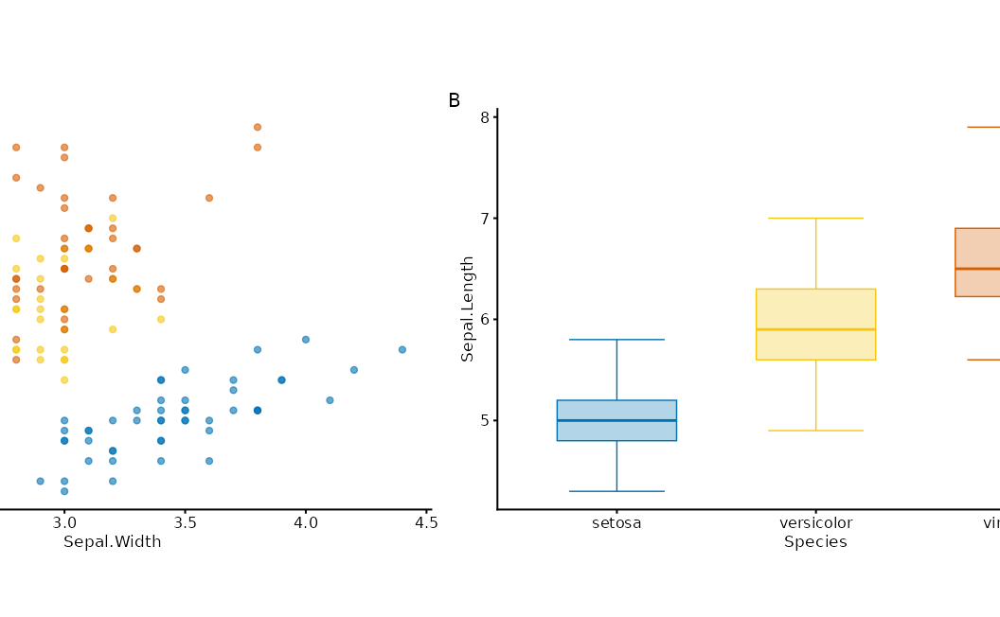

``` r

main <- iris |>
  plotit(encode(x = Sepal.Width, y = Sepal.Length, colour = Species)) |>
  mark_point()
top <- iris |>
  plotit(encode(x = Sepal.Width, fill = Species)) |>
  mark_histogram(bins = 15, alpha = 0.5)
right <- iris |>
  plotit(encode(x = Sepal.Length, fill = Species)) |>
  mark_histogram(bins = 15, alpha = 0.5) |>
  project_cartesian(flip = TRUE)
compose_marginal(main, top, right)
```

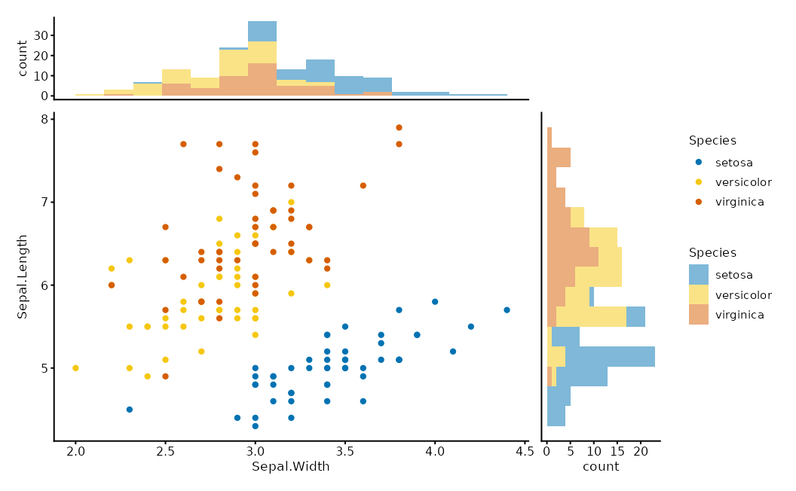

``` r

compose_inset(p1, p2, left = 0.6, bottom = 0.6, right = 0.95, top = 0.95)
```

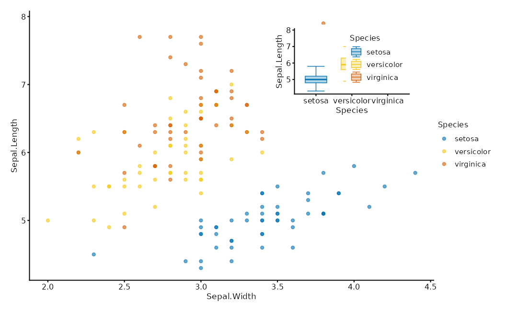

## Relational layouts

A layout is a **data transform**, not a layer.
[`as_graph()`](https://zorrooz.github.io/plotit/reference/as_graph.md)
normalises relations into a `plotit_graph`; `layout_*()` bakes
coordinates into its tables; marks render sub-tables with
`data = ~table`.

    edges / matrix / tree ──as_graph()──▶ plotit_graph ──layout_*()──▶ x/y columns
                                                  │
                        plotit(graph) ──▶ mark_*(data = ~nodes | ~edges | ~ribbons)

``` r

flows <- data.frame(
  source = c("A", "A", "B", "B", "C"),
  target = c("B", "C", "C", "D", "D"),
  value = c(10, 5, 8, 3, 6)
)
# Sugar path
flows |>
  plotit(encode(source = source, target = target, value = value, fill = source)) |>
  mark_sankey()
#> Coordinate system already present.
#> ℹ Adding new coordinate system, which will replace the existing one.
```

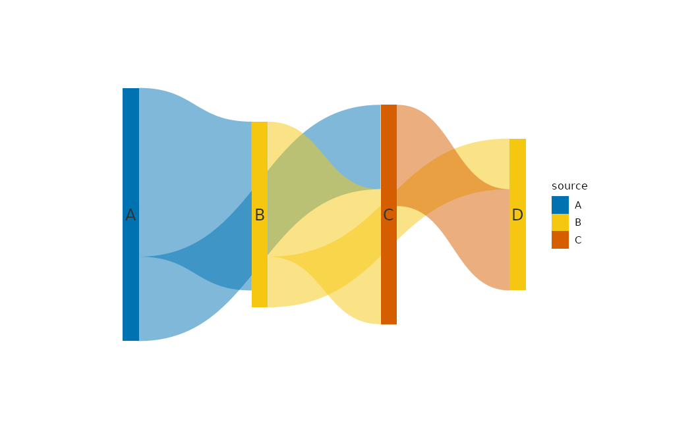

``` r

# Explicit layout path
as_graph(flows) |>
  plotit() |>
  layout_sankey() |>
  mark_polygon(data = ~ribbons) |>
  mark_rect(data = ~nodes)
```


``` r

edges <- data.frame(source = c("a", "a", "b", "c"), target = c("b", "c", "d", "d"))
nodes <- data.frame(id = c("a", "b", "c", "d"), type = c("x", "y", "x", "y"))
as_graph(edges, nodes = nodes) |>
  plotit() |>
  layout_force(seed = 4) |>
  mark_rule(data = ~edges) |>
  mark_point(data = ~nodes)
```

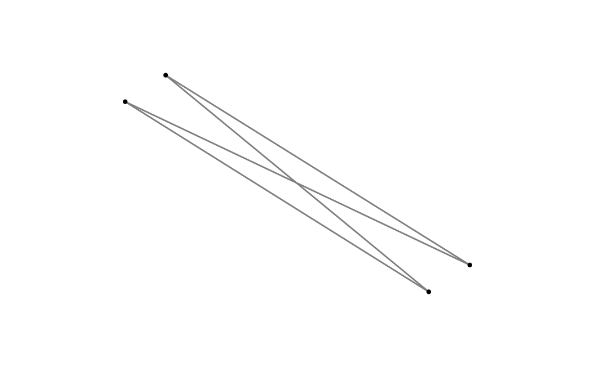

| Layout              | Engine                   | Notes              |
|:--------------------|:-------------------------|:-------------------|
| `layout_force`      | Fruchterman–Reingold     | `seed` required    |
| `layout_circle`     | trigonometric            | `order_by`         |
| `layout_tree`       | leaf-order walk          | `direction`        |
| `layout_dendrogram` | hclust heights           | `direction`        |
| `layout_chord`      | sector + Bézier ribbons  | deterministic      |
| `layout_sankey`     | layered + Bézier ribbons | deterministic      |
| `layout_treemap`    | squarify                 | hierarchical table |

Relational sugar marks (`mark_sankey`, `mark_treemap`, `mark_network`,
`mark_chord`) call the same engines. Prefer sugar for one-liners; drop
to `layout_*` when you need custom marks on sub-tables.

## Scales in depth

All `scale_*()` functions share `name`, `trans`, `limits`, `range`,
`breaks`, `labels`.

| `trans` | Effect | Typical aesthetic |
|:---|:---|:---|
| `"identity"` | linear (default for x/y) | position |
| `"log"`, `"log10"`, `"log2"`, `"sqrt"` | transform data | x, y |
| `"reverse"` | flip order | most |
| `"discrete"` | treat as categories | colour, shape, … |
| `"binned"` | bin then discretise | colour, fill, size |

`range` is the **visual output domain** (Vega-aligned):

- colour/fill: scheme name (`"viridis"`, `"brewer"`, `"friendly"`,
  `"rdbu"`, …) or colour vector
- size / alpha: numeric bounds (`c(1, 6)`, `c(0.1, 1)`)
- shape / linetype: shape codes / linetype names

``` r

mtcars |>
  plotit(encode(x = wt, y = mpg, colour = hp)) |>
  mark_point() |>
  scale_x(trans = "log10") |>
  scale_color(range = "rdbu", mid = 0)
#> Scale for colour is already present.
#> Adding another scale for colour, which will replace the existing scale.
```

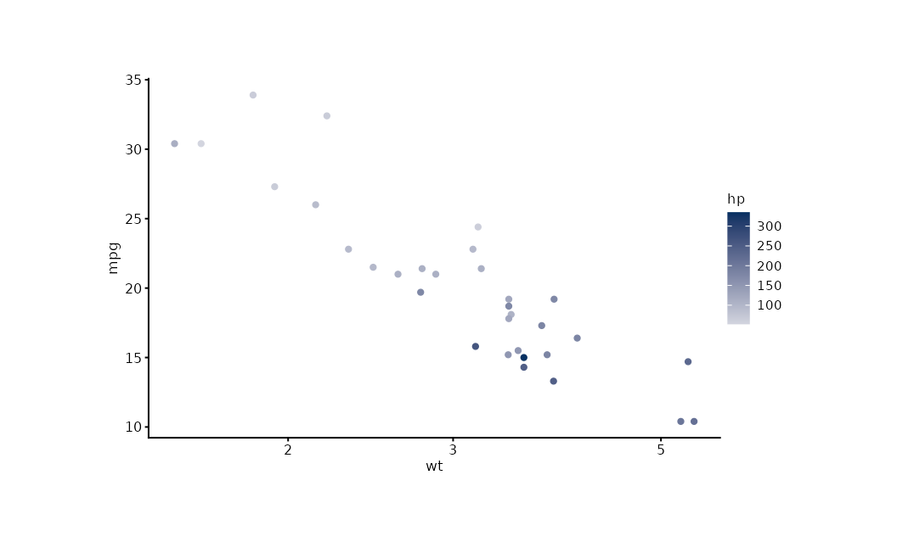

``` r

iris |>
  plotit(encode(x = Sepal.Width, y = Sepal.Length, colour = Sepal.Length)) |>
  mark_point() |>
  scale_color(trans = "binned", n_bins = 5)
#> Scale for colour is already present.
#> Adding another scale for colour, which will replace the existing scale.
```

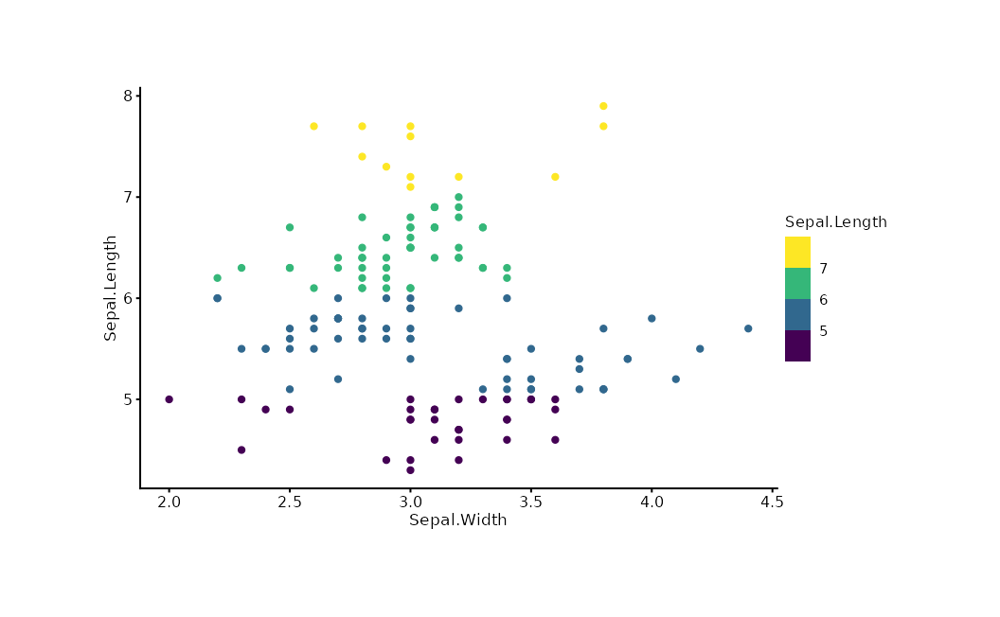

Date/POSIXct columns auto-route to a date axis — do **not** force
`trans = "identity"` on them.

## Labels, themes, export

Three-parameter protocol: `reset` \> `hide` \> `text`.

``` r

iris |>
  plotit(encode(x = Sepal.Width, y = Sepal.Length, colour = Species)) |>
  mark_point() |>
  label_title("Iris Measurements") |>
  label_subtitle("Anderson's Iris Data") |>
  label_caption("Source: R.A. Fisher, 1936") |>
  label_axis("Sepal Width (cm)", aes = "x") |>
  label_legend("Species", aes = "colour") |>
  style(base_size = 12)
```

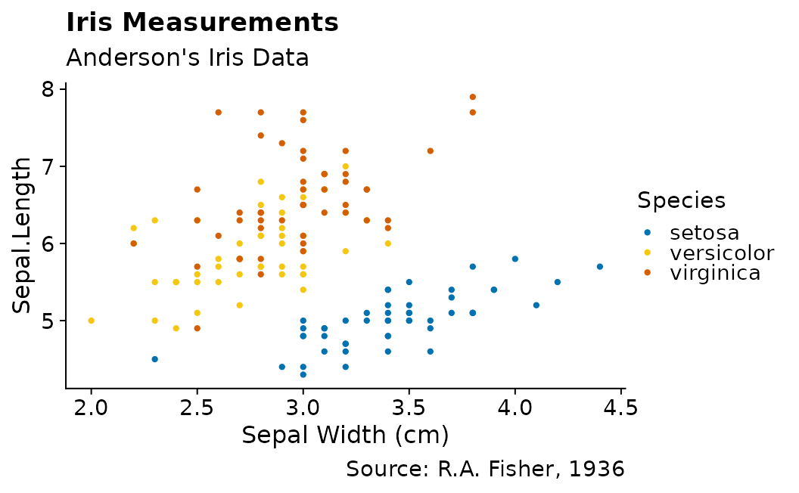

``` r

export(p, "figure.pdf", width = 8, height = 5, dpi = 300)
```

## The ggplot2 escape hatch

[`add_ggplot()`](https://zorrooz.github.io/plotit/reference/add_ggplot.md)
appends any ggplot2 layer, guide, or theme while returning a plotit
object so the pipe continues.

``` r

iris |>
  plotit(encode(x = Sepal.Width, y = Sepal.Length)) |>
  mark_point() |>
  add_ggplot(ggplot2::geom_smooth(method = "lm", se = FALSE, colour = "#E15759"))
#> `geom_smooth()` using formula = 'y ~ x'
```

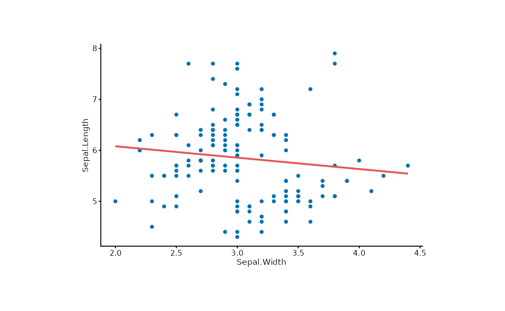

Prefer the verb API; use
[`add_ggplot()`](https://zorrooz.github.io/plotit/reference/add_ggplot.md)
for features plotit has not wrapped.

## Extending plotit

``` r

make_mark("mark_spoke", ggplot2::geom_spoke)

style_dark <- make_theme(
  "style_dark",
  plot.background = ggplot2::element_rect(fill = "#1a1a1a"),
  text = ggplot2::element_text(colour = "white")
)
```

Custom marks share the same registration path as built-ins (`position`,
`rasterize`, defaults).

## Data-prep recipes

plotit consumes tidy tables; reshape with dplyr/tidyr before the pipe.

### Rank / bump chart

``` r

set.seed(7)
df <- data.frame(
  year = rep(c(2018, 2022), each = 4),
  team = rep(letters[1:4], 2),
  score = c(70, 80, 90, 60, 75, 85, 95, 65)
)
df |>
  dplyr::group_by(year) |>
  dplyr::mutate(rank = dplyr::row_number(dplyr::desc(score))) |>
  dplyr::ungroup() |>
  plotit(encode(x = year, y = rank, group = team, colour = team)) |>
  mark_line() |>
  mark_point()
```

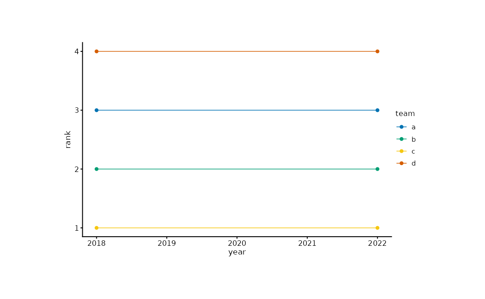

### Waterfall

``` r

steps <- data.frame(
  item = paste0("s", 1:5),
  delta = c(100, -40, 30, -20, 50)
)
steps$end <- cumsum(steps$delta)
steps$start <- steps$end - steps$delta
steps$dir <- ifelse(steps$delta >= 0, "up", "down")
steps |>
  plotit(encode(x = item, y = end, fill = dir)) |>
  mark_rect(mapping = encode(xmin = item, xmax = item, ymin = start, ymax = end)) |>
  mark_rule(yintercept = 0, colour = "#4E79A7")
```

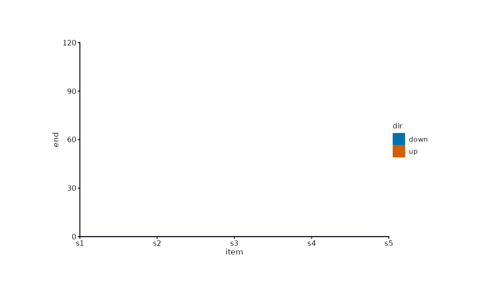

### Mean ± SE summary

``` r

se <- function(x) stats::sd(x) / sqrt(length(x))
grpm <- data.frame(
  Species = levels(iris$Species),
  mean = tapply(iris$Sepal.Length, iris$Species, mean),
  sem = tapply(iris$Sepal.Length, iris$Species, se)
)
grpm |>
  plotit(encode(x = Species, y = mean, ymin = mean - sem, ymax = mean + sem)) |>
  mark_point(size = 3) |>
  mark_errorbar(width = 0.2)
```

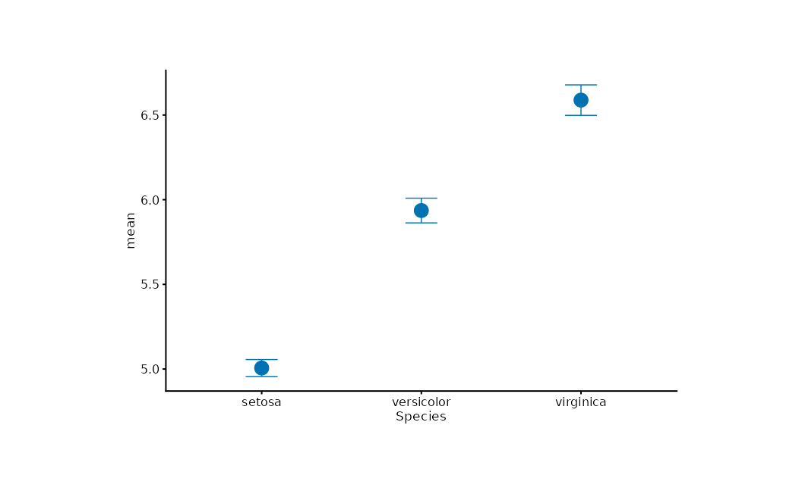

### Group envelope

``` r

set.seed(7)
pts <- data.frame(
  x = rnorm(60), y = rnorm(60),
  g = rep(letters[1:3], each = 20)
)
pts |>
  plotit(encode(x = x, y = y, colour = g)) |>
  mark_point(alpha = 0.6) |>
  mark_encircle(shape = "ellipse")
```

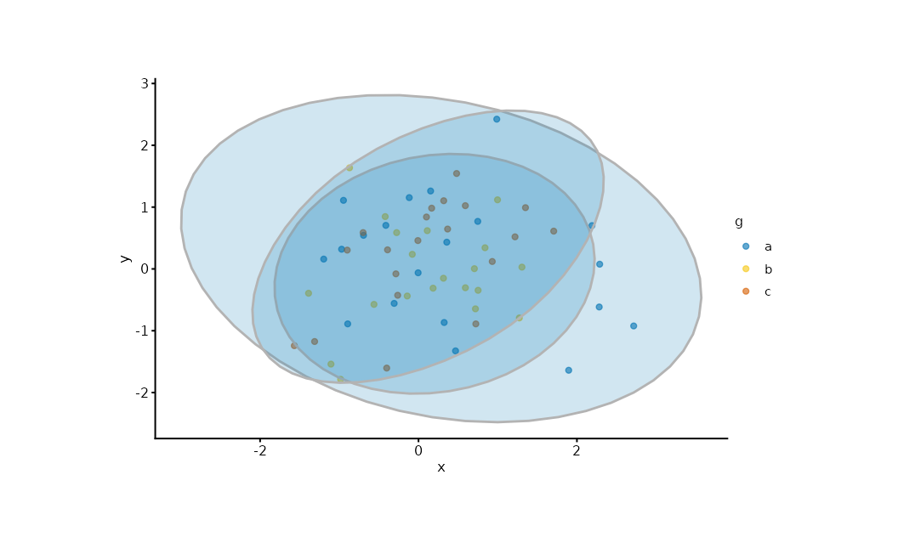

## Next

- [Gallery](https://zorrooz.github.io/plotit/articles/visualizing-data.md)
  — chart families by intent
- [API](https://zorrooz.github.io/plotit/articles/api.md) — the grammar
  as a system
- [Design
  Goals](https://zorrooz.github.io/plotit/articles/design-goals.md) —
  why the grammar looks this way
