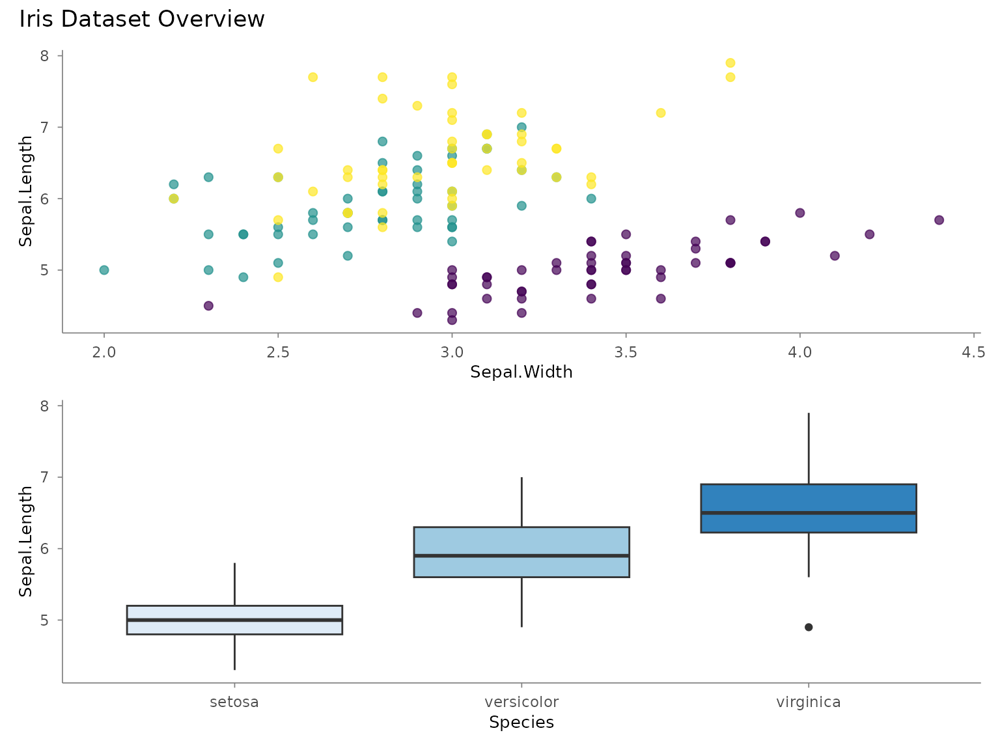
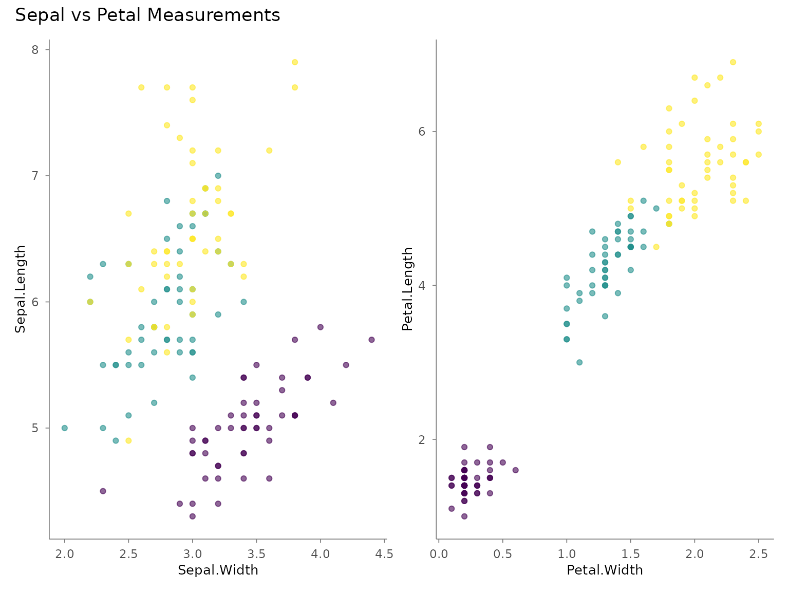
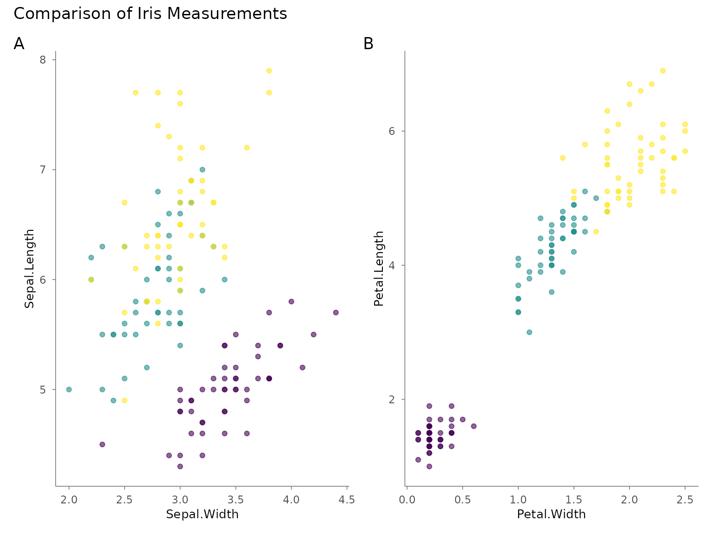
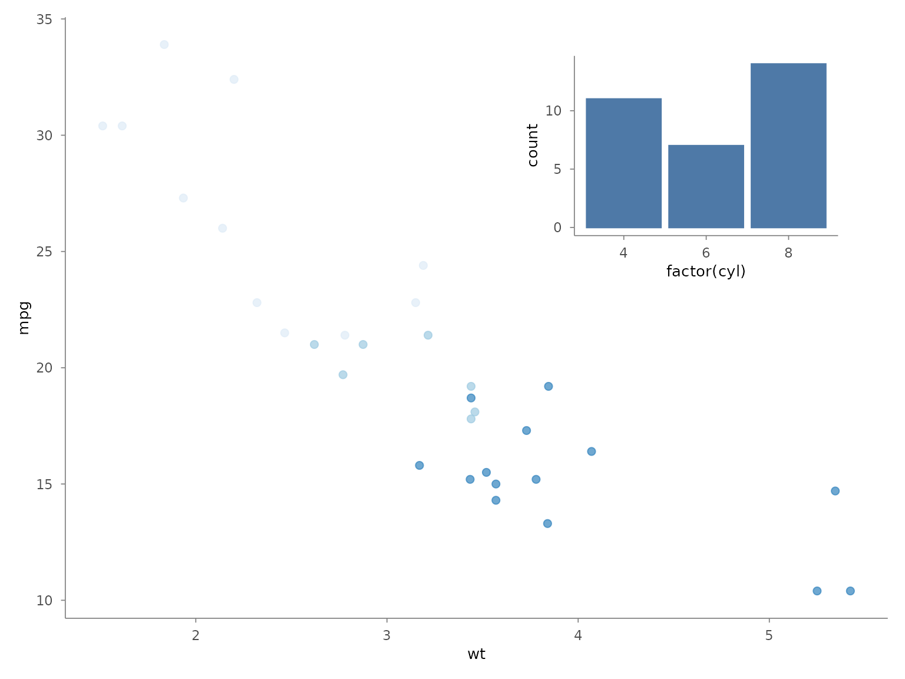
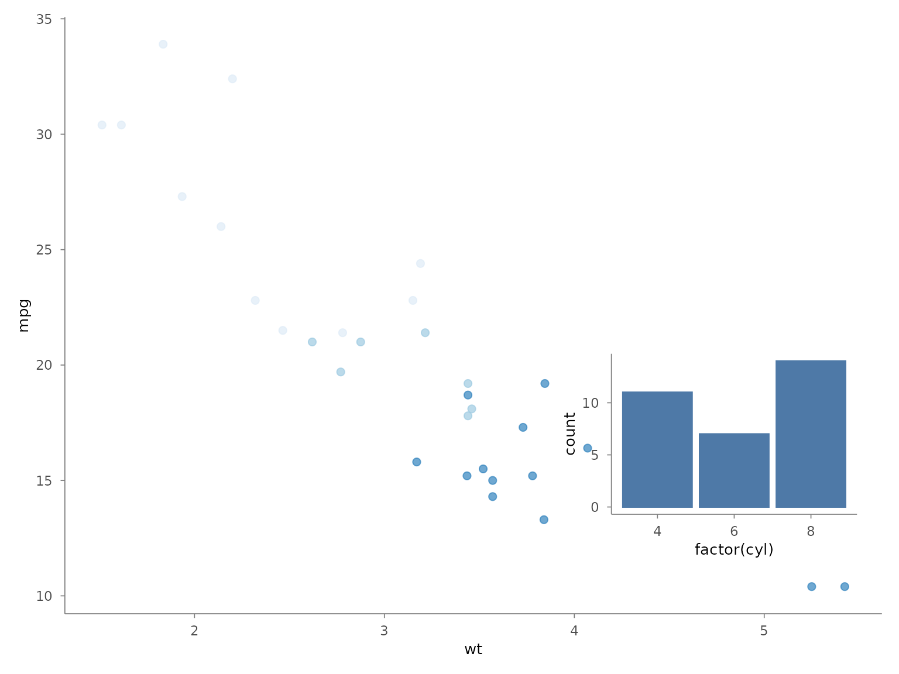
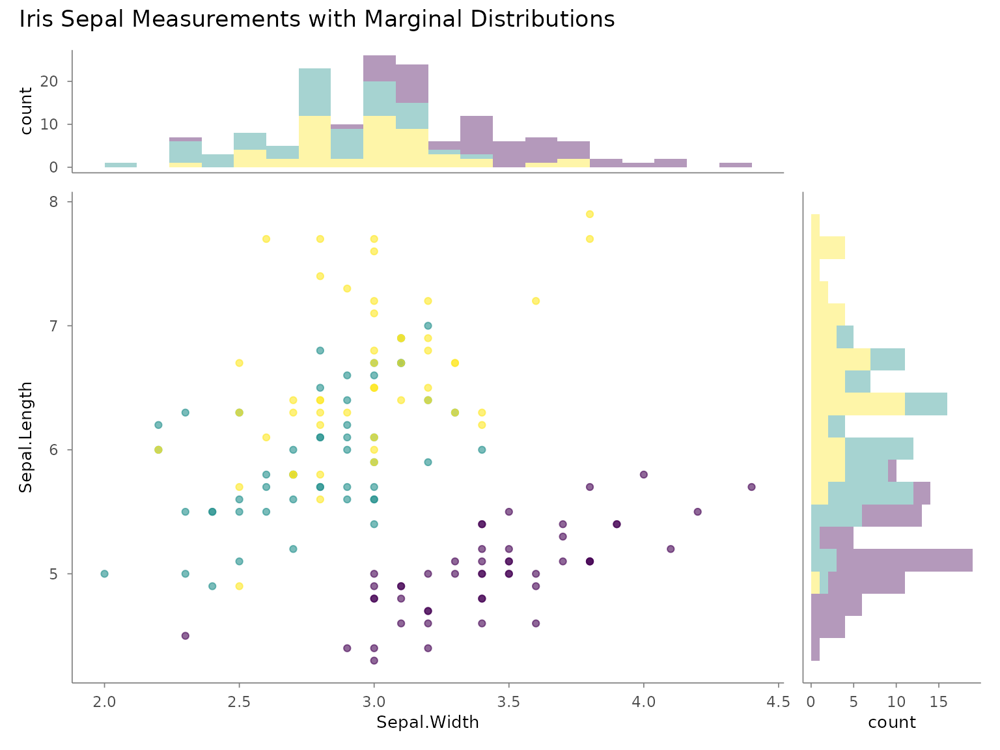
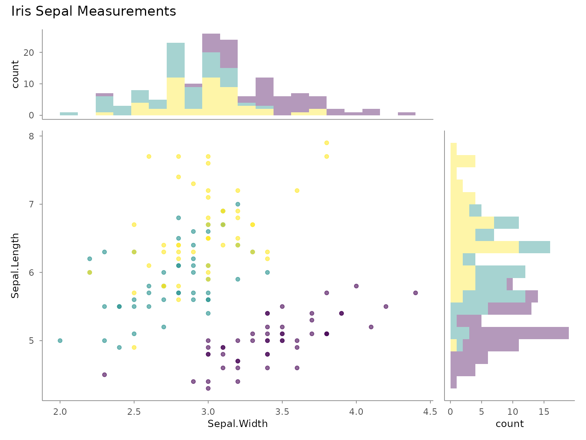
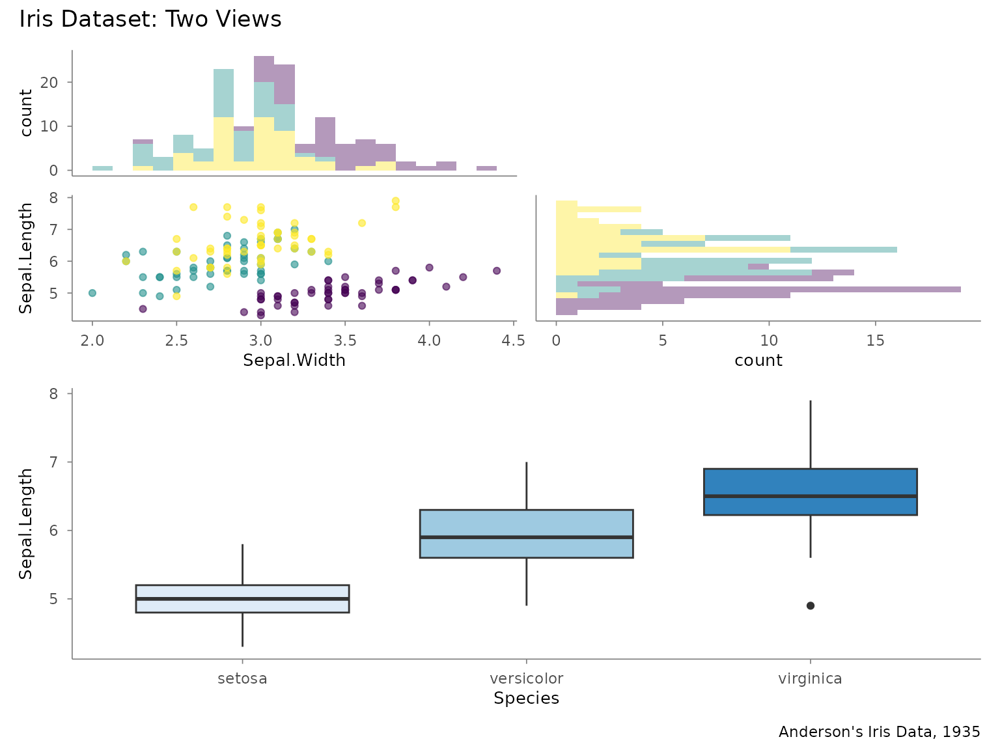

# Composing Figures with plotit

``` r

library(plotit)
```

## Introduction

The `compose_*()` family assembles multiple `plotit` objects into
multi-panel layouts. Unlike `split_*()` (which splits one dataset across
facets), `compose_*()` combines **independent plots** — each can have
different data, geometries, scales, and coordinate systems.

Three composers are available:

| Function | Layout |
|:---|:---|
| [`compose_grid()`](https://zorrooz.github.io/plotit/reference/compose_grid.md) | Grid of plots (rows × columns) |
| [`compose_inset()`](https://zorrooz.github.io/plotit/reference/compose_inset.md) | Floating overlay on a base plot |
| [`compose_marginal()`](https://zorrooz.github.io/plotit/reference/compose_marginal.md) | Scatter + marginal distributions |

All return a `plotit_composite` object that pipes seamlessly into
`label_*()`,
[`style()`](https://zorrooz.github.io/plotit/reference/style.md), and
[`export()`](https://zorrooz.github.io/plotit/reference/export.md).

------------------------------------------------------------------------

## `compose_grid()` — Grid Layout

Arrange any number of plots into a grid. By default, plots stack
vertically (`ncol = 1`).

### Basic Grid

``` r

p1 <- iris |>
  plotit(encode(x = Sepal.Width, y = Sepal.Length, colour = Species)) |>
  mark_point(size = 2, alpha = 0.7) |>
  scale_color(range = "viridis")

p2 <- iris |>
  plotit(encode(x = Species, y = Sepal.Length, fill = Species)) |>
  mark_boxplot() |>
  scale_fill(range = "brewer")

compose_grid(p1, p2) |>
  label_title("Iris Dataset Overview")
```



### Custom Layout

Control columns, rows, and relative sizes with `ncol`, `nrow`, `widths`,
and `heights`:

``` r

p1 <- mtcars |>
  plotit(encode(x = wt, y = mpg, colour = factor(cyl))) |>
  mark_point(size = 2) |>
  scale_color(range = "brewer") |>
  label_title("Weight vs MPG")

p2 <- mtcars |>
  plotit(encode(x = factor(cyl))) |>
  mark_bar() |>
  label_title("Cylinder Count")

p3 <- mtcars |>
  plotit(encode(x = hp, y = mpg, colour = factor(cyl))) |>
  mark_point(size = 2) |>
  scale_color(range = "brewer") |>
  label_title("Horsepower vs MPG")

p4 <- mtcars |>
  plotit(encode(x = factor(gear), y = mpg)) |>
  mark_boxplot() |>
  label_title("Gears vs MPG")

# 2×2 grid, first column twice as wide
compose_grid(p1, p2, p3, p4, ncol = 2, widths = c(2, 1)) |>
  label_title("mtcars Dashboard") |>
  label_caption("Source: Motor Trend, 1974")
```

### Shared Axes and Guides

``` r

p1 <- iris |>
  plotit(encode(x = Sepal.Width, y = Sepal.Length, colour = Species)) |>
  mark_point(alpha = 0.6) |>
  scale_color(range = "viridis")

p2 <- iris |>
  plotit(encode(x = Petal.Width, y = Petal.Length, colour = Species)) |>
  mark_point(alpha = 0.6) |>
  scale_color(range = "viridis")

# Shared legend, shared axes
compose_grid(p1, p2, ncol = 2, guides = "collect", axes = "collect") |>
  label_title("Sepal vs Petal Measurements")
```



### Sub-Figure Tags

Use `tag_levels` to auto-label sub-figures:

``` r

compose_grid(p1, p2, ncol = 2, tag_levels = "A") |>
  label_title("Comparison of Iris Measurements")
```



Supported tag schemes: `"A"` (uppercase), `"a"` (lowercase), `"1"`
(numbers), `"i"` (roman numerals), or custom character vectors like
`c("(a)", "(b)")`.

------------------------------------------------------------------------

## `compose_inset()` — Floating Overlay

Place a smaller plot as an overlay on a base plot. Position is specified
in normalised parent coordinates (0–1).

``` r

base <- mtcars |>
  plotit(encode(x = wt, y = mpg, colour = factor(cyl))) |>
  mark_point(size = 2, alpha = 0.7) |>
  scale_color(range = "brewer") |>
  label_title("Weight vs MPG")

inset <- mtcars |>
  plotit(encode(x = factor(cyl))) |>
  mark_bar() |>
  label_title("Cylinders")

# Place inset in the top-right corner
compose_inset(base, inset,
  left = 0.55, bottom = 0.55, right = 0.95, top = 0.95
)
```



``` r

# Larger inset with panel alignment
compose_inset(base, inset,
  left = 0.60, bottom = 0.08, right = 0.98, top = 0.45,
  align_to = "panel"
)
```



------------------------------------------------------------------------

## `compose_marginal()` — Scatter + Distributions

Create a scatter plot with marginal histogram or density plots on the
top (x-axis) and right (y-axis). Axes are shared so bins align
perfectly.

``` r

main <- iris |>
  plotit(encode(x = Sepal.Width, y = Sepal.Length, colour = Species)) |>
  mark_point(alpha = 0.6) |>
  scale_color(range = "viridis") |>
  label_title("")

top <- iris |>
  plotit(encode(x = Sepal.Width, fill = Species)) |>
  mark_histogram(bins = 20, alpha = 0.4) |>
  scale_fill(range = "viridis")

right <- iris |>
  plotit(encode(x = Sepal.Length, fill = Species)) |>
  mark_histogram(bins = 20, alpha = 0.4) |>
  scale_fill(range = "viridis") |>
  project_cartesian(flip = TRUE)

compose_marginal(main, top, right) |>
  label_title("Iris Sepal Measurements with Marginal Distributions")
```



### Adjusting Proportions

Control the relative size of marginal panels with `widths` and
`heights`:

``` r

# Larger marginals
compose_marginal(main, top, right, widths = c(3, 1), heights = c(1, 3)) |>
  label_title("Iris Sepal Measurements")
```



------------------------------------------------------------------------

## Composing Composites

[`compose_grid()`](https://zorrooz.github.io/plotit/reference/compose_grid.md)
accepts `plotit_composite` objects, so you can nest compositions:

``` r

# Create a composite of the scatter + marginals
scatter_with_marginals <- compose_marginal(main, top, right)

# Create a standalone boxplot
box <- iris |>
  plotit(encode(x = Species, y = Sepal.Length, fill = Species)) |>
  mark_boxplot() |>
  scale_fill(range = "brewer") |>
  label_title("By Species")

# Combine them
compose_grid(scatter_with_marginals, box, widths = c(3, 1)) |>
  label_title("Iris Dataset: Two Views") |>
  label_caption("Anderson's Iris Data, 1935")
```



------------------------------------------------------------------------

## Exporting Composites

Composite objects are exported the same way as single plots:

``` r

dashboard <- compose_grid(p1, p2, p3, p4, ncol = 2, tag_levels = "A") |>
  label_title("Dashboard") |>
  style(ggplot2::theme_minimal(base_size = 12))

export(dashboard, "dashboard.png", width = 12, height = 8, dpi = 300)
```

------------------------------------------------------------------------

## What’s Not Supported on Composites

Operations that modify individual plots (`mark_*()`, `scale_*()`,
`project_*()`, `split_*()`,
[`label_axis()`](https://zorrooz.github.io/plotit/reference/label_axis.md),
[`label_legend()`](https://zorrooz.github.io/plotit/reference/label_legend.md))
are not supported on composite objects. Build and style each sub-plot
**before** composing.
