# Customizing Plots with plotit

``` r

library(plotit)
```

## Introduction

This vignette covers the customisation features of plotit: how to
control scales with `trans` and `range`, set labels, apply themes,
transform coordinates, and split data into facets.

## Scales in Depth

All eight `scale_*()` functions share identical parameters. The two most
powerful are `trans` (how data is transformed) and `range` (what visual
values are produced).

### The `trans` Parameter

`trans` controls how data values are mapped to visual properties:

| `trans` | Effect | Works on |
|:---|:---|:---|
| `"identity"` | Linear (default) | All |
| `"log"`, `"log10"`, `"log2"` | Logarithmic | x, y |
| `"sqrt"` | Square-root | x, y |
| `"reverse"` | Reverse order | All |
| `"discrete"` | Treat as categories | All |
| `"binned"` | Bin then discretize | All except shape, linetype |

``` r

# Logarithmic x-axis
mtcars |>
  plotit(encode(x = wt, y = mpg)) |>
  mark_point(size = 2) |>
  scale_x(trans = "log10") |>
  label_title("Log-transformed x-axis")
```

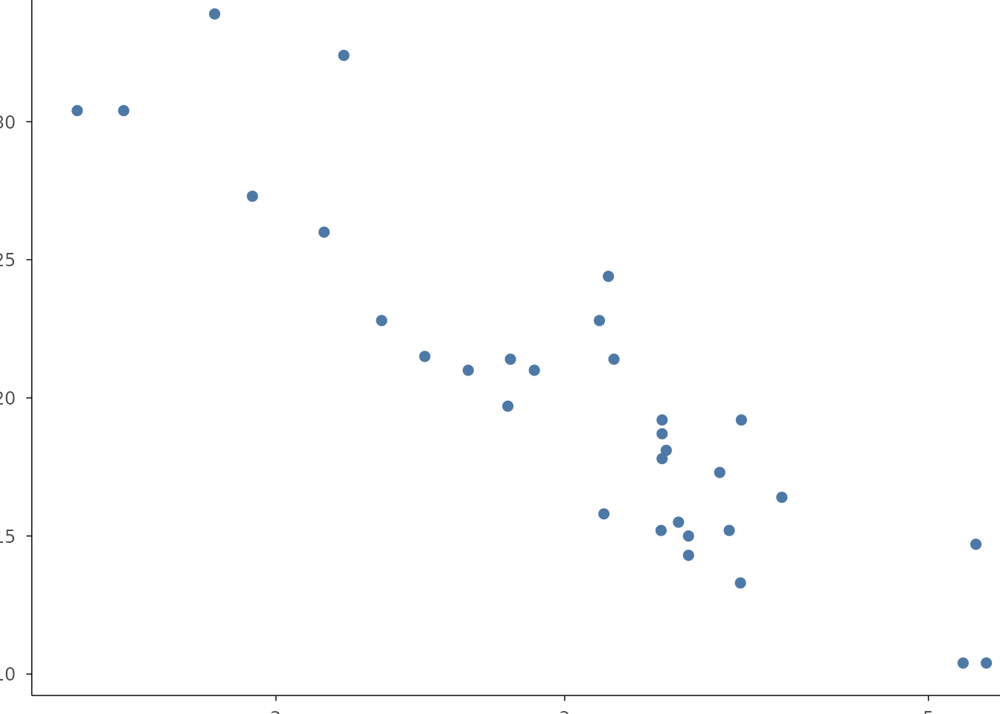

``` r

# Binned colour scale
iris |>
  plotit(encode(x = Sepal.Width, y = Sepal.Length, colour = Sepal.Length)) |>
  mark_point(size = 2) |>
  scale_color(trans = "binned", range = "viridis")
```

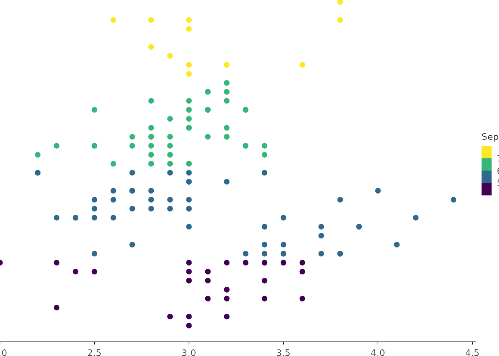

``` r

# Reverse order
mtcars |>
  plotit(encode(x = factor(cyl), y = mpg)) |>
  mark_boxplot() |>
  scale_x(trans = "reverse")
```

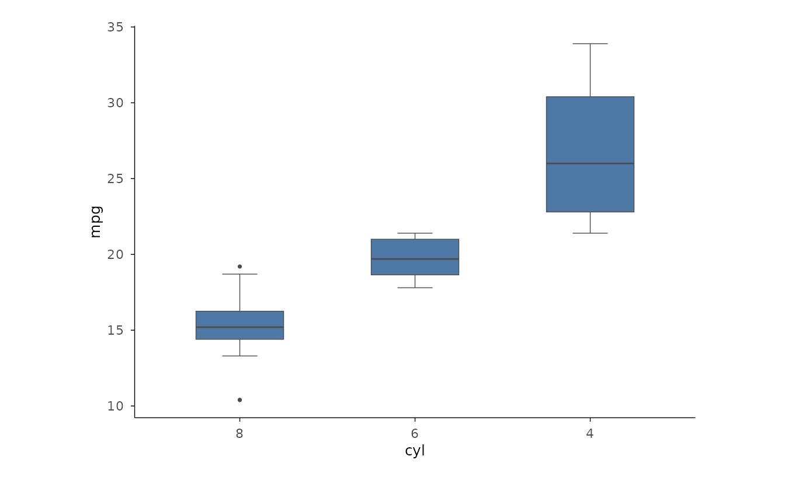

### The `range` Parameter

`range` specifies the visual output — colour schemes, size ranges, or
axis limits.

``` r

# Viridis colour scheme (continuous)
mtcars |>
  plotit(encode(x = wt, y = mpg, colour = hp)) |>
  mark_point(size = 3, alpha = 0.8) |>
  scale_color(range = "viridis")
```

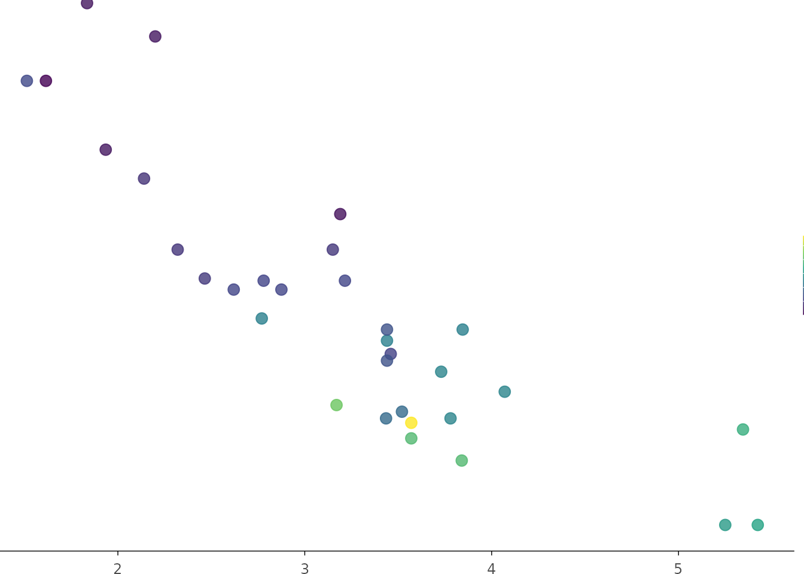

``` r

# Brewer discrete scheme
iris |>
  plotit(encode(x = Sepal.Width, y = Sepal.Length, colour = Species)) |>
  mark_point(size = 2) |>
  scale_color(range = "brewer")
```

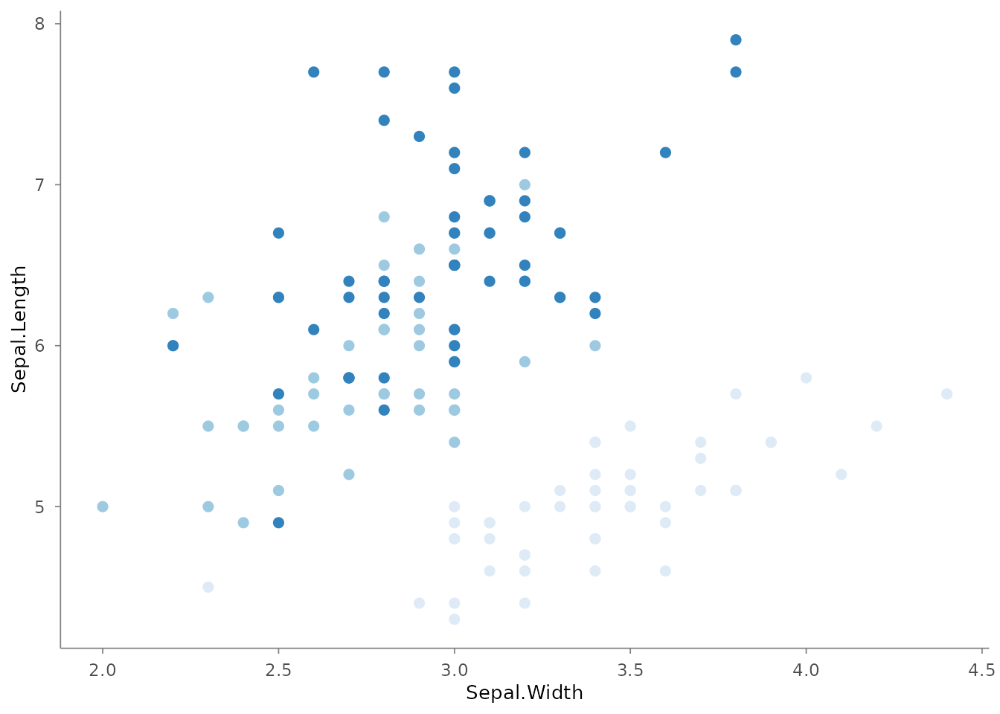

``` r

# Custom colour gradient
mtcars |>
  plotit(encode(x = wt, y = mpg, colour = hp)) |>
  mark_point(size = 3) |>
  scale_color(range = c("steelblue", "tomato"))
```

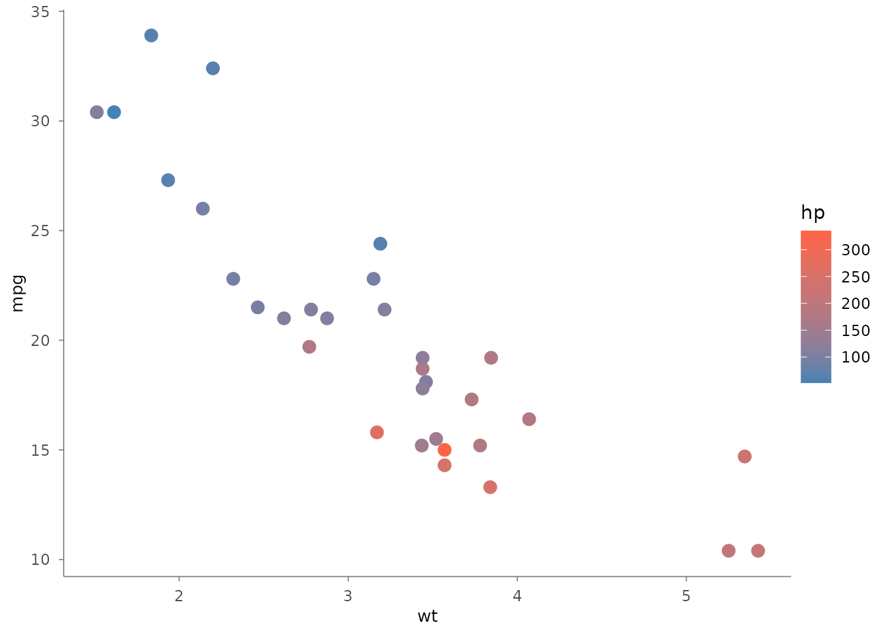

``` r

# Custom size range
mtcars |>
  plotit(encode(x = wt, y = mpg, size = hp)) |>
  mark_point(alpha = 0.6) |>
  scale_size(range = c(1, 15))
```

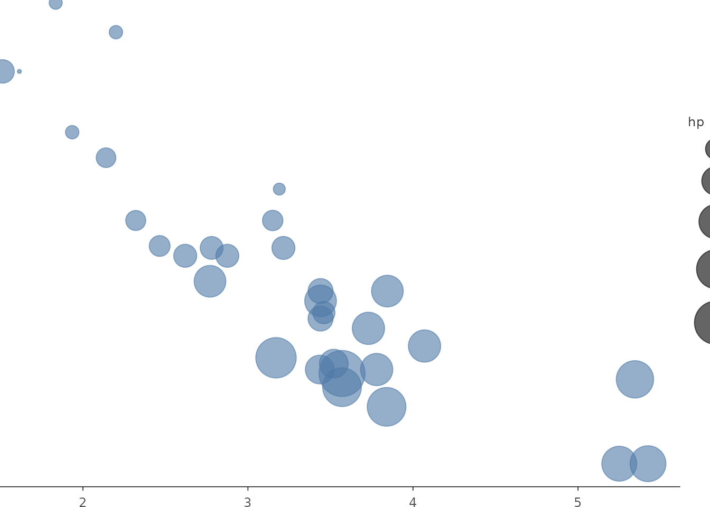

### Breaks and Limits

``` r

mtcars |>
  plotit(encode(x = wt, y = mpg)) |>
  mark_point() |>
  scale_x(limits = c(2, 5), breaks = c(2, 3, 4, 5)) |>
  scale_y(limits = c(10, 35))
#> Warning: Removed 7 rows containing missing values or values outside the scale range
#> (`geom_point()`).
```

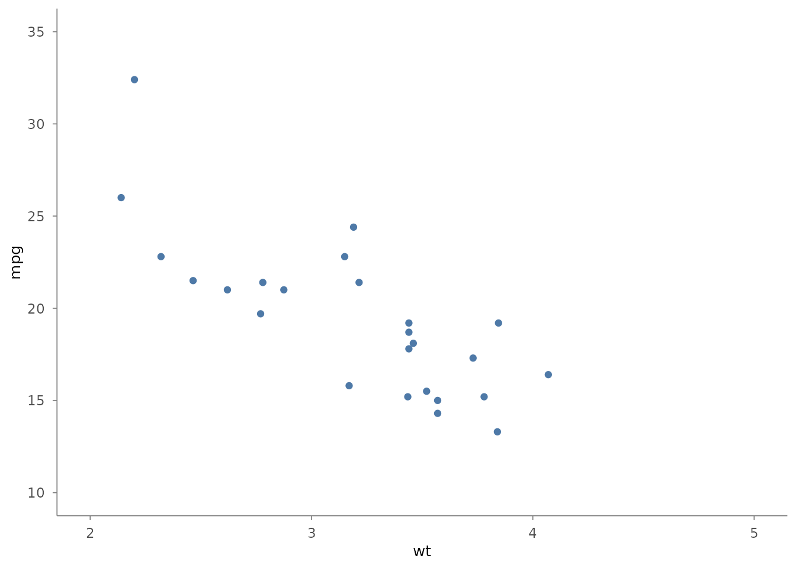

## Labels: The Three-Parameter Protocol

Every label function accepts three mutually exclusive parameters:
`text`, `hide`, and `reset`. Priority is well-defined: `reset` always
wins, then `hide`, then `text`.

### Setting Titles

``` r

iris |>
  plotit(encode(x = Sepal.Width, y = Sepal.Length, colour = Species)) |>
  mark_point() |>
  scale_color(range = "viridis") |>
  label_title("Iris Sepal Measurements") |>
  label_subtitle("Three species, 150 observations") |>
  label_caption("Data: Anderson (1935)")
```

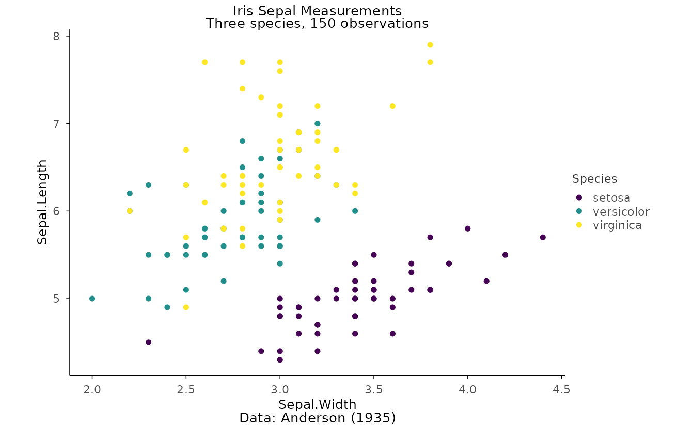

### Axis and Legend Labels

``` r

iris |>
  plotit(encode(x = Sepal.Width, y = Sepal.Length, colour = Species)) |>
  mark_point() |>
  scale_color(range = "viridis") |>
  label_axis("Sepal Width (cm)", aes = "x") |>
  label_axis("Sepal Length (cm)", aes = "y") |>
  label_legend("Iris Species", aes = "colour")
```

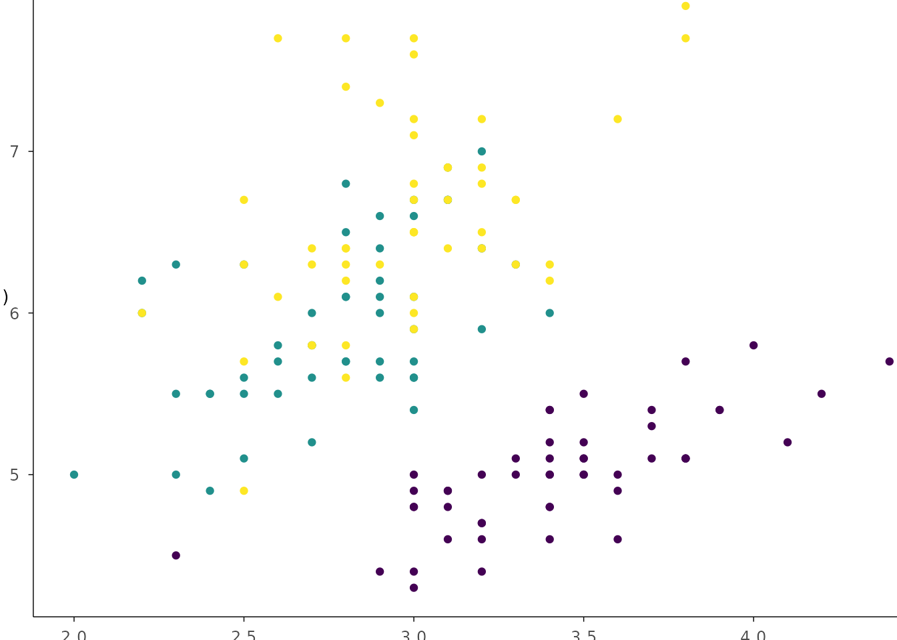

### Hiding Elements

`hide = TRUE` removes the element and its space from the layout:

``` r

iris |>
  plotit(encode(x = Sepal.Width, y = Sepal.Length, colour = Species)) |>
  mark_point() |>
  scale_color(range = "viridis") |>
  label_title(hide = TRUE) |>
  label_legend(hide = TRUE, aes = "colour")
```

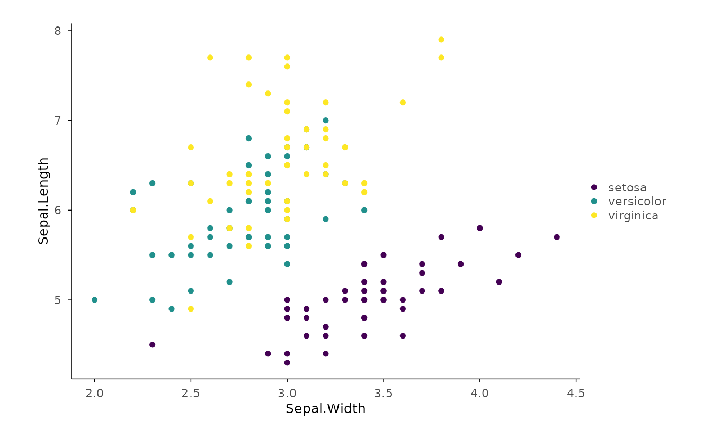

### Resetting to Defaults

`reset = TRUE` restores the default variable name (for axes and legends)
or removes the text (for titles):

``` r

iris |>
  plotit(encode(x = Sepal.Width, y = Sepal.Length)) |>
  mark_point() |>
  label_axis("Custom X", aes = "x") |>
  label_axis(reset = TRUE, aes = "x") # restores "Sepal.Width"
```

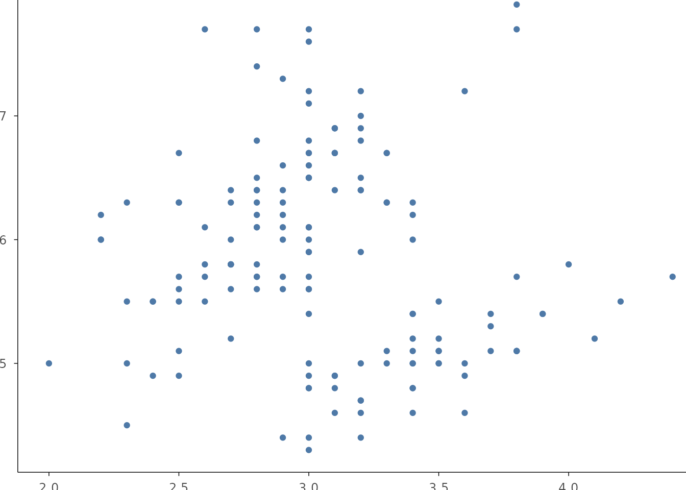

## Themes with `style()`

[`style()`](https://zorrooz.github.io/plotit/reference/style.md) applies
a base theme and merges overrides via `...`:

``` r

iris |>
  plotit(encode(x = Sepal.Width, y = Sepal.Length, colour = Species)) |>
  mark_point(size = 2, alpha = 0.7) |>
  scale_color(range = "viridis") |>
  style(
    base_theme = ggplot2::theme_minimal(base_size = 14),
    plot.title = ggplot2::element_text(face = "bold", colour = "#2c3e50"),
    legend.position = "bottom"
  ) |>
  label_title("Iris Sepal Measurements")
```

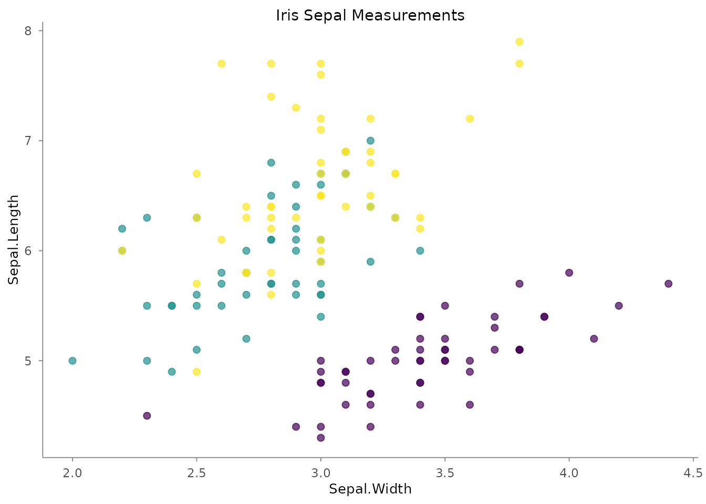

[`style_default()`](https://zorrooz.github.io/plotit/reference/style_default.md)
applies the built-in plotit default theme:

``` r

iris |>
  plotit(encode(x = Sepal.Width, y = Sepal.Length, colour = Species)) |>
  mark_point() |>
  scale_color(range = "viridis") |>
  style_default(base_size = 12)
```

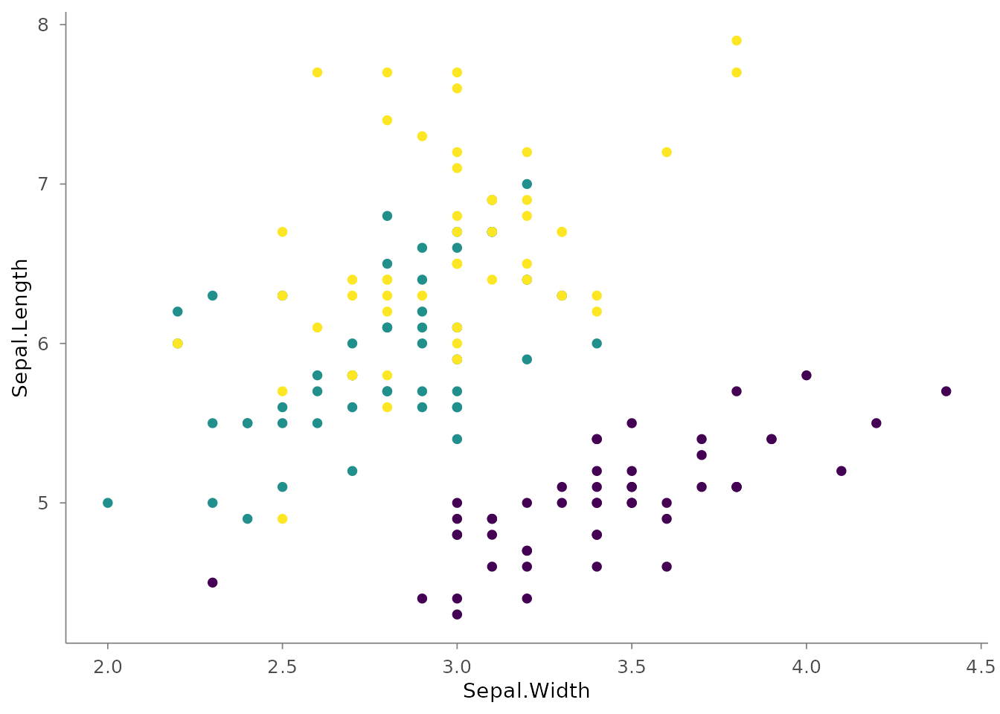

## Coordinate Systems with `project_*()`

### Cartesian: Flip, Zoom, Fixed Ratio

``` r

# Flip axes
iris |>
  plotit(encode(x = Species, y = Sepal.Length, fill = Species)) |>
  mark_boxplot() |>
  project_cartesian(flip = TRUE)
```

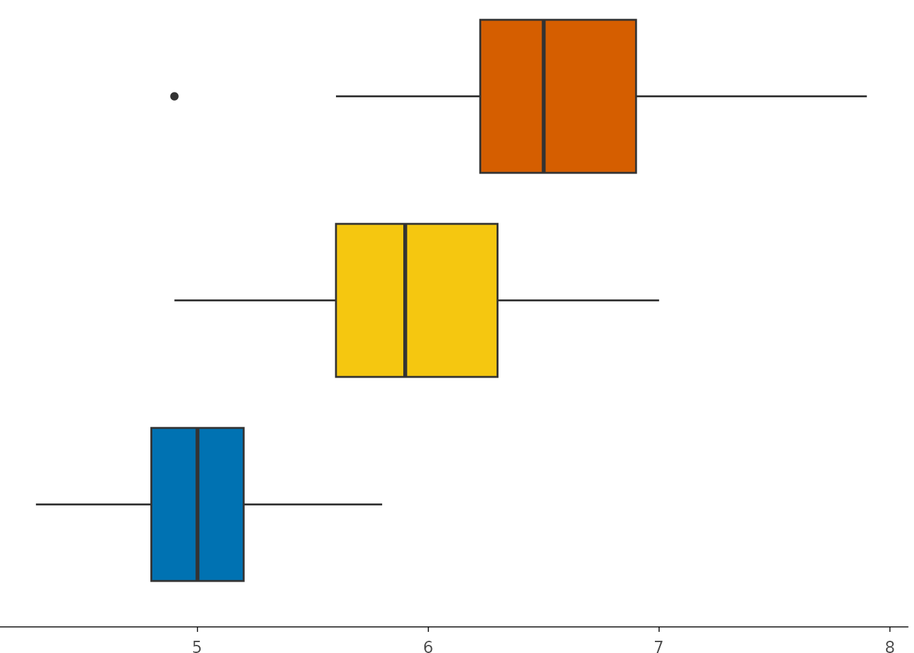

``` r

# Fixed aspect ratio
mtcars |>
  plotit(encode(x = wt, y = mpg)) |>
  mark_point() |>
  project_cartesian(fixed = 1)
```

### Polar Coordinates

``` r

mtcars |>
  plotit(encode(x = factor(cyl))) |>
  mark_bar() |>
  project_polar()
```

### Parallel Coordinates

``` r

iris |>
  plotit(encode()) |>
  project_parallel(
    columns = c("Sepal.Length", "Sepal.Width", "Petal.Length", "Petal.Width"),
    group = "Species",
    scale = "std"
  )
```

## Facets with `split_*()`

``` r

# Wrapped facets
iris |>
  plotit(encode(x = Sepal.Width, y = Sepal.Length)) |>
  mark_point() |>
  split_wrap(Species, ncol = 3)
```

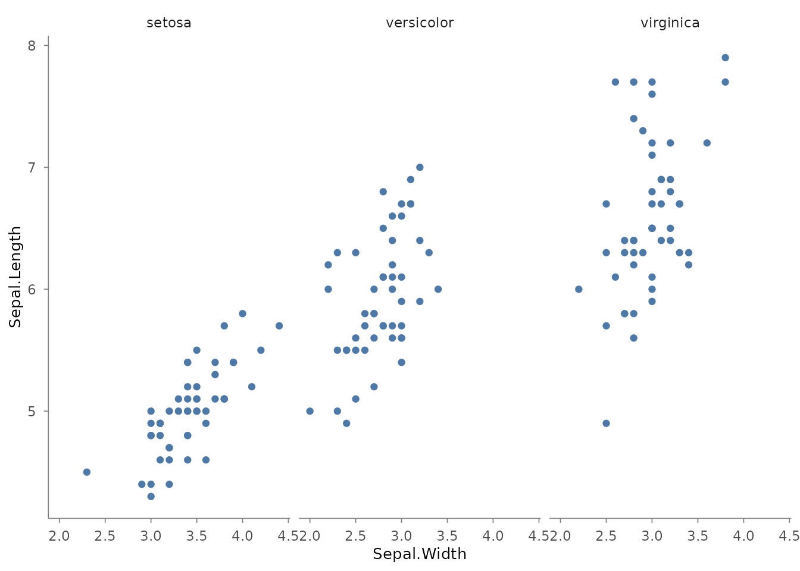

``` r

# Grid facets <U+2014> uses ggplot2::vars() for formula-free specification
mtcars |>
  plotit(encode(x = wt, y = mpg)) |>
  mark_point() |>
  split_grid(rows = ggplot2::vars(cyl), cols = ggplot2::vars(am))
```

## Default Colour

When no `colour` or `fill` is mapped, plotit injects a sensible default
blue (`#4E79A7`). This is automatically cleared when you add any colour
or fill scale:

``` r

# Default colour (no colour in mapping)
iris |>
  plotit(encode(x = Sepal.Width, y = Sepal.Length)) |>
  mark_point(size = 2)
```

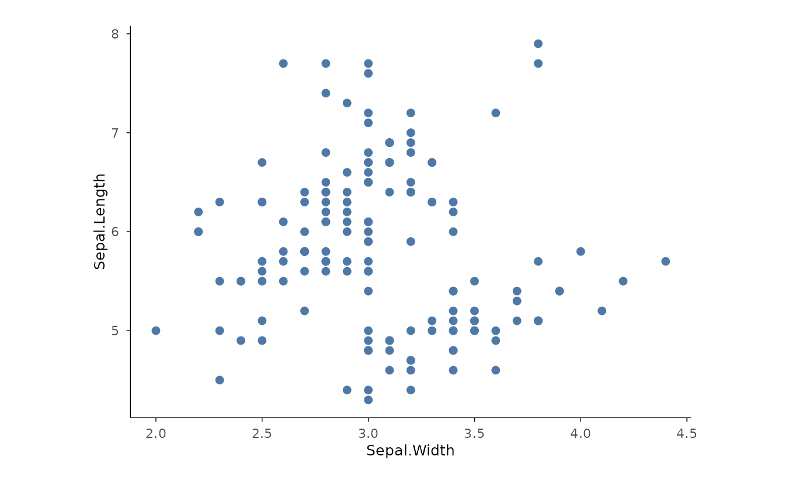
