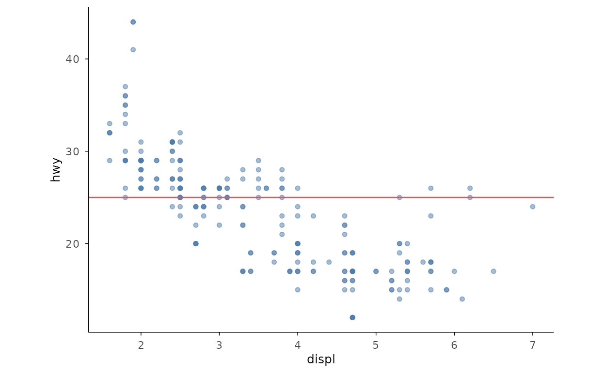
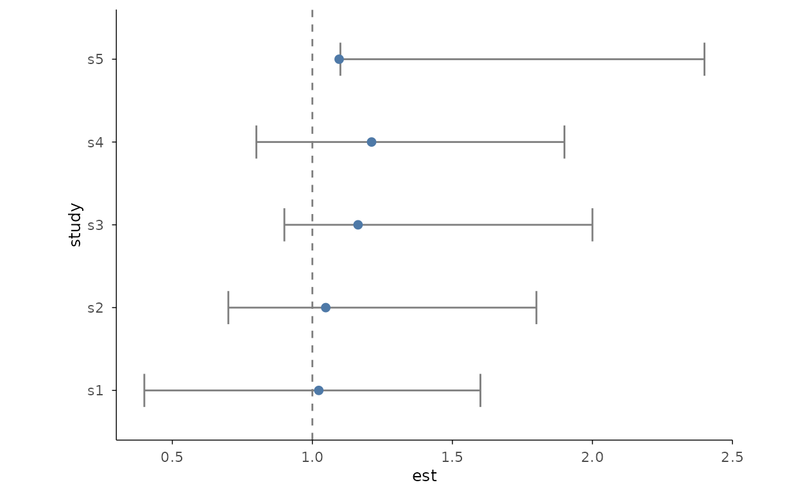
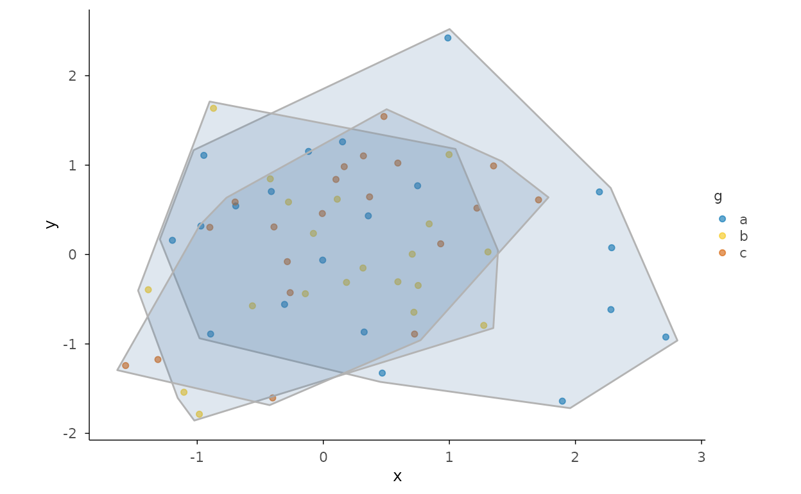
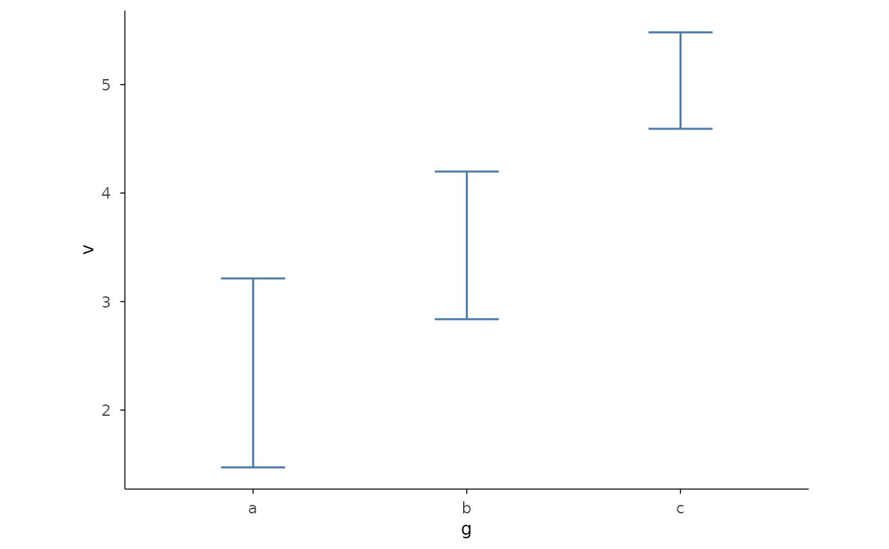

# Gallery: Annotations

> **本页解决什么问题**：Annotate charts: text, labels, significance
> brackets. **前置**：已完成
> [gallery-geo](https://zorrooz.github.io/plotit/articles/articles/gallery-geo.md)

> **下一步**：→
> [gallery-composing](https://zorrooz.github.io/plotit/articles/articles/gallery-composing.md)

``` r

library(plotit)
```

## Reference lines and segments

``` r

ggplot2::mpg |>
  plotit(encode(x = displ, y = hwy)) |>
  mark_point(alpha = 0.5) |>
  mark_rule(yintercept = 25, colour = "#E15759")
```



## Significance brackets (auto-stacked, stage 3)

[`mark_significance()`](https://zorrooz.github.io/plotit/reference/mark_significance.md)
with `comparisons` auto-stacks brackets above the data.

``` r

set.seed(7)
d <- data.frame(g = rep(c("a", "b", "c"), each = 20), v = rnorm(60, rep(c(0, 0.8, 1.6), each = 20)))
d |>
  plotit(encode(x = g, y = v)) |>
  mark_boxplot() |>
  mark_significance(comparisons = data.frame(
    group1 = c("a", "a", "b"),
    group2 = c("b", "c", "c"),
    label = c("*", "**", "ns")
  ))
```


## Forest plot

``` r

est <- data.frame(
  study = paste0("s", 1:5),
  est = rnorm(5, 1, 0.3),
  lo = c(0.4, 0.7, 0.9, 0.8, 1.1),
  hi = c(1.6, 1.8, 2.0, 1.9, 2.4)
)
est |>
  plotit(encode(y = study, x = est, xmin = lo, xmax = hi)) |>
  mark_forest(ref = 1)
```



## Group encircle (stage 3: mark_encircle)

``` r

set.seed(7)
pts <- data.frame(
  x = rnorm(60),
  y = rnorm(60),
  g = rep(letters[1:3], each = 20)
)
pts |>
  plotit(encode(x = x, y = y, colour = g)) |>
  mark_point(alpha = 0.6) |>
  mark_encircle(shape = "hull", expand = 0.02)
```



## Error bars and confidence ribbons (stage 3)

``` r

set.seed(7)
d <- data.frame(g = rep(letters[1:3], each = 12), v = rnorm(36, rep(c(2, 3, 5), each = 12)))
d |>
  plotit(encode(x = g, y = v)) |>
  mark_errorbar(stat = "mean_ci95", width = 0.3)
```


