# Gallery: Comparing Groups

> **本页解决什么问题**：Compare groups: bars, boxes, violins, beeswarm,
> lollipops, forests. **前置**：已完成
> [relational](https://zorrooz.github.io/plotit/articles/articles/relational.md)

> **下一步**：→
> [gallery-distributions](https://zorrooz.github.io/plotit/articles/articles/gallery-distributions.md)

Group comparisons are the bread and butter of statistical graphics:
bars, boxes, violins, and cumulative curves all place summaries or
distributions side by side.

## Bars

### Counts by class

Count bars tally the rows per category — map only `x` and
[`mark_bar()`](https://zorrooz.github.io/plotit/reference/mark_bar.md)
knows to count. Here it shows how many cars of each `class` are in the
[`ggplot2::mpg`](https://ggplot2.tidyverse.org/reference/mpg.html) data.

``` r

ggplot2::mpg |>
  plotit(encode(x = class)) |>
  mark_bar()
```

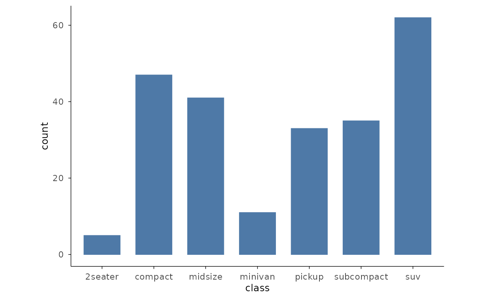

### Value bars

Map `y` as well and the bars read their heights directly from a data
column. Inline data frames are a convenient source for small, hand-built
figures.

``` r

dfv <- data.frame(cat = c("A", "B", "C", "D"), val = c(12, 7, 19, 5))
dfv |>
  plotit(encode(x = cat, y = val)) |>
  mark_bar()
```

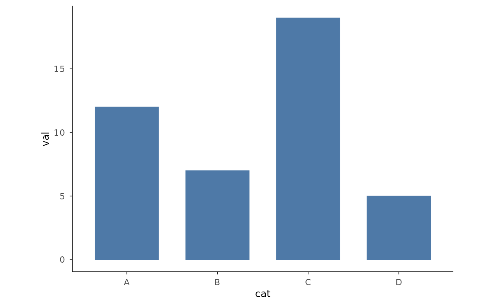

### Stacked bars

Mapping a second categorical variable to `fill` and stacking shows the
composition of every group at a glance.

``` r

ggplot2::mpg |>
  plotit(encode(x = class, fill = drv)) |>
  mark_bar(position = "stack")
```

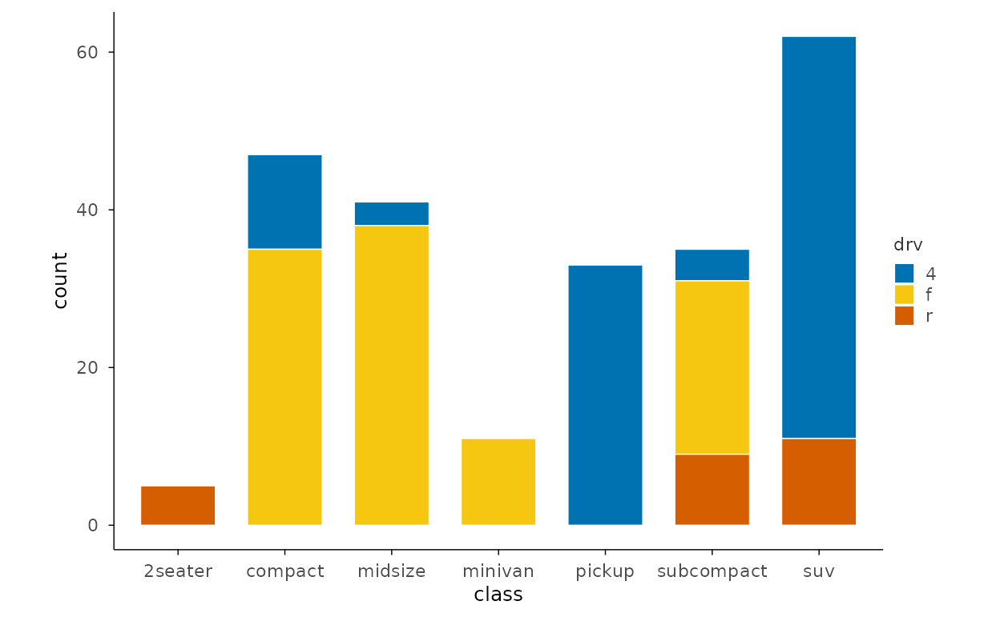

### Filled bars

With `position = "fill"` every stack is scaled to a constant height,
turning the comparison into group shares that sum to one.

``` r

ggplot2::mpg |>
  plotit(encode(x = class, fill = drv)) |>
  mark_bar(position = "fill")
```

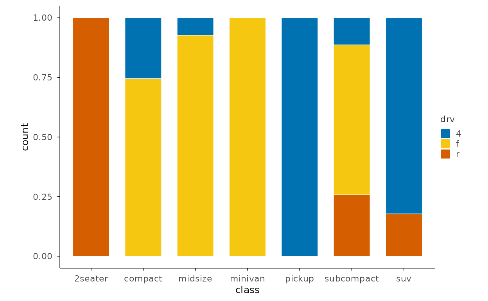

### Flipped bars

Long category labels read better along the horizontal axis — flip the
coordinates with `project_cartesian(flip = TRUE)`.

``` r

ggplot2::mpg |>
  plotit(encode(x = class)) |>
  mark_bar() |>
  project_cartesian(flip = TRUE)
```

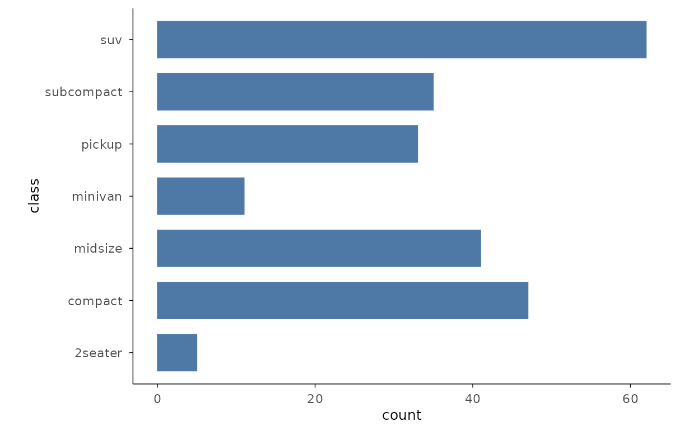

### Grouped bars

Colour by a second group and dodge the bars side by side. Value bars
need pre-aggregated data, so summarise with
[`aggregate()`](https://rdrr.io/r/stats/aggregate.html) first.

``` r

mpg_grp <- aggregate(hwy ~ class + drv, data = ggplot2::mpg, FUN = mean)
mpg_grp |>
  plotit(encode(x = class, y = hwy, fill = drv)) |>
  mark_bar(position = "dodge")
```

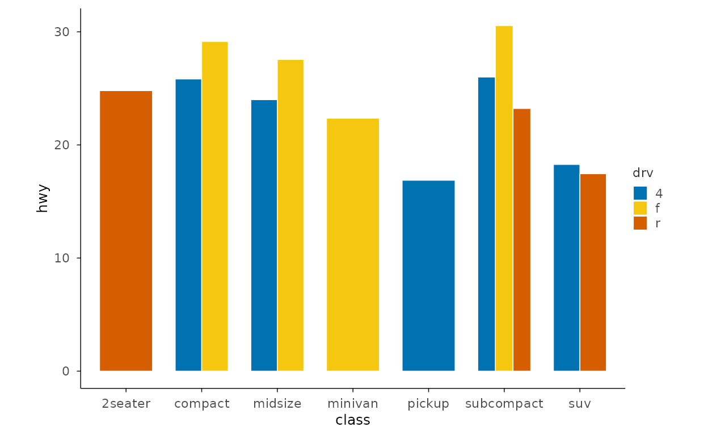

## Lollipop and Dumbbell

### Lollipop chart

[`mark_lollipop()`](https://zorrooz.github.io/plotit/reference/mark_lollipop.md)
anchors each point with a stem at zero, giving bar-like rankings without
the visual weight of a filled rectangle.

``` r

dfl <- data.frame(cat = LETTERS[1:6], val = c(3, 7, 2, 9, 5, 6))
dfl |>
  plotit(encode(x = cat, y = val)) |>
  mark_lollipop()
```

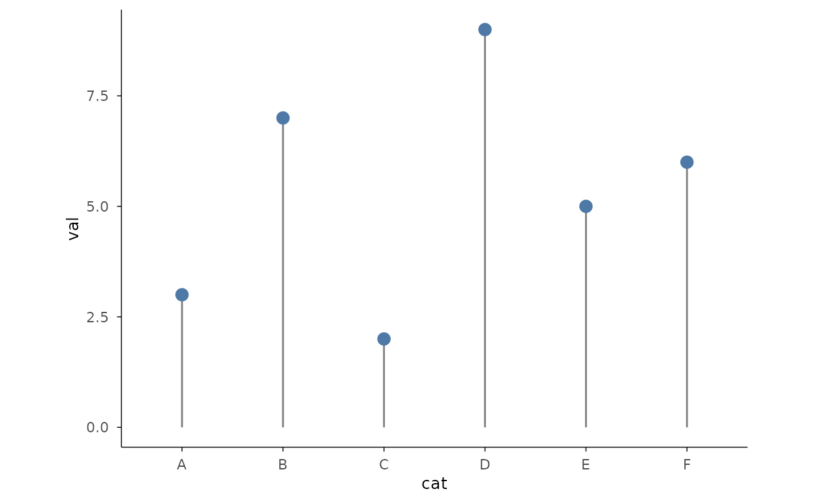

### Dumbbell chart

[`mark_dumbbell()`](https://zorrooz.github.io/plotit/reference/mark_dumbbell.md)
connects paired before/after values with a line. Encode the start in `y`
and the end in `yend`; each row is one comparison.

``` r

dfd <- data.frame(
  item = c("A", "B", "C", "D", "E"),
  before = c(3, 5, 2, 8, 4),
  after = c(7, 6, 5, 10, 6)
)
dfd |>
  plotit(encode(x = item, y = before, yend = after)) |>
  mark_dumbbell()
```

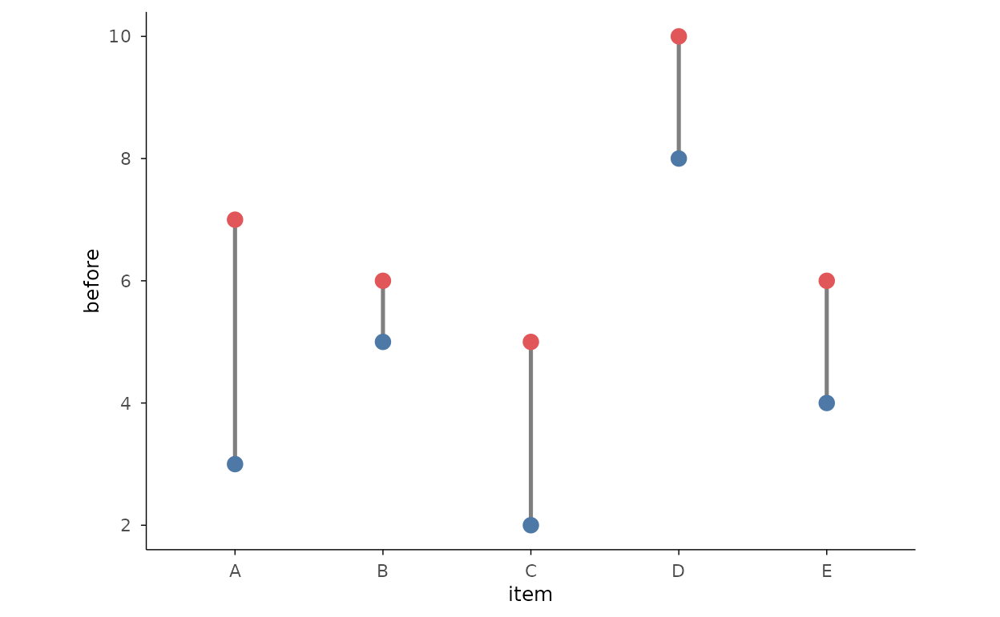

## Boxplots

### Boxplot by group

[`mark_boxplot()`](https://zorrooz.github.io/plotit/reference/mark_boxplot.md)
summarises a distribution with quartiles and outliers. Fill by the
grouping variable so each box is visually distinct.

``` r

iris |>
  plotit(encode(x = Species, y = Sepal.Length, fill = Species)) |>
  mark_boxplot()
```

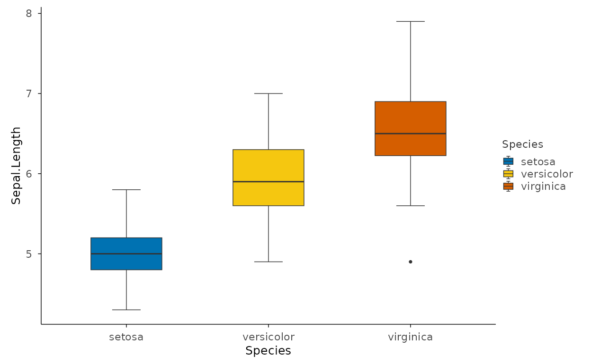

### Grouped boxplots

Two grouping variables on the same axes make pairwise comparisons easy —
engine `cyl` on `x`, transmission `am` mapped to `fill`.

``` r

mtcars |>
  plotit(encode(x = factor(cyl), y = mpg, fill = factor(am))) |>
  mark_boxplot()
```

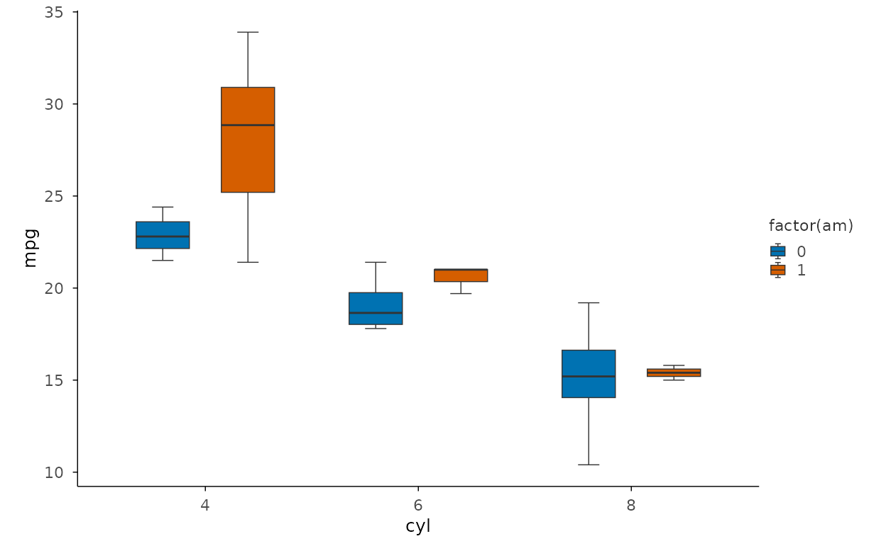

## Violins and Strips

### Violin plot

A violin shows the full density shape instead of just the quartiles.
`draw_quantiles = 0.5` marks the median with a line across each body.

``` r

iris |>
  plotit(encode(x = Species, y = Sepal.Length, fill = Species)) |>
  mark_violin(draw_quantiles = 0.5)
```

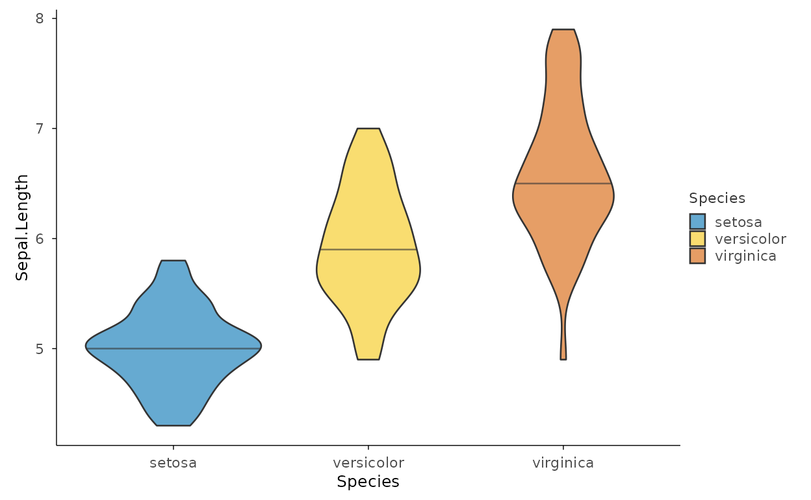

### Beeswarm

[`mark_beeswarm()`](https://zorrooz.github.io/plotit/reference/mark_beeswarm.md)
packs every point without overlap, preserving each observation while
showing where the data are densest.

``` r

iris |>
  plotit(encode(x = Species, y = Sepal.Length, colour = Species)) |>
  mark_beeswarm()
```

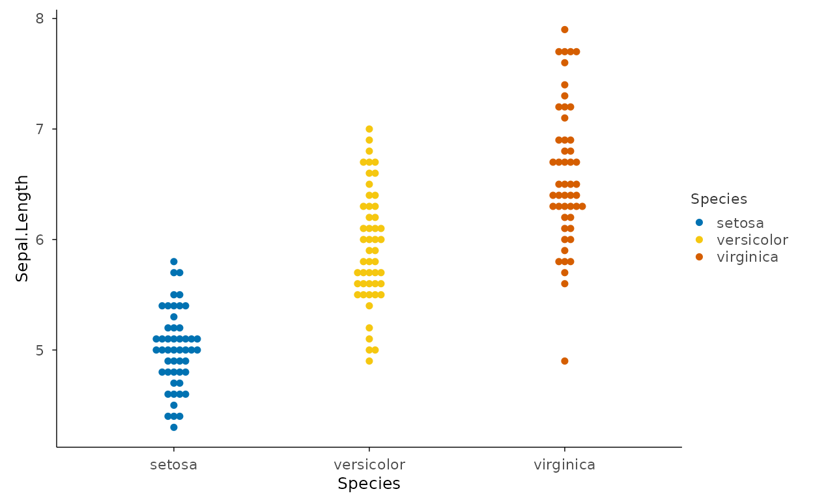

### Strip plot

A strip plot jitters points horizontally along each group.
[`set.seed()`](https://rdrr.io/r/base/Random.html) keeps the jitter
reproducible across renders.

``` r

set.seed(42)
iris |>
  plotit(encode(x = Species, y = Sepal.Length, colour = Species)) |>
  mark_point(position = "jitter", alpha = 0.5, size = 1.5)
```

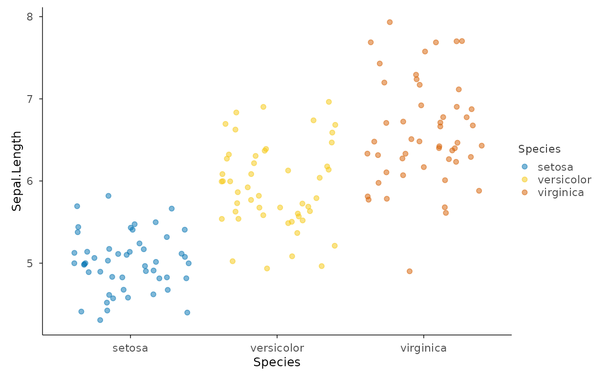

### Boxplot with jitter overlay

Layer a boxplot and jittered points together for the classic
raw-data-plus- summary view. Suppress the boxplot’s own outliers so
points are not doubled.

``` r

set.seed(42)
iris |>
  plotit(encode(x = Species, y = Sepal.Length, fill = Species)) |>
  mark_boxplot(outlier.shape = NA) |>
  mark_point(mapping = encode(colour = Species), position = "jitter", alpha = 0.4, size = 1)
```

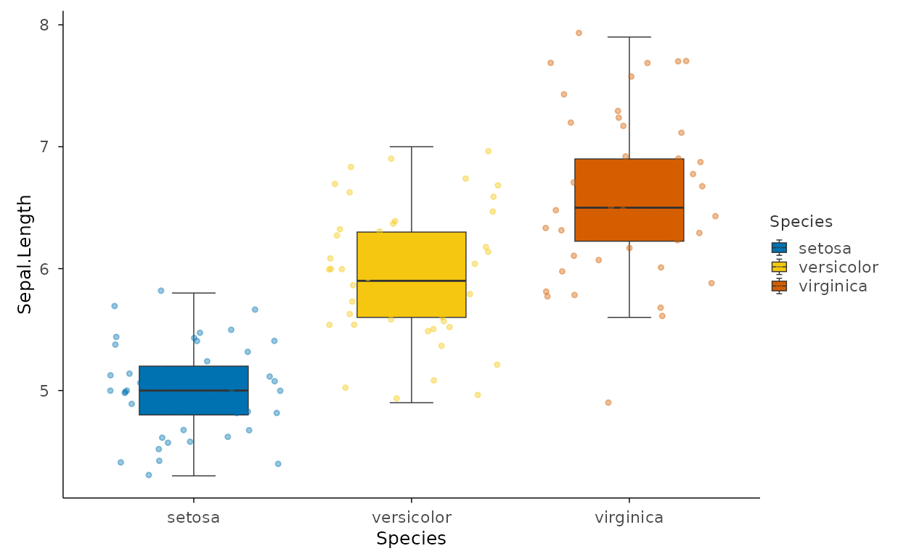

## Cumulative Distributions

### Single ECDF

[`mark_ecdf()`](https://zorrooz.github.io/plotit/reference/mark_ecdf.md)
draws the empirical cumulative distribution as a step — every
observation is represented exactly, with no binning parameter to choose.

``` r

faithful |>
  plotit(encode(x = eruptions)) |>
  mark_ecdf()
```


### ECDF by group

Colouring the ECDF by a group compares entire distributions at once:
shifts, spreads, and tail behaviour are all visible.

``` r

ec <- data.frame(
  value = c(iris$Sepal.Length, iris$Petal.Length),
  part = rep(c("Sepal", "Petal"), each = 150)
)
ec |>
  plotit(encode(x = value, colour = part)) |>
  mark_ecdf()
```

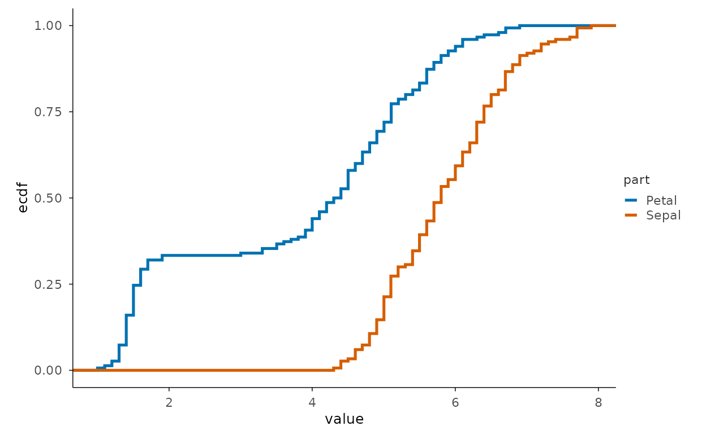

## Distributions Across Groups

### Side-by-side histograms

Dodging histograms by a fill group aligns bins between categories,
making shape comparisons direct.

``` r

iris |>
  plotit(encode(x = Sepal.Length, fill = Species)) |>
  mark_histogram(position = "dodge", bins = 20)
```

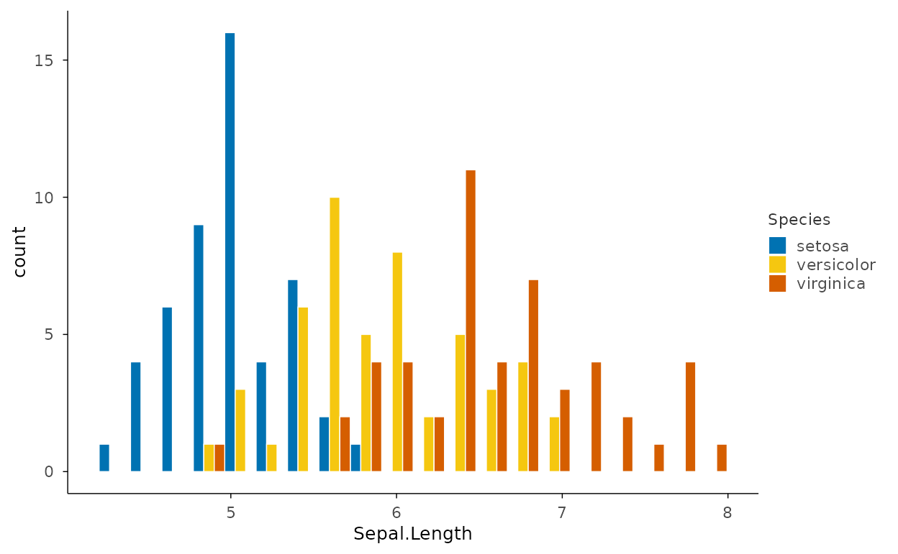

### Density by group

Overlapping density curves are the smoothest way to compare several
groups on one panel. Mapping both `fill` and `colour` gives a
translucent curve outline.

``` r

iris |>
  plotit(encode(x = Sepal.Length, fill = Species, colour = Species)) |>
  mark_density(alpha = 0.4)
```

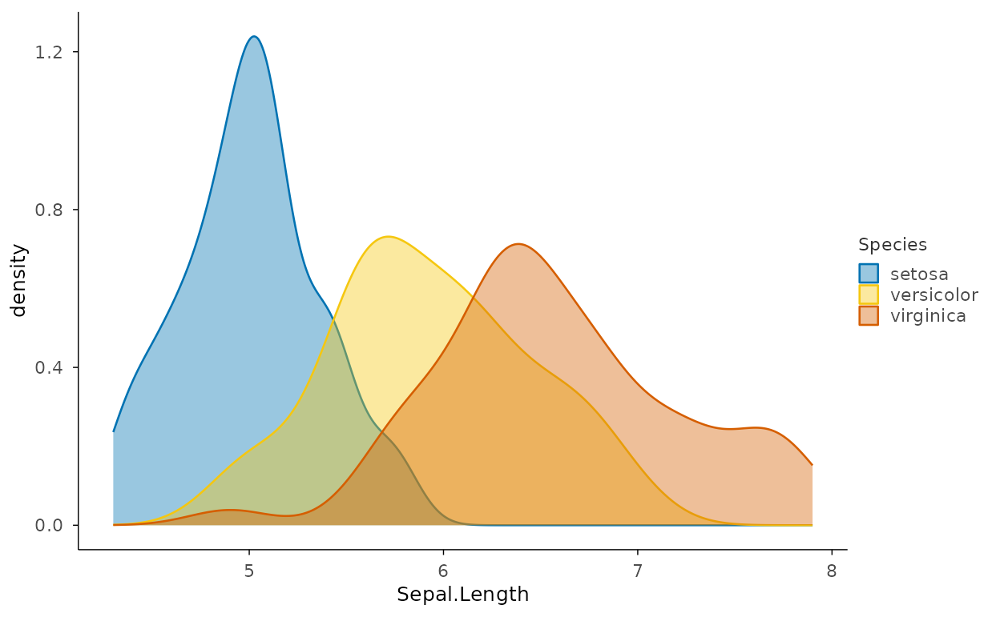
