# Gallery: Faceting, Composition & Annotation

``` r

library(plotit)
```

## Small multiples

### Wrapped facets

``` r

ggplot2::mpg |>
  plotit(encode(x = displ, y = hwy)) |>
  mark_point() |>
  split_wrap(class, ncol = 4, scales = "free") |>
  label_title("split_wrap(class, ncol = 4, scales = \"free\")")
```

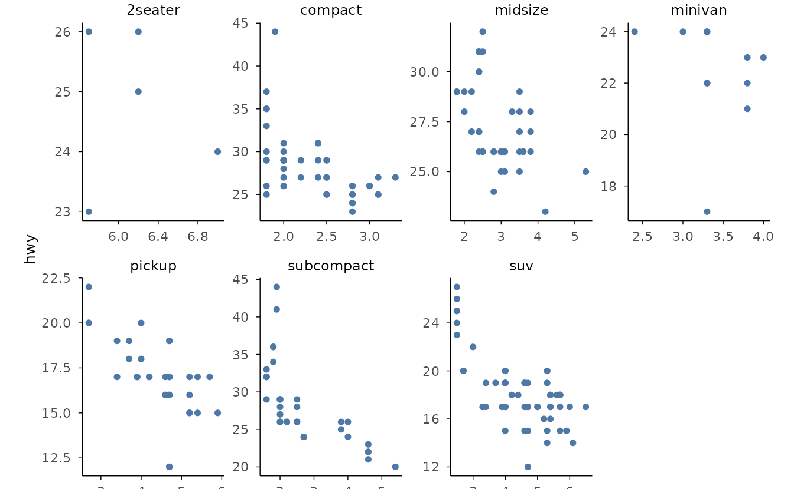

### Grid facets

``` r

iris |>
  plotit(encode(x = Sepal.Width, y = Sepal.Length)) |>
  mark_point() |>
  split_wrap(Species, ncol = 3) |>
  label_title("split_wrap(Species, ncol = 3)")
```

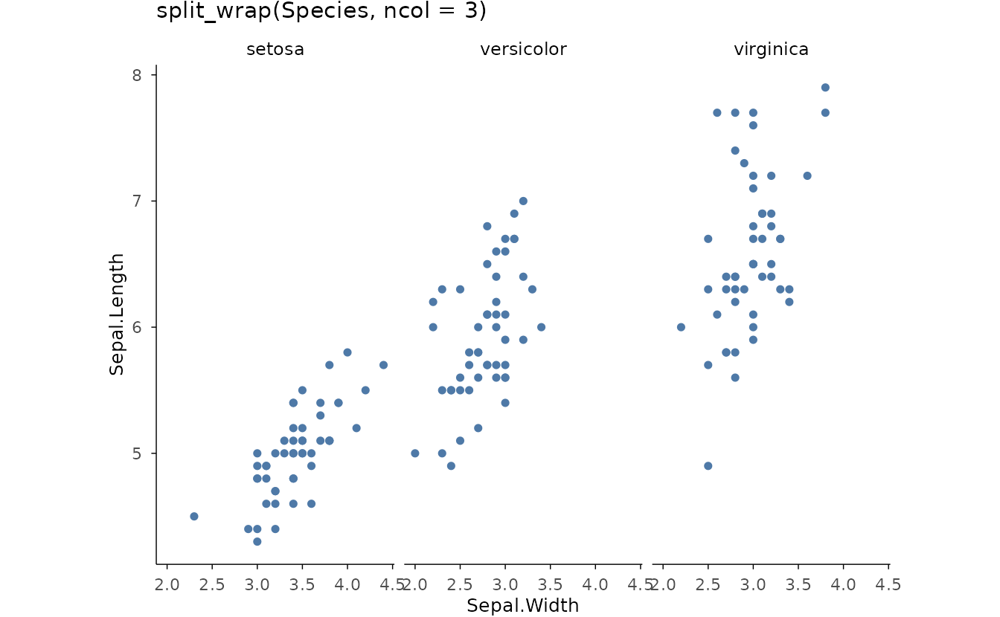

### Two-variable grid

``` r

set.seed(4)
tips <- data.frame(
  day = rep(c("Thur", "Fri", "Sat", "Sun"), each = 20),
  time = rep(c(
    "Lunch", "Dinner", "Lunch", "Dinner", "Lunch", "Dinner",
    "Lunch", "Dinner"
  ), each = 10),
  bill = round(runif(80, 5, 50), 1)
)
tips |>
  plotit(encode(x = bill)) |>
  mark_histogram(bins = 8) |>
  split_grid(day, cols = ggplot2::vars(time)) |>
  label_title("split_grid(rows = day, cols = time)")
```

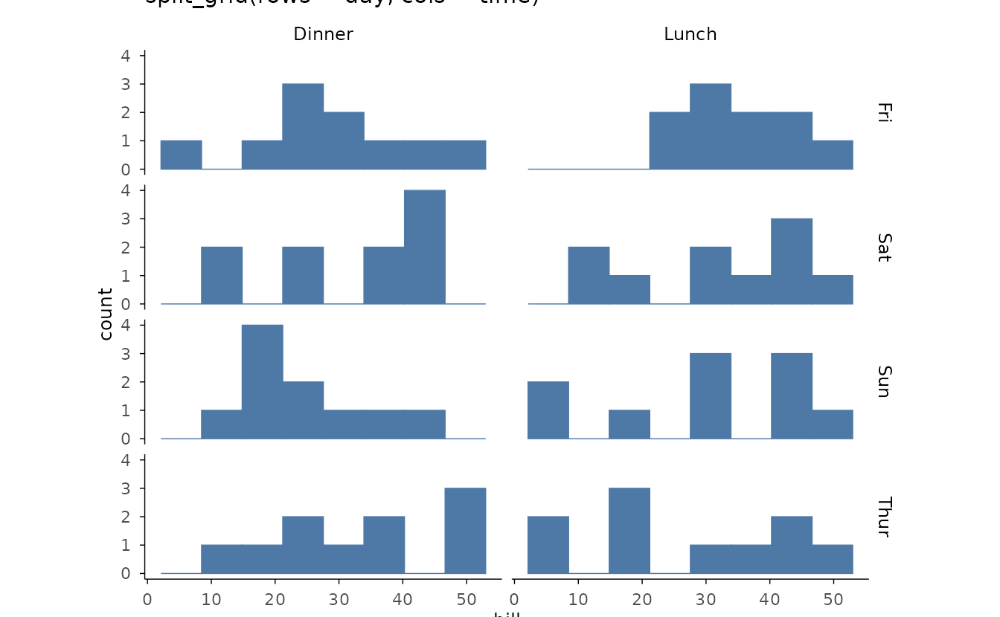

## Multi-plot figures

### Tagged grid

``` r

p1 <- iris |>
  plotit(encode(x = Sepal.Width, y = Sepal.Length, colour = Species)) |>
  mark_point()
p2 <- iris |>
  plotit(encode(x = Species, y = Sepal.Length, fill = Species)) |>
  mark_boxplot()
compose_grid(p1, p2, ncol = 2, tag_levels = "1") |>
  label_title("compose_grid(ncol = 2, tag_levels = \"1\")")
```

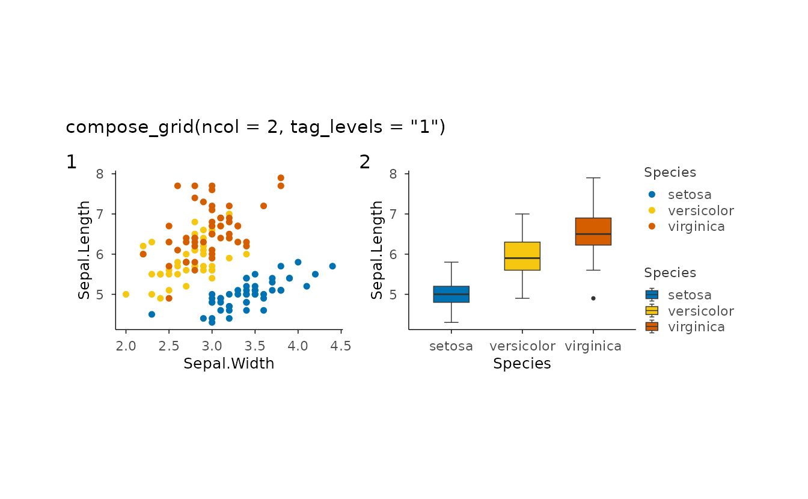

### Shared legend across panels

``` r

pa <- ggplot2::mpg |>
  plotit(encode(x = displ, y = hwy, colour = class)) |>
  mark_point()
pb <- ggplot2::mpg |>
  plotit(encode(x = displ, y = cty, colour = class)) |>
  mark_point()
compose_grid(pa, pb, ncol = 1, guides = "collect", axes = "collect_x") |>
  label_title("Guides collected, x axes shared")
```

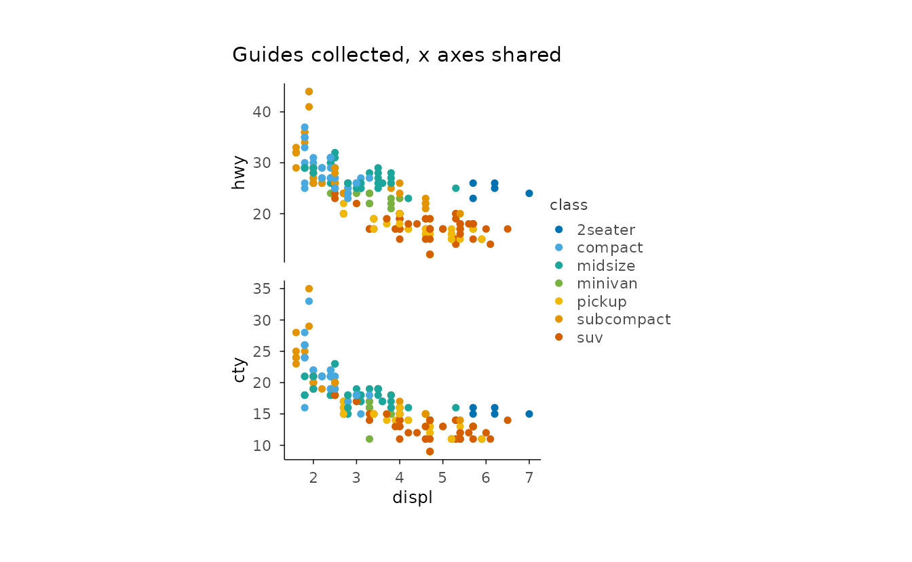

### Inset

``` r

base <- faithful |>
  plotit(encode(x = eruptions, y = waiting)) |>
  mark_point(alpha = 0.4)
zoom <- faithful |>
  plotit(encode(x = eruptions, y = waiting)) |>
  mark_point() |>
  project_cartesian(xlim = c(4, 5.5), ylim = c(70, 90)) |>
  style(base_size = 7)
compose_inset(base, zoom, left = 0.45, bottom = 0.55, right = 0.95, top = 0.95) |>
  label_title("compose_inset() with a zoom panel")
```

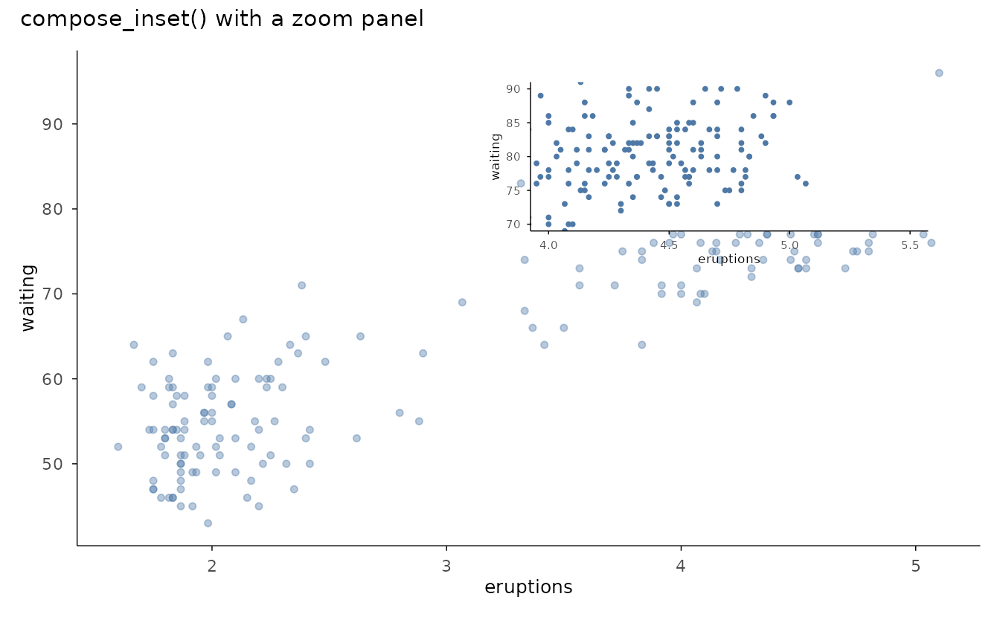

### Marginal distributions

``` r

main <- iris |>
  plotit(encode(x = Sepal.Width, y = Sepal.Length, colour = Species)) |>
  mark_point()
top <- iris |>
  plotit(encode(x = Sepal.Width, fill = Species)) |>
  mark_histogram(bins = 15, alpha = 0.6)
right <- iris |>
  plotit(encode(x = Sepal.Length, fill = Species)) |>
  mark_histogram(bins = 15, alpha = 0.6) |>
  project_cartesian(flip = TRUE)
compose_marginal(main, top, right) |>
  label_title("compose_marginal(main, top, right)")
```

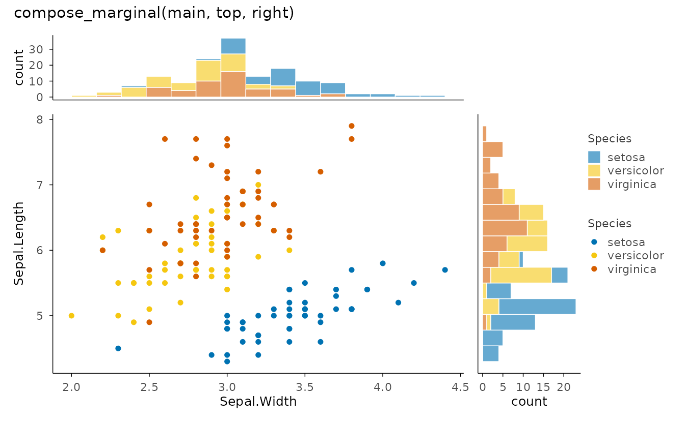

## Annotation layers

### Reference lines

``` r

ggplot2::mpg |>
  plotit(encode(x = displ, y = hwy, colour = class)) |>
  mark_point(size = 2) |>
  mark_rule(yintercept = 30, color = "#E15759", linetype = "dashed") |>
  mark_rule(slope = -4, intercept = 40, color = "grey40", linewidth = 0.4) |>
  label_title("mark_rule(): h-line and an abline")
```

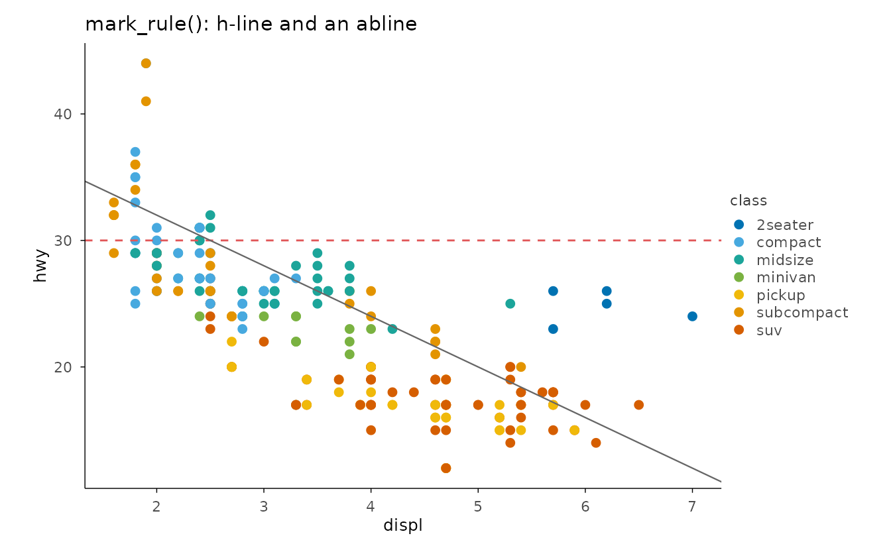

### Segments from data

``` r

segs <- data.frame(
  x = c(1, 2, 3, 4), xend = c(2, 3, 4, 5),
  y = c(1, 2, 3, 4), yend = c(2, 3, 4, 5)
)
segs |>
  plotit(encode(x = x, y = y, xend = xend, yend = yend)) |>
  mark_rule() |>
  mark_point(
    data = segs[, c("x", "y")], mapping = encode(x = x, y = y),
    inherit.aes = FALSE, size = 2
  ) |>
  mark_point(
    data = segs[, c("xend", "yend")],
    mapping = encode(x = xend, y = yend),
    inherit.aes = FALSE, size = 2, colour = "#E15759"
  ) |>
  label_title("Data-driven mark_rule segments")
```

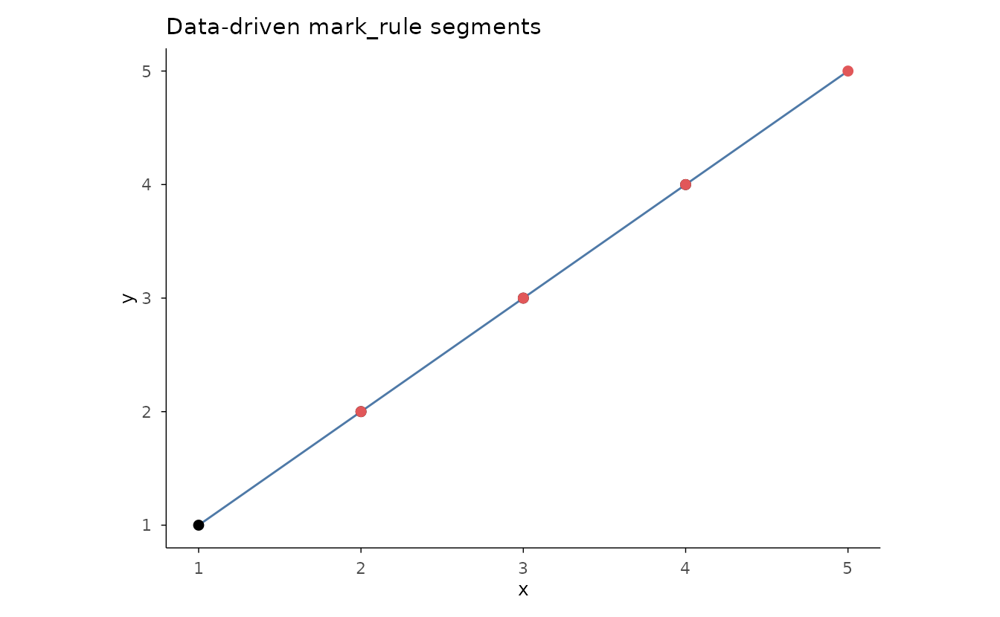

### Direct labels

``` r

lab <- subset(mtcars, mpg > 30 | wt > 4.5)
lab$car <- rownames(lab)
mtcars |>
  plotit(encode(x = wt, y = mpg)) |>
  mark_point() |>
  mark_label(
    data = lab, mapping = encode(x = wt, y = mpg, label = car),
    inherit.aes = FALSE, size = 2.5
  ) |>
  label_title("mark_label(): boxed labels")
```

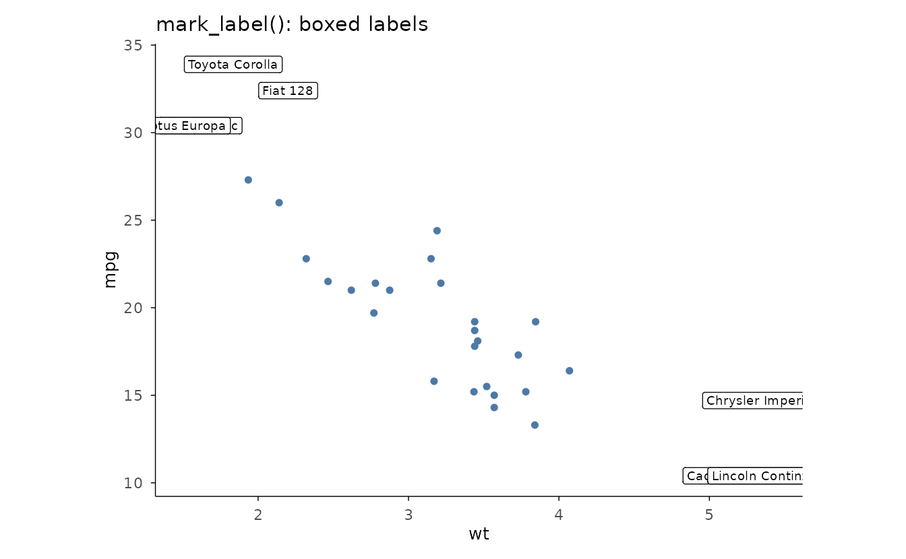

### Repelled labels

``` r

set.seed(2)
pts <- head(iris, 12)
pts$name <- rownames(pts)
iris |>
  plotit(encode(x = Sepal.Width, y = Sepal.Length, colour = Species)) |>
  mark_point() |>
  mark_text(
    data = pts,
    mapping = encode(x = Sepal.Width, y = Sepal.Length, label = name),
    inherit.aes = FALSE, repel = TRUE, size = 2.5
  ) |>
  label_title("mark_text(repel = TRUE)")
```

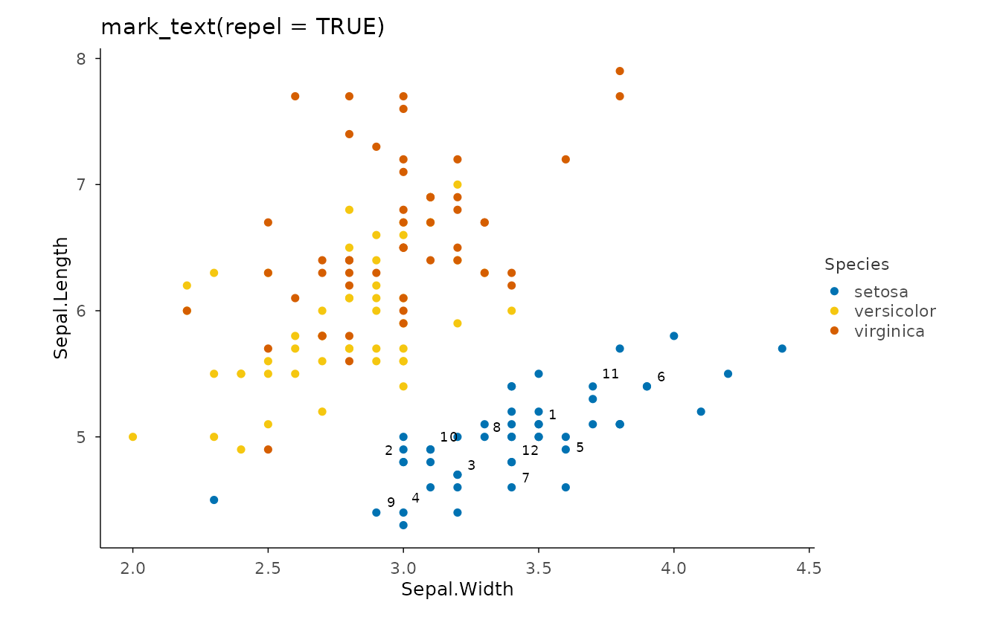

### Significance brackets

``` r

set.seed(10)
trt <- data.frame(
  group = rep(c("ctrl", "low", "high"), each = 25),
  value = c(rnorm(25, 5), rnorm(25, 6.8), rnorm(25, 8.1))
)
comp <- data.frame(
  group1 = c("ctrl", "low"),
  group2 = c("low", "high"),
  label = c("**", "***")
)
trt |>
  plotit(encode(x = group, y = value, fill = group)) |>
  mark_boxplot() |>
  mark_significance(comp, y_position = c(11.5, 13)) |>
  label_title("mark_significance() with custom comparisons")
```

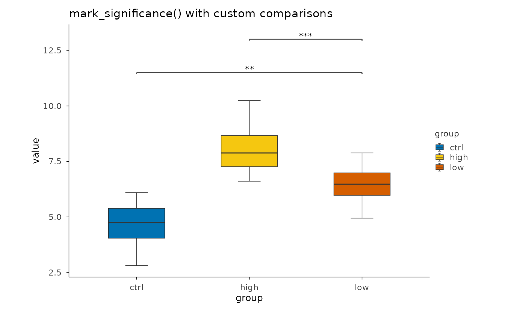

## Label & style protocol

### Hide vs reset

``` r

p <- ggplot2::mpg |>
  plotit(encode(x = displ, y = hwy, colour = class)) |>
  mark_point()
left <- p |>
  label_axis("Engine displacement (L)", aes = "x") |>
  label_axis("Highway MPG", aes = "y")
right <- p |>
  label_axis(hide = TRUE, aes = "x") |>
  label_axis(hide = TRUE, aes = "y") |>
  label_legend(hide = TRUE)
compose_grid(left, right, ncol = 2) |>
  label_title("Left: custom axis titles. Right: hide = TRUE everywhere")
```

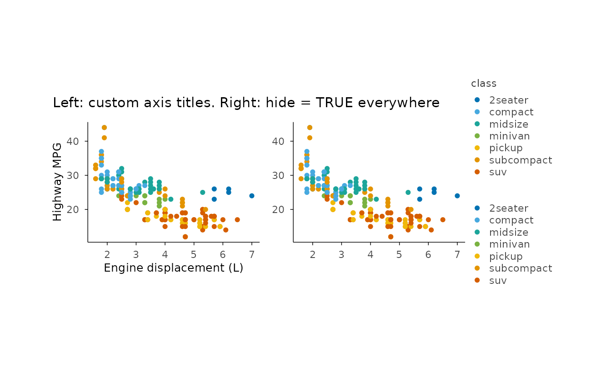

### Theme base size

``` r

ggplot2::mpg |>
  plotit(encode(x = displ, y = hwy, colour = class)) |>
  mark_point(size = 2) |>
  style(base_size = 8) |>
  label_title("style(base_size = 8)")
```

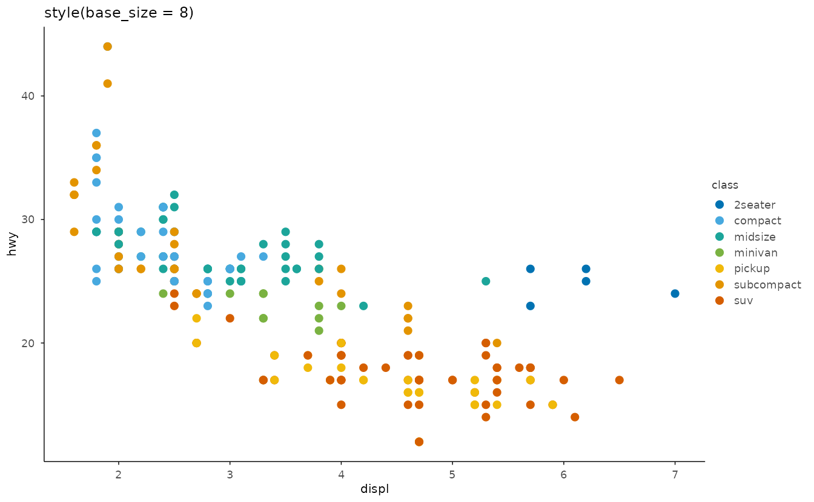

### Custom theme factory

``` r

style_warm <- make_theme("style_warm",
  plot.background = ggplot2::element_rect(fill = "#FBF7F0", colour = NA),
  panel.background = ggplot2::element_rect(fill = "#FFFDF8", colour = NA)
)
ggplot2::mpg |>
  plotit(encode(x = displ, y = hwy)) |>
  mark_point(colour = "#B5651D", size = 2) |>
  style_warm() |>
  label_title("make_theme() presets")
```

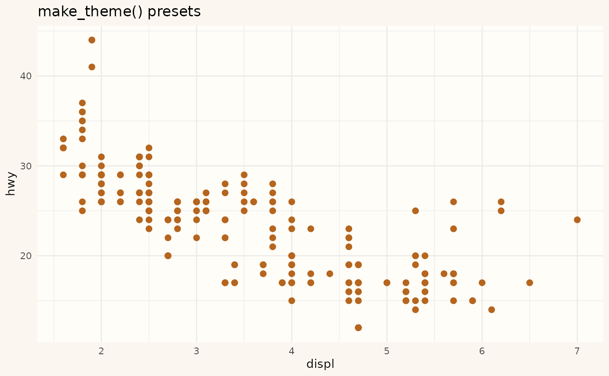
