# Gallery: Time, Polar & Coordinates

``` r

library(plotit)
```

## Polar recipes (composition, not new marks)

### Pie chart

[`mark_bar()`](https://zorrooz.github.io/plotit/reference/mark_bar.md)
with a constant x plus `project_polar(theta = "y")`: the stacked bars
wrap into sectors (the G2 “stack-on-a-circle” trick).

``` r

shares <- data.frame(
  segment = c("Mobile", "Desktop", "Tablet", "Console", "Other"),
  value = c(48, 27, 11, 9, 5)
)
shares |>
  plotit(encode(x = 1, y = value, fill = segment)) |>
  mark_bar(position = "stack", width = 1) |>
  project_polar(theta = "y") |>
  style(axis.text = ggplot2::element_blank(), axis.title = ggplot2::element_blank()) |>
  label_title("Pie = mark_bar + project_polar")
```

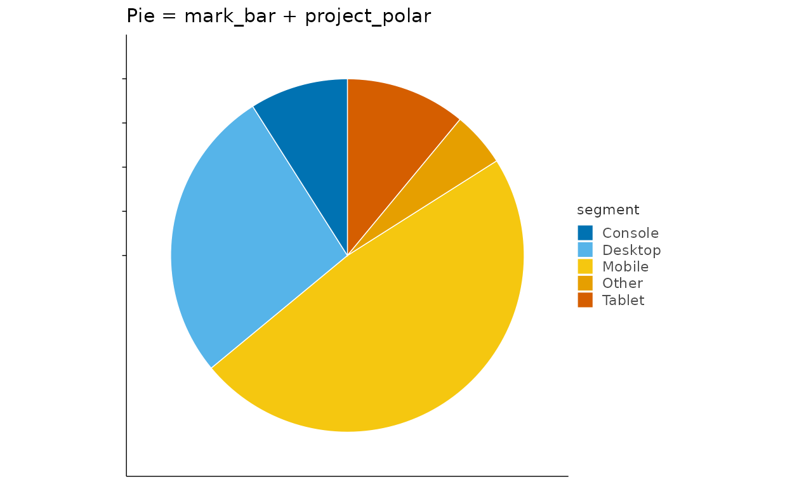

### Donut

``` r

shares |>
  plotit(encode(x = 1, y = value, fill = segment)) |>
  mark_bar(position = "stack", width = 1) |>
  project_polar(theta = "y", inner_radius = 0.45) |>
  style(axis.text = ggplot2::element_blank(), axis.title = ggplot2::element_blank()) |>
  label_title("Donut = same, inner_radius = 0.45")
```

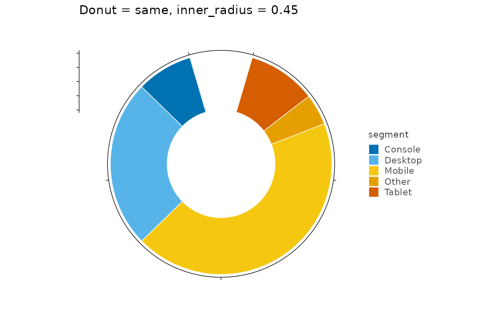

### Rose / Nightingale

``` r

weekly <- data.frame(
  day = c("Mon", "Tue", "Wed", "Thu", "Fri", "Sat", "Sun"),
  visits = c(12, 19, 15, 22, 26, 31, 24)
)
weekly |>
  plotit(encode(x = day, y = visits, fill = day)) |>
  mark_bar(width = 0.9) |>
  project_polar(inner_radius = 0.15) |>
  style(axis.text = ggplot2::element_blank(), axis.title = ggplot2::element_blank()) |>
  label_title("Rose: unstacked bars around the circle")
```

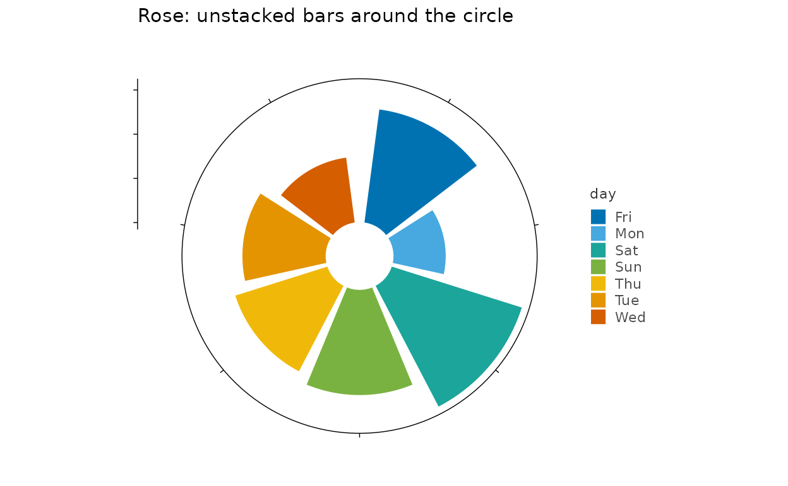

### Radar chart

``` r

skills <- data.frame(
  person = rep(c("Ada", "Lin"), each = 5),
  trait = factor(rep(c("design", "code", "research", "comms", "ops"), 2),
    levels = c("design", "code", "research", "comms", "ops")
  ),
  score = c(7, 9, 6, 5, 8, 9, 5, 7, 8, 6)
)
# A radar needs straight chords, which coord_polar cannot give a polygon
# (it arcs the connecting path). Pre-compute cartesian polar coordinates
# instead and close each person's ring back to the first vertex.
ring <- do.call(rbind, lapply(
  split(skills, skills$person, drop = TRUE),
  function(d) rbind(d, d[1, ])
))
theta <- (as.numeric(ring$trait) - 1) / 5 * 2 * pi
ring$px <- ring$score * sin(theta)
ring$py <- ring$score * cos(theta)
spokes <- do.call(rbind, lapply(seq_len(5), function(i) {
  a <- (i - 1) / 5 * 2 * pi
  data.frame(x = 0, y = 0, xend = 9 * sin(a), yend = 9 * cos(a))
}))
ring |>
  plotit(encode(x = px, y = py, colour = person, group = person), dodge = 0) |>
  mark_rule(
    data = spokes, mapping = encode(x = x, y = y, xend = xend, yend = yend),
    inherit.aes = FALSE, color = "grey85", linewidth = 0.3
  ) |>
  mark_polygon(alpha = 0.15, linewidth = 0.8) |>
  mark_point(size = 2) |>
  project_cartesian(fixed = 1) |>
  style(
    axis.text = ggplot2::element_blank(), axis.title = ggplot2::element_blank(),
    axis.ticks = ggplot2::element_blank(), panel.border = ggplot2::element_blank()
  ) |>
  label_title("Radar = polar coords + mark_polygon")
```

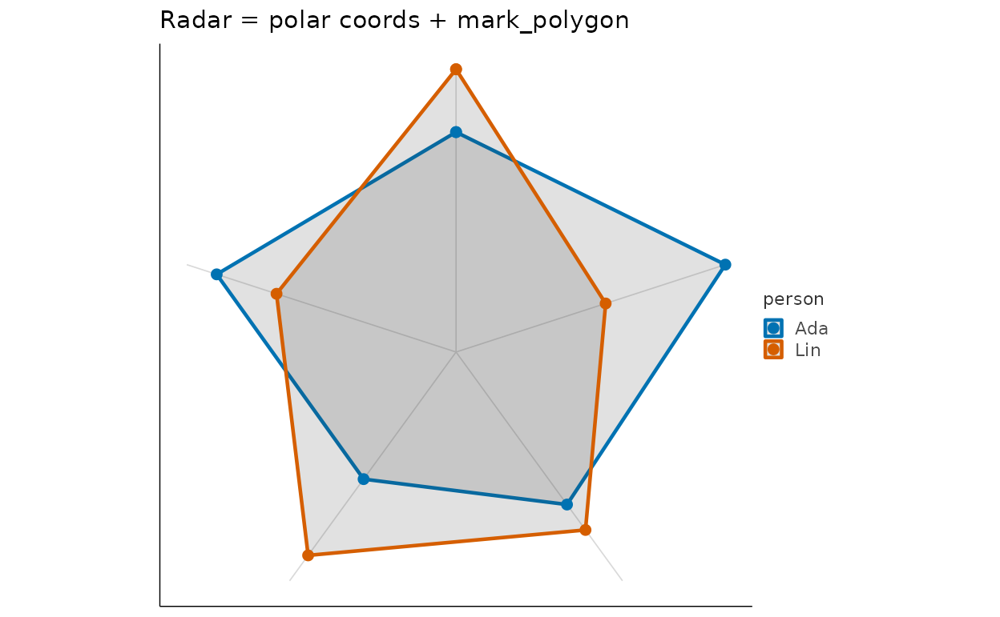

### Polar histogram

``` r

set.seed(5)
angles <- data.frame(
  a = c(rnorm(300, 0, 1), rnorm(300, 3, 0.7)),
  half = rep(c("low", "high"), each = 300)
)
angles |>
  plotit(encode(x = a, fill = half)) |>
  mark_histogram(bins = 24) |>
  project_polar() |>
  style(axis.text = ggplot2::element_blank(), axis.title = ggplot2::element_blank()) |>
  label_title("Circular histogram")
```

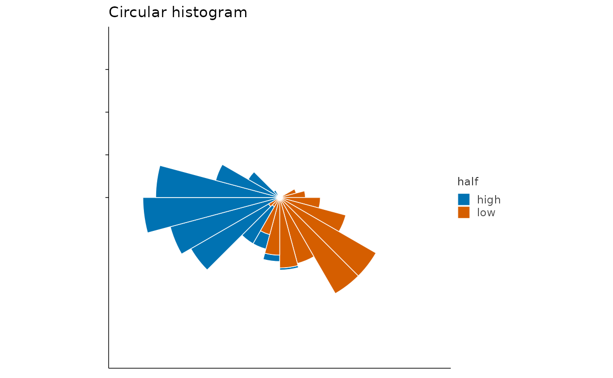

## Cartesian controls

### Flipped bars

``` r

iris |>
  plotit(encode(x = Species, y = Sepal.Length, fill = Species)) |>
  mark_boxplot() |>
  project_cartesian(flip = TRUE) |>
  label_title("project_cartesian(flip = TRUE)")
```

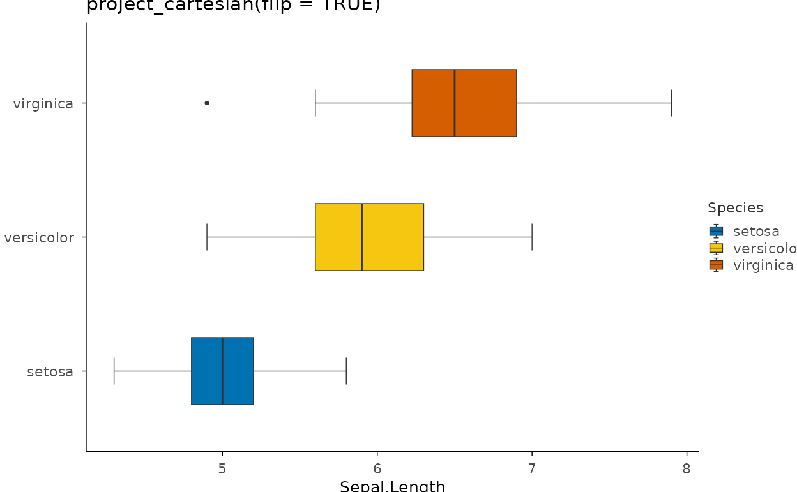

### Zoom without dropping data

``` r

ggplot2::mpg |>
  plotit(encode(x = displ, y = hwy, colour = class)) |>
  mark_point(size = 2) |>
  project_cartesian(xlim = c(1.6, 3), ylim = c(20, 35)) |>
  label_title("Zoom via xlim/ylim (statistics see all data)")
```

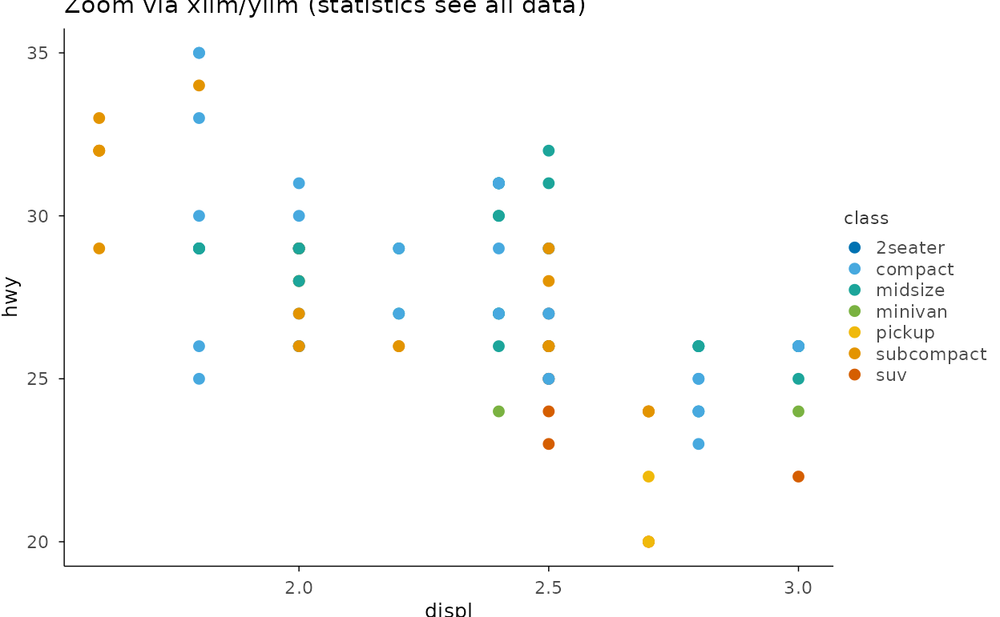

### Square panel for distance decay

``` r

set.seed(9)
circ <- data.frame(x = rnorm(120), y = rnorm(120), r = rep(1, 120))
circ |>
  plotit(encode(x = x, y = y)) |>
  mark_point(alpha = 0.4) |>
  project_cartesian(fixed = 1) |>
  label_title("project_cartesian(fixed = 1)")
```

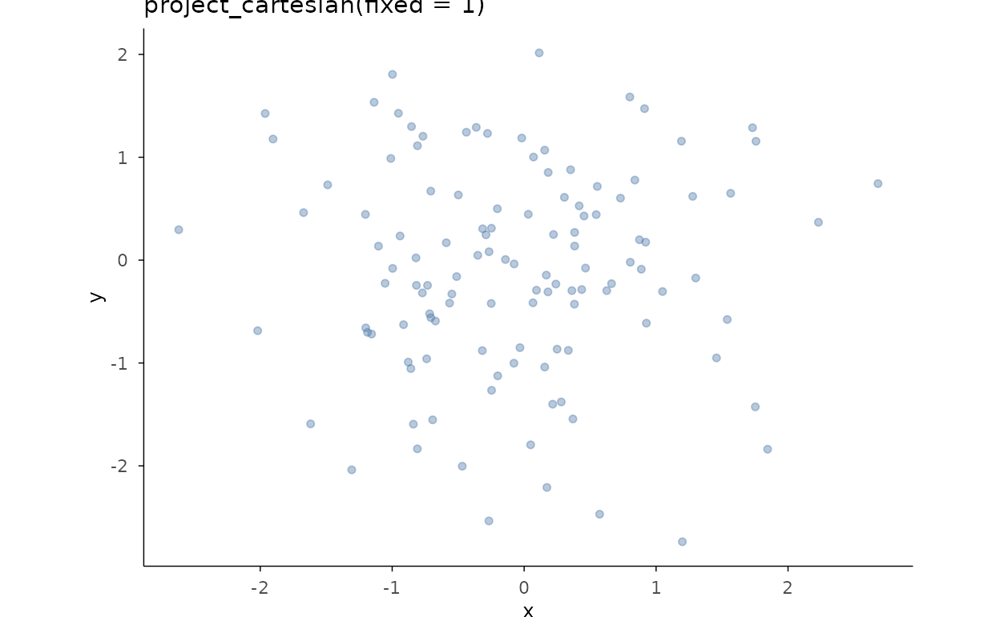

### Transformed coordinate panel

``` r

ggplot2::diamonds |>
  plotit(encode(x = price, y = carat)) |>
  mark_point(alpha = 0.4, size = 1) |>
  project_cartesian(coord_trans = "log10") |>
  label_title("coord_trans = \"log10\" (both axes)")
```

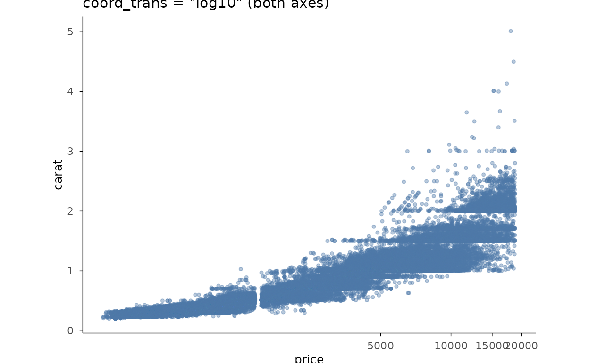

### Area chart

``` r

ggplot2::economics |>
  plotit(encode(x = date, y = unemploy)) |>
  mark_area(alpha = 0.6, fill = "#4E79A7") |>
  label_title("mark_area()")
```

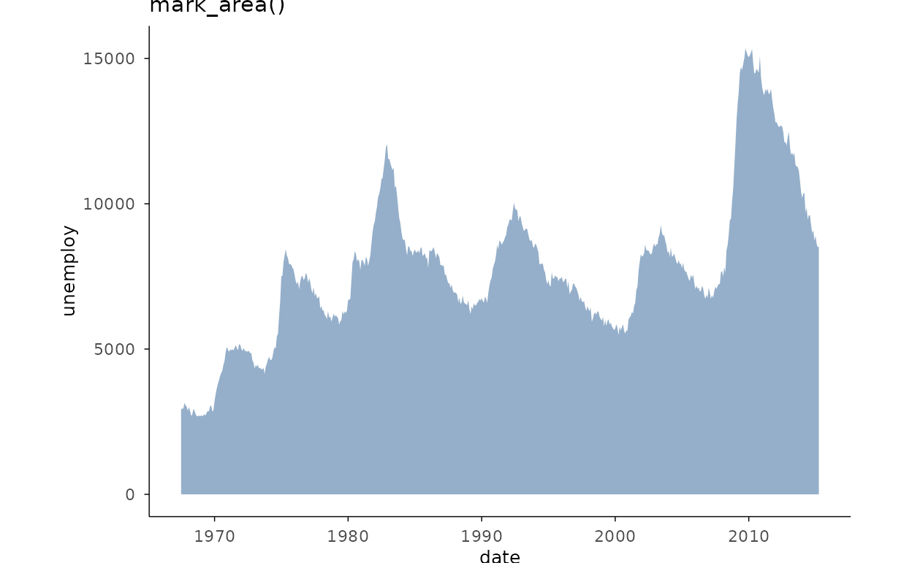

### Stacked area

``` r

sm <- subset(
  ggplot2::economics_long,
  variable %in% c("psavert", "uempmed")
)
sm$lab <- ifelse(sm$variable == "psavert", "savings", "duration")
sm |>
  plotit(encode(x = date, y = value, fill = lab)) |>
  mark_area(alpha = 0.75) |>
  label_title("Two stacked series (fill groups the stacking)")
```

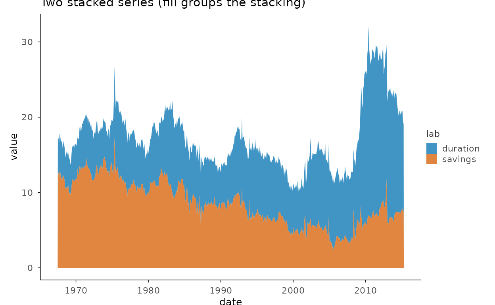

### Bubble radius encoding

``` r

ggplot2::midwest |>
  plotit(encode(x = popdensity, y = percprof, size = poptotal, colour = category)) |>
  mark_point(alpha = 0.6) |>
  scale_radius(range = c(1, 9)) |>
  label_title("scale_radius(): area grows with value^2")
```

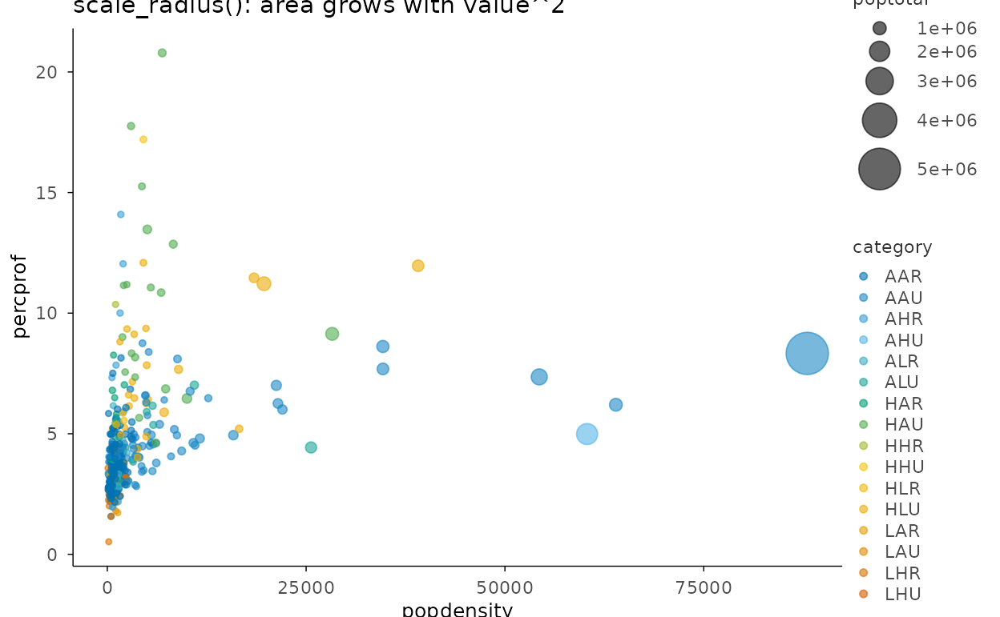

## Maps

``` r

nc <- sf::st_read(system.file("shape/nc.shp", package = "sf"), quiet = TRUE)
nc |>
  plotit(encode(geometry = geometry, fill = BIR74)) |>
  mark_map() |>
  scale_fill(trans = "binned", range = "viridis") |>
  project_map() |>
  label_title("Census tracts of North Carolina (mark_map + project_map)")
#> Scale for fill is already present.
#> Adding another scale for fill, which will replace the existing scale.
```

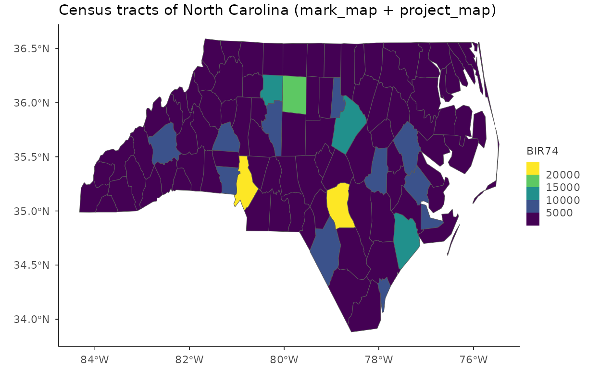
