# Gallery: Distributions

> **本页解决什么问题**：Explore one or two variables: histograms,
> density, ECDF, QQ, 2D bins. **前置**：已完成
> [gallery-comparisons](https://zorrooz.github.io/plotit/articles/articles/gallery-comparisons.md)

> **下一步**：→
> [gallery-relationships](https://zorrooz.github.io/plotit/articles/articles/gallery-relationships.md)

Distributions describe how values spread out. plotit’s distribution
marks reveal shape, tails, and relationships — from histograms and
densities to ECDFs, QQ plots, and bivariate binning.

## Histograms

### Histogram with 30 bins

[`mark_histogram()`](https://zorrooz.github.io/plotit/reference/mark_histogram.md)
bins a continuous variable and counts observations per bin. The `bins`
argument controls the resolution.

``` r

faithful |>
  plotit(encode(x = eruptions)) |>
  mark_histogram(bins = 30)
```

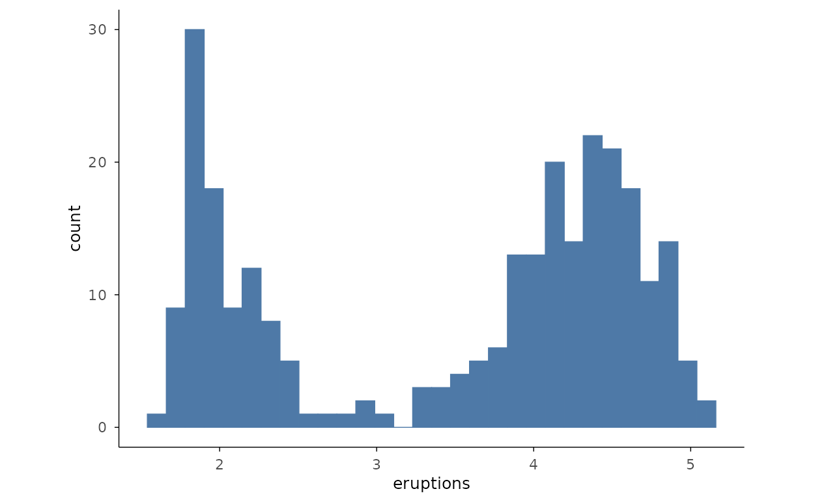

### Histograms by group

Filling by a categorical variable and lowering alpha lets several
histograms overlap on one panel. A small subset of `mpg` classes keeps
the comparison readable.

``` r

mpg2 <- ggplot2::mpg[ggplot2::mpg$class %in% c("compact", "suv", "pickup", "subcompact"), ]
mpg2 |>
  plotit(encode(x = hwy, fill = class)) |>
  mark_histogram(bins = 20, alpha = 0.5)
```

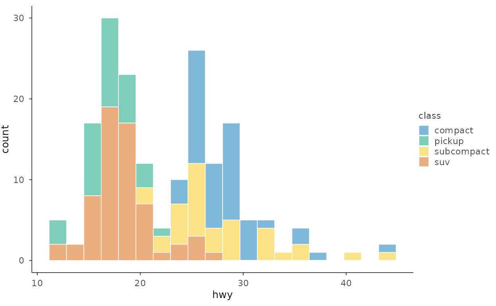

## Densities

### Density with custom bandwidth

[`mark_density()`](https://zorrooz.github.io/plotit/reference/mark_density.md)
estimates a smooth kernel density. The bandwidth `bw` (passed through
`...`) trades smoothness against detail — smaller values follow the data
more closely.

``` r

faithful |>
  plotit(encode(x = eruptions)) |>
  mark_density(bw = 0.15, alpha = 0.6)
```

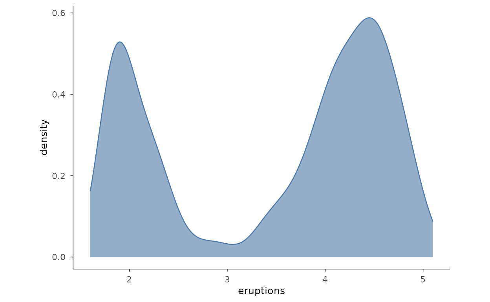

### Density by group

Coloured density curves overlay several groups for direct shape
comparison.

``` r

iris |>
  plotit(encode(x = Sepal.Length, colour = Species)) |>
  mark_density()
```

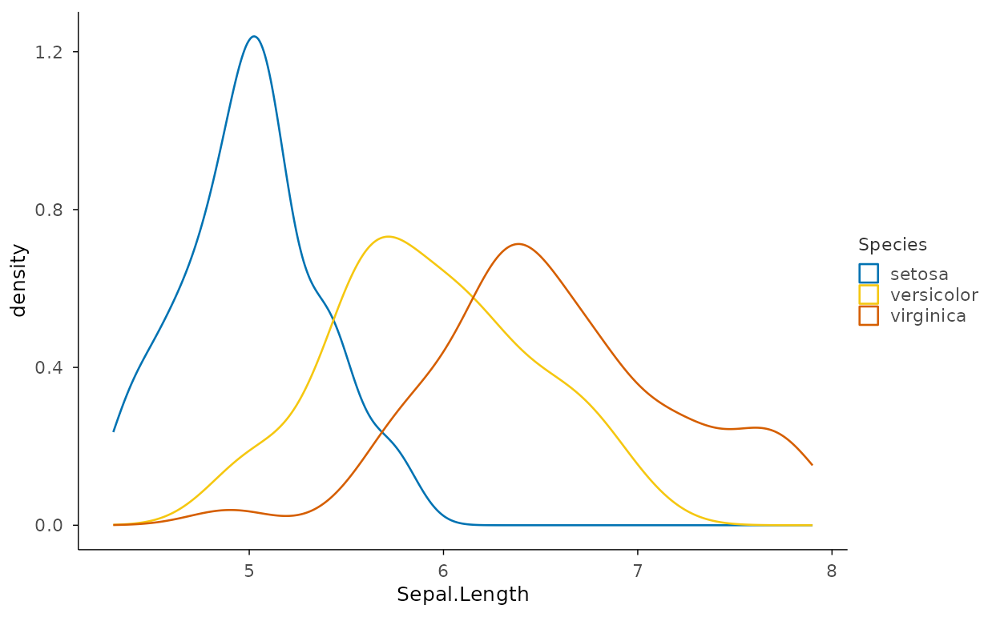

### Histogram and density overlay

Rescale the histogram with `after_stat(density)` so the bars and the
density curve share the same y scale.

``` r

faithful |>
  plotit(encode(x = eruptions)) |>
  mark_histogram(mapping = encode(y = ggplot2::after_stat(density)), bins = 30, alpha = 0.5) |>
  mark_density(bw = 0.15)
```

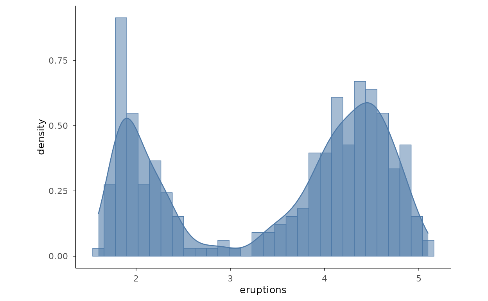

## Cumulative Distributions

### Empirical CDF

[`mark_ecdf()`](https://zorrooz.github.io/plotit/reference/mark_ecdf.md)
draws the empirical cumulative distribution function as a step with no
binning to choose — every point is represented exactly.

``` r

faithful |>
  plotit(encode(x = eruptions)) |>
  mark_ecdf()
```

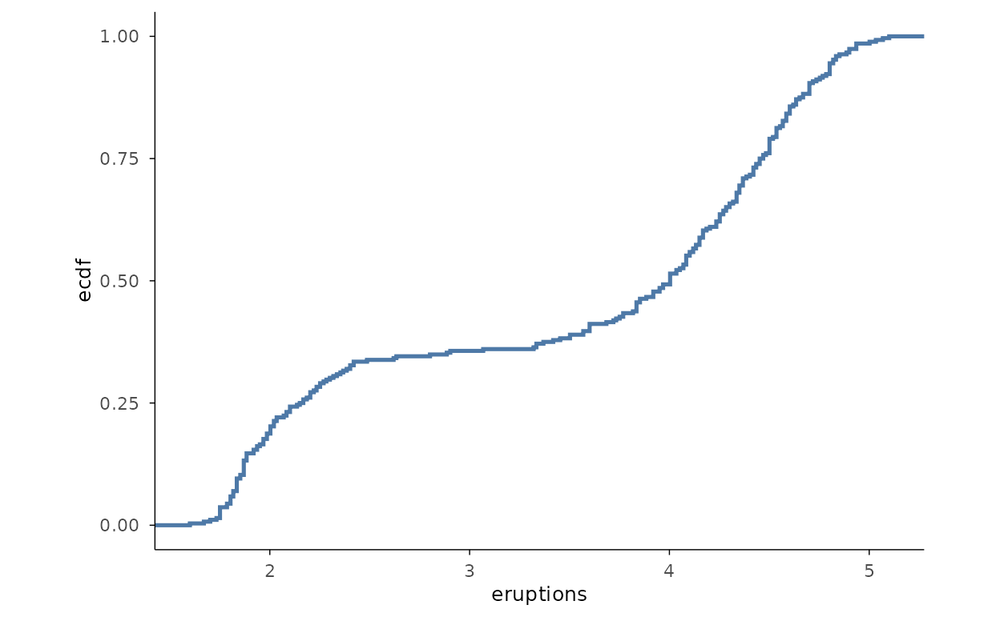

## Quantile-Quantile Plots

### QQ plot with normal reference

[`mark_qq()`](https://zorrooz.github.io/plotit/reference/mark_qq.md)
plots sample quantiles against the theoretical quantiles of a
distribution;
[`mark_qq_line()`](https://zorrooz.github.io/plotit/reference/mark_qq_line.md)
adds the fitted reference line. Deviations from the line signal
departures from normality.

``` r

faithful |>
  plotit(encode(x = eruptions)) |>
  mark_qq() |>
  mark_qq_line()
```

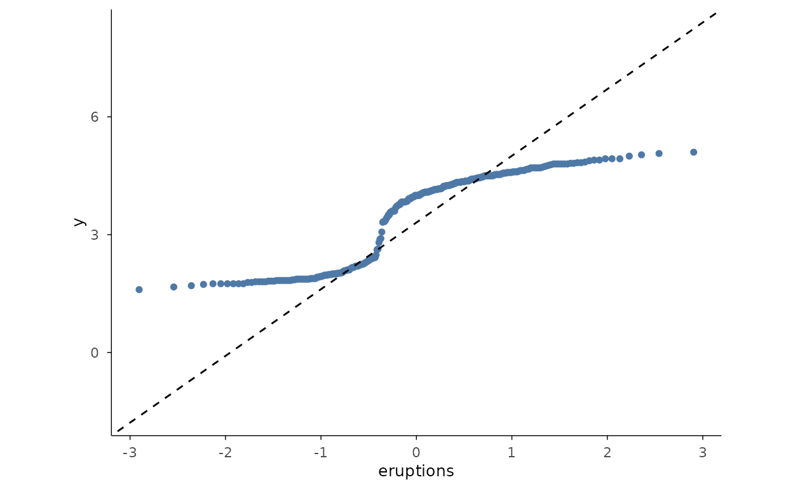

### QQ plot with exponential reference

Pass `distribution` to check against any theoretical distribution — here
`"exp"` for data simulated from an exponential. Both the points and the
line must use the same distribution.

``` r

set.seed(42)
rex <- data.frame(value = rexp(200))
rex |>
  plotit(encode(x = value)) |>
  mark_qq(distribution = "exp") |>
  mark_qq_line(distribution = "exp")
```

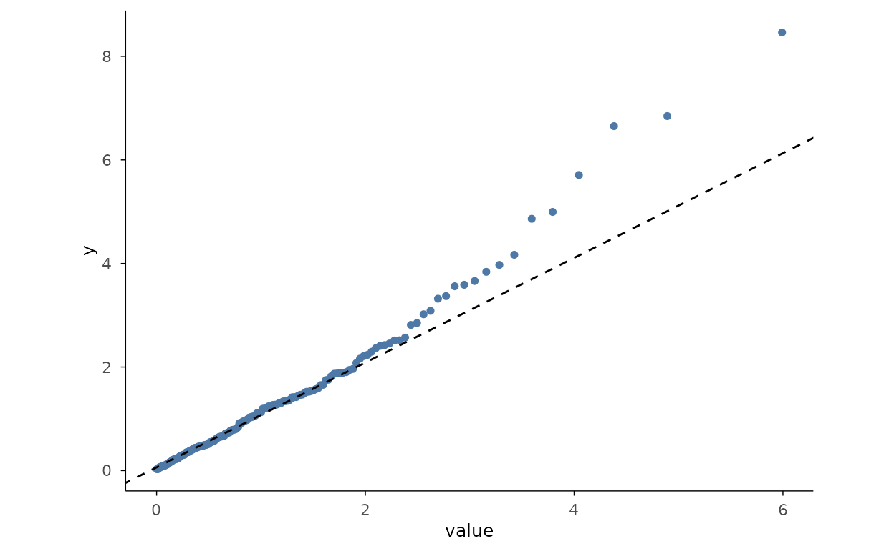

## Bivariate Distributions

### 2D density contours

[`mark_density_2d()`](https://zorrooz.github.io/plotit/reference/mark_density_2d.md)
draws contour lines of a two-dimensional kernel density — here the
classic `faithful` eruptions/waiting relationship.

``` r

faithful |>
  plotit(encode(x = eruptions, y = waiting)) |>
  mark_density_2d()
```

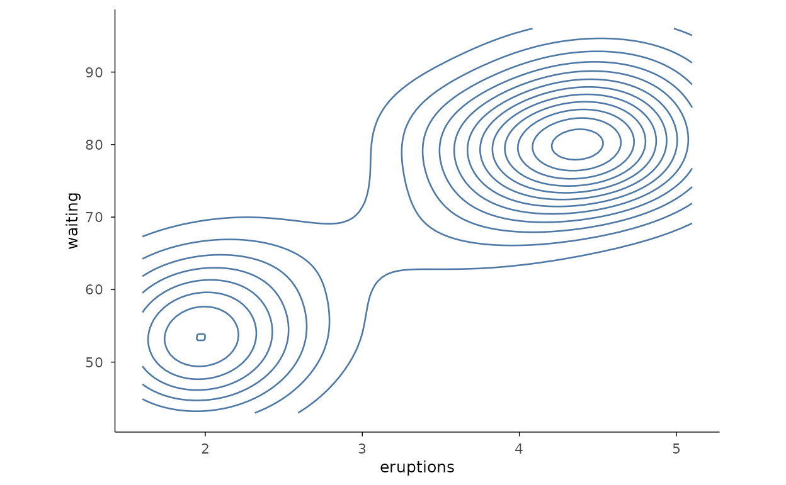

### Filled 2D density

With `filled = TRUE` the contour bands are filled, giving a topographic
view of where the density is highest.

``` r

faithful |>
  plotit(encode(x = eruptions, y = waiting)) |>
  mark_density_2d(filled = TRUE, bins = 10)
```

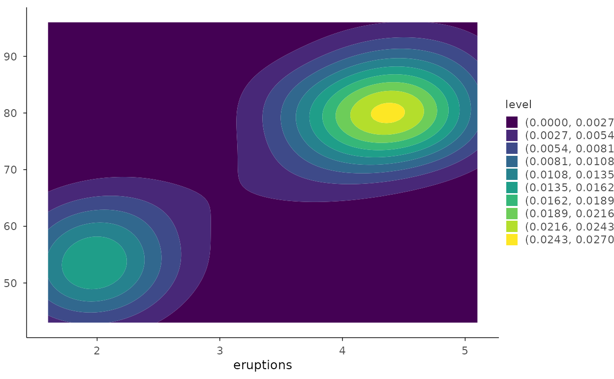

### Bin 2D

[`mark_bin2d()`](https://zorrooz.github.io/plotit/reference/mark_bin2d.md)
tiles the plane into a rectangular grid of counts — a clean way to
visualise overplotting in dense data.

``` r

set.seed(1)
dmid <- ggplot2::diamonds[ggplot2::diamonds$carat < 2, ]
dmid |>
  plotit(encode(x = carat, y = price)) |>
  mark_bin2d(bins = 20)
```

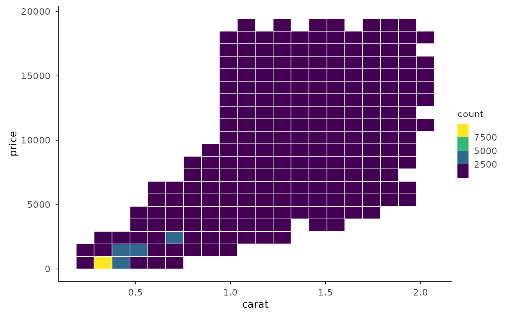

### Hexbin

[`mark_hex()`](https://zorrooz.github.io/plotit/reference/mark_hex.md)
bins into hexagons instead of squares, which avoids the visual bias of
axis-aligned rectangles.

``` r

dmid |>
  plotit(encode(x = carat, y = price)) |>
  mark_hex(bins = 30)
```

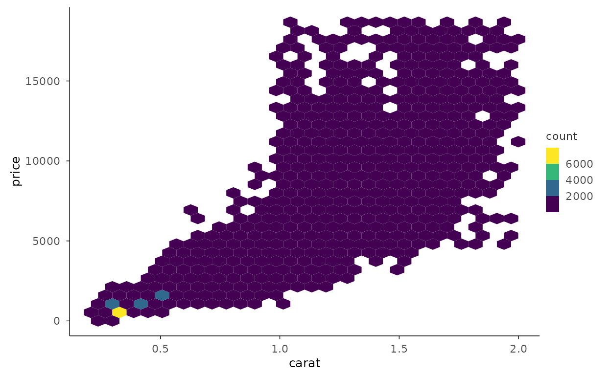

## Distribution Details

### Density with rug

[`mark_rug()`](https://zorrooz.github.io/plotit/reference/mark_rug.md)
adds a tick per observation along the axis, recovering the exact data
positions that a smooth density can hide.

``` r

faithful |>
  plotit(encode(x = eruptions)) |>
  mark_density() |>
  mark_rug(sides = "b", color = "grey30")
```

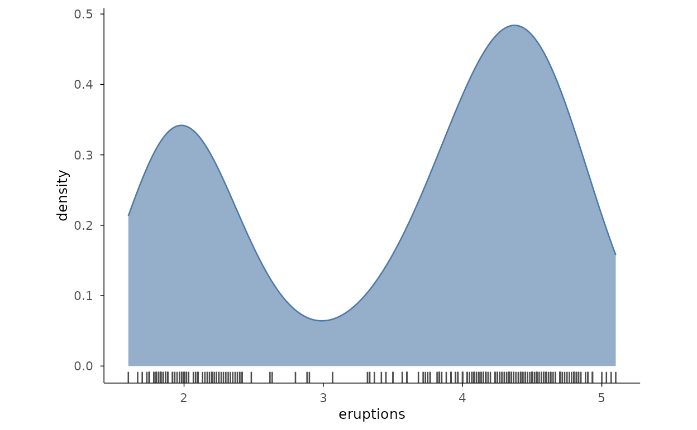

### Faceted histograms

[`split_wrap()`](https://zorrooz.github.io/plotit/reference/split_wrap.md)
repeats the histogram for each group in its own panel, avoiding the
overlap of stacked or dodged bins.

``` r

ggplot2::mpg |>
  plotit(encode(x = hwy)) |>
  mark_histogram(bins = 20) |>
  split_wrap(drv, ncol = 3)
```

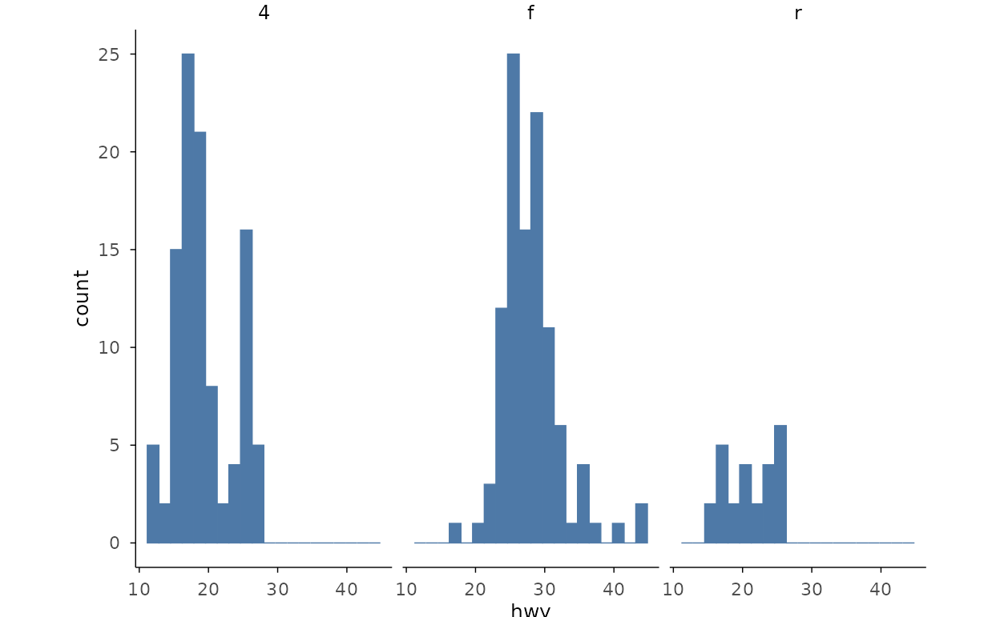

### Mean with standard error

Summarise groups into means with error bars for the standard error of
the mean.
[`mark_errorbar()`](https://zorrooz.github.io/plotit/reference/mark_errorbar.md)
takes `ymin`/`ymax` alongside `y`; the point shows the mean.

``` r

se <- function(x) sd(x) / sqrt(length(x))
grpm <- data.frame(
  Species = levels(iris$Species),
  mean = tapply(iris$Sepal.Length, iris$Species, mean),
  sem = tapply(iris$Sepal.Length, iris$Species, se)
)
grpm |>
  plotit(encode(x = Species, y = mean, ymin = mean - sem, ymax = mean + sem)) |>
  mark_point(size = 3) |>
  mark_errorbar(width = 0.2)
```

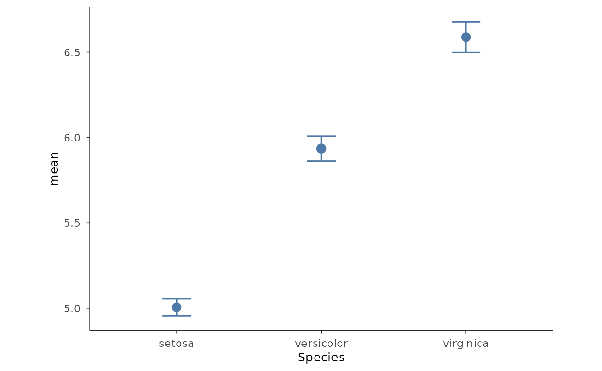
