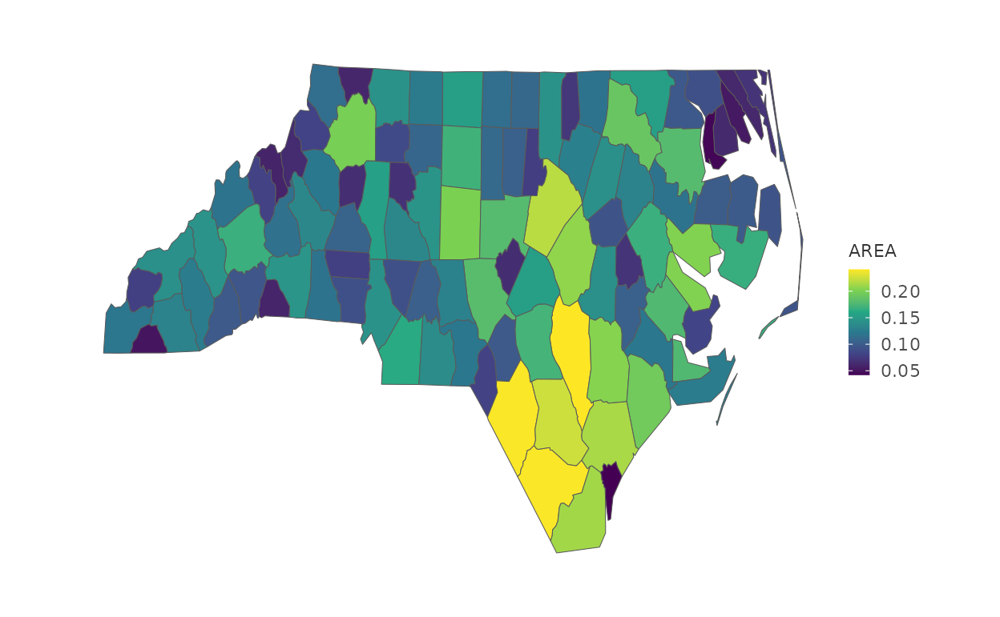

# Gallery: Geo

``` r

library(plotit)
```

Map support requires `sf`.
[`mark_map()`](https://zorrooz.github.io/plotit/reference/mark_map.md)
draws sf polygons; coordinate projection is handled by
[`project_map()`](https://zorrooz.github.io/plotit/reference/project_map.md).

## Choropleth

``` r

if (requireNamespace("sf", quietly = TRUE)) {
  nc <- sf::st_read(system.file("shape/nc.shp", package = "sf"), quiet = TRUE)
  nc |>
    plotit(encode(fill = AREA)) |>
    mark_map() |>
    scale_fill(range = "viridis") |>
    project_map()
}
#> Scale for fill is already present.
#> Adding another scale for fill, which will replace the existing scale.
```


## Point symbols over a map

``` r

nc |>
  plotit(encode(x = 1, y = 1)) |>
  mark_map(fill = "grey90", colour = "grey50") |>
  mark_point(mapping = encode(x = lon, y = lat), data = nc, size = 0.8)
```

## Recipe: spike / lollipop map (R-16)

`mark_spoke` on lon/lat (zero-length stems) gives radial bars; overlay
it on a `mark_map` base with `project_map`.

``` r

if (requireNamespace("sf", quietly = TRUE)) {
  nc |>
    plotit(encode(fill = AREA)) |>
    mark_map() |>
    scale_fill(range = "viridis") |>
    project_map()
}
#> Scale for fill is already present.
#> Adding another scale for fill, which will replace the existing scale.
```


