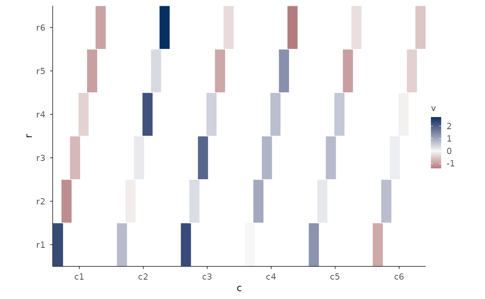
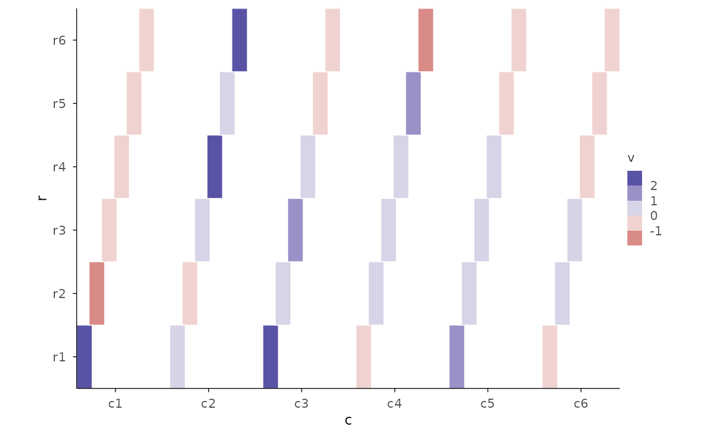
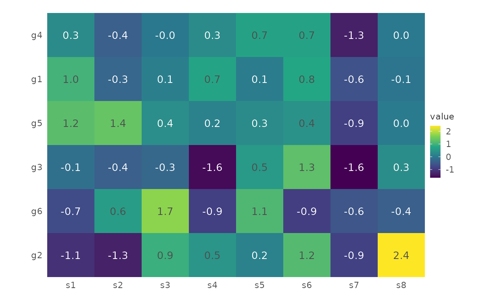
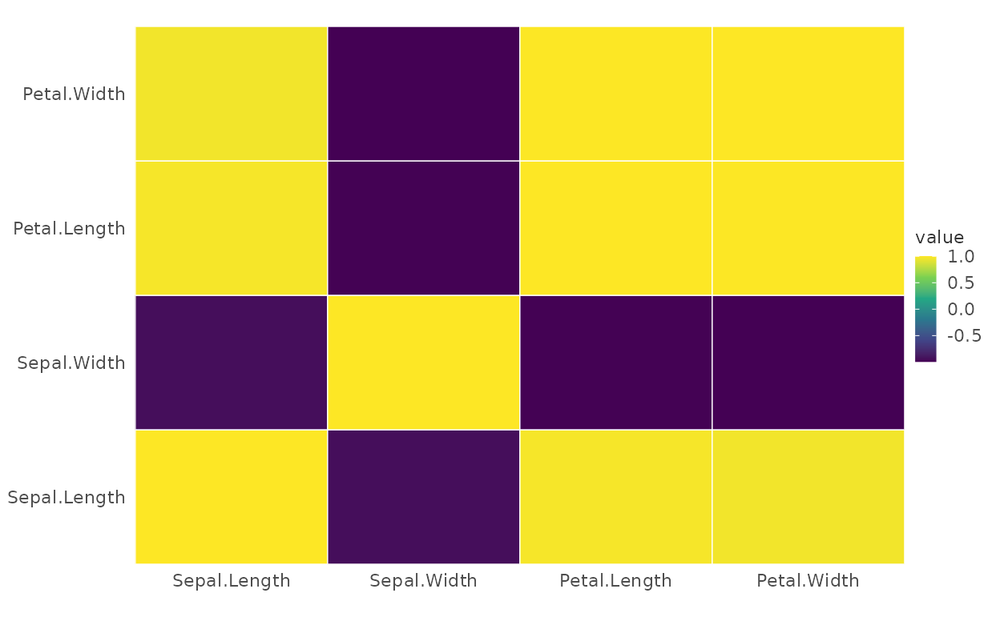
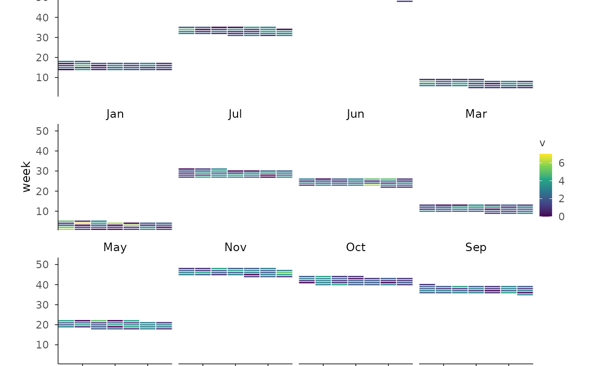

# Gallery: Matrix

``` r

library(plotit)
```

## Tile heatmaps from long data

### Rect heatmap with diverging scale (stage 5: mid + rdbu)

``` r

set.seed(7)
d <- expand.grid(r = paste0("r", 1:6), c = paste0("c", 1:6))
d$v <- rnorm(nrow(d))
d |>
  plotit(encode(x = c, y = r, fill = v)) |>
  mark_rect() |>
  scale_fill(mid = 0, range = "rdbu")
#> Scale for fill is already present.
#> Adding another scale for fill, which will replace the existing scale.
```



### Binned legend (stage 5: n_bins)

``` r

d |>
  plotit(encode(x = c, y = r, fill = v)) |>
  mark_rect() |>
  scale_fill(range = "rdylbu", n_bins = 5)
#> Scale for fill is already present.
#> Adding another scale for fill, which will replace the existing scale.
```



## mark_heatmap from a matrix

### Clustered with cell numbers

``` r

mat <- matrix(rnorm(48), nrow = 6, dimnames = list(paste0("g", 1:6), paste0("s", 1:8)))
h <- stats::hclust(stats::dist(mat))
plotit(mat, encode()) |>
  mark_heatmap(cluster = h, show_numbers = TRUE, number_format = "%.1f")
```



### Correlation matrix

``` r

plotit(stats::cor(iris[1:4])) |> mark_corr()
```



## Recipe: calendar heatmap (R-15)

Time bins + `mark_rect`, year/month faceted.

``` r

set.seed(7)
days <- seq(as.Date("2024-01-01"), as.Date("2024-12-31"), by = "day")
cal <- data.frame(d = days, v = rpois(length(days), 2))
cal$wday <- as.integer(format(days, "%u"))
cal$week <- as.integer(format(days, "%W"))
cal$mon <- format(days, "%b")
cal |>
  plotit(encode(x = wday, y = week, fill = v)) |>
  mark_rect() |>
  split_wrap(mon) |>
  scale_fill(range = "viridis")
#> Scale for fill is already present.
#> Adding another scale for fill, which will replace the existing scale.
```


