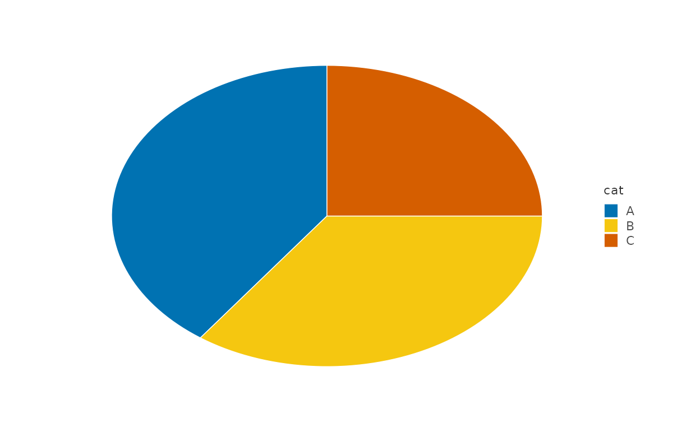
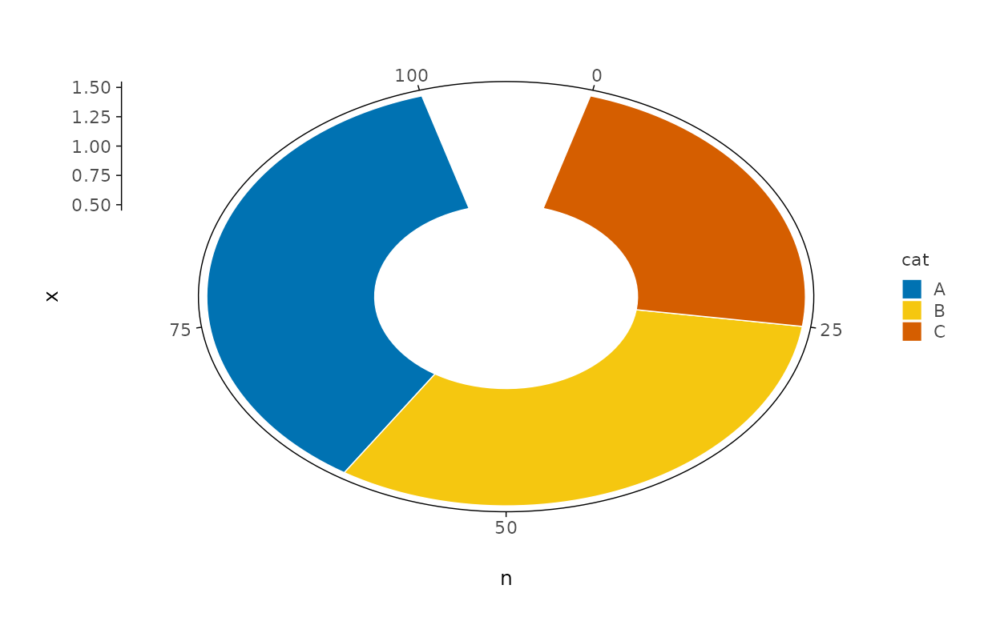
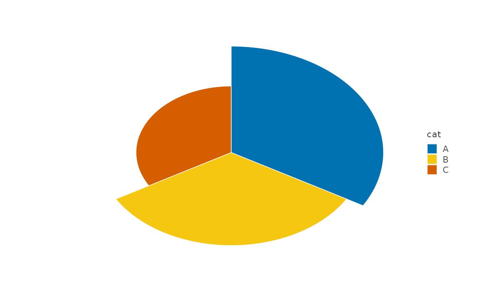
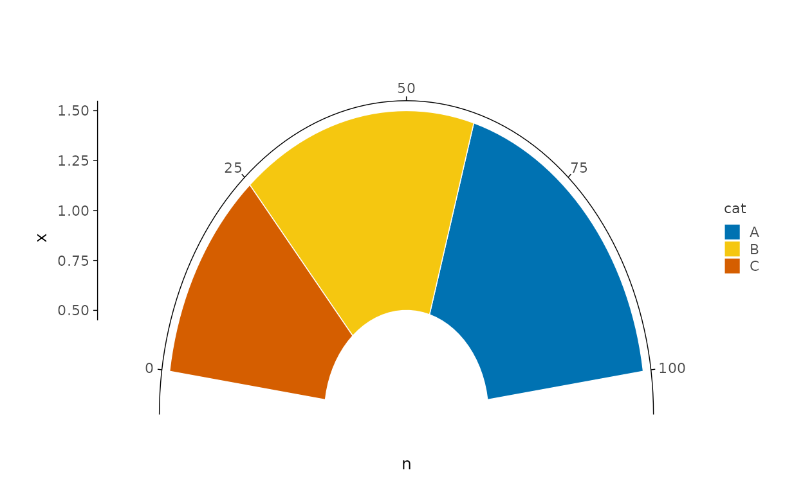
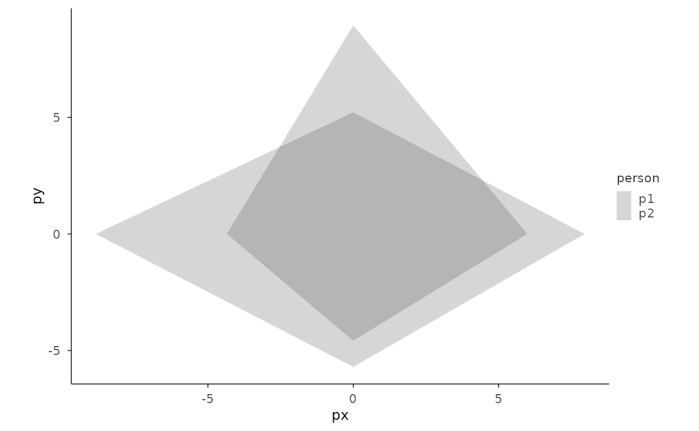

# Gallery: Proportions

``` r

library(plotit)
```

All proportion charts are **recipes**: `mark_bar` + `project_polar`. No
dedicated pie/rose/donut marks exist (composition-first principle).

## Pie and donut

``` r

d <- data.frame(cat = c("A", "B", "C"), n = c(40, 35, 25))
# Pie: single constant x + stack + polar(theta = "y")
d |>
  plotit(encode(x = 1, y = n, fill = cat)) |>
  mark_bar(position = "stack", width = 1) |>
  project_polar(theta = "y")
```



``` r

# Donut: add inner_radius
d |>
  plotit(encode(x = 1, y = n, fill = cat)) |>
  mark_bar(position = "stack", width = 1) |>
  project_polar(theta = "y", inner_radius = 0.4)
```



## Rose / Nightingale

``` r

d |>
  plotit(encode(x = cat, y = n, fill = cat)) |>
  mark_bar(width = 1) |>
  project_polar()
```



## Semicircle gauge (stage 5: start/end)

``` r

d |>
  plotit(encode(x = 1, y = n, fill = cat)) |>
  mark_bar(position = "stack", width = 1) |>
  project_polar(theta = "y", start = -pi / 2, end = pi / 2, inner_radius = 0.3)
```



## Radar (recipe)

Precomputed polar coordinates + `mark_polygon` in Cartesian space (see
AGENTS.md 3.2b).

``` r

set.seed(7)
lv <- 4
rd <- data.frame(
  variable = rep(letters[1:lv], 2),
  person = rep(c("p1", "p2"), each = lv),
  value = runif(lv * 2, 4, 9)
)
rd$theta <- (as.numeric(factor(rd$variable)) - 1) / lv * 2 * pi
rd$px <- rd$value * sin(rd$theta)
rd$py <- rd$value * cos(rd$theta)
rd |>
  plotit(encode(x = px, y = py, group = person, colour = person), dodge = 0) |>
  mark_polygon(alpha = 0.2) |>
  project_cartesian(fixed = 1)
```


