# Gallery: Relational Charts

Networks, flows, and hierarchies built with
[`as_graph()`](https://zorrooz.github.io/plotit/reference/as_graph.md) +
`layout_*()` transforms and the four relational sugar marks. See the
[Relational Charts
article](https://zorrooz.github.io/plotit/articles/relational.md) for
the full system.

## Networks

### Force-directed graph

``` r

edges <- data.frame(
  source = c("A", "A", "B", "B", "C", "D", "E", "A", "E"),
  target = c("B", "C", "C", "D", "D", "A", "A", "F", "F")
)
edges |>
  as_graph() |>
  plotit() |>
  layout_force(seed = 4) |>
  mark_rule(data = ~edges, color = "grey70") |>
  mark_point(data = ~nodes, size = 4) |>
  label_title("Nine edges, six nodes")
```

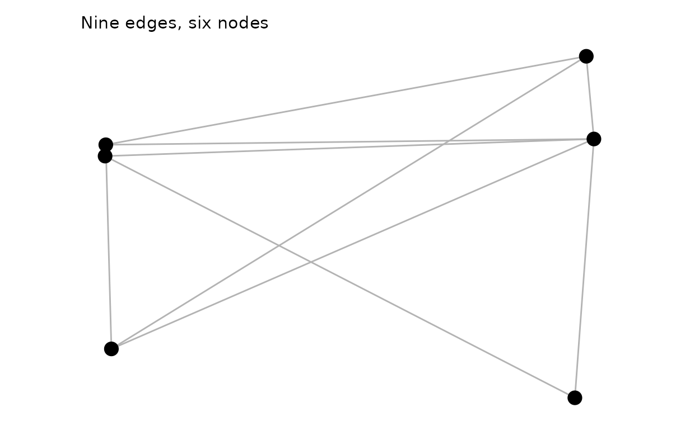

### Curved edges (sugar)

``` r

nodes <- data.frame(
  id   = c("A", "B", "C", "D", "E", "F"),
  type = c("hub", "spoke", "spoke", "spoke", "hub", "spoke")
)
nodes |>
  plotit(encode(colour = type, label = id)) |>
  mark_network(edges = edges, seed = 4, edge_shape = "curved", edge_alpha = 0.5) |>
  label_title("mark_network(edge_shape = \"curved\")")
```

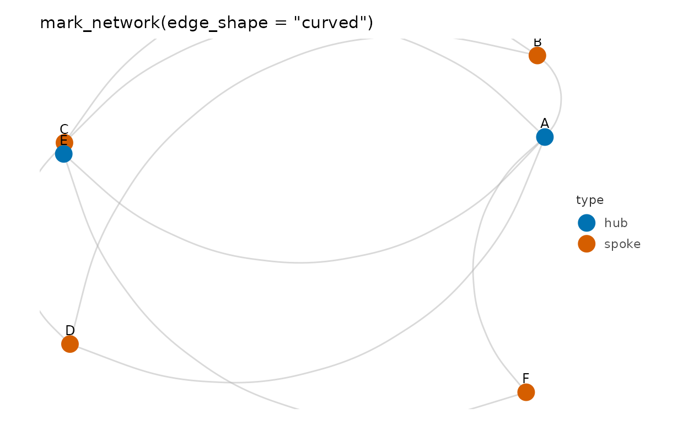

### Circular layout by degree

``` r

as_graph(edges, nodes = nodes) |>
  plotit() |>
  layout_circle(order_by = "degree") |>
  mark_curve(data = ~edges, curvature = 0.55, color = "grey60") |>
  mark_point(data = ~nodes, size = 4) |>
  label_title("layout_circle(order_by = \"degree\") + mark_curve")
```

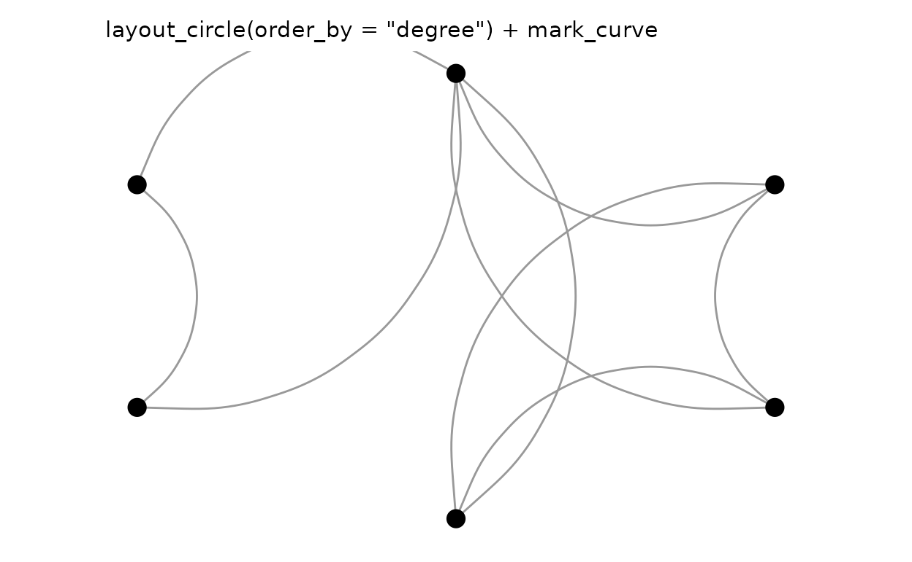

### Weighted force layout

``` r

w_edges <- data.frame(
  source = c("hub", "hub", "hub", "hub", "a", "b"),
  target = c("a", "b", "c", "d", "c", "d"),
  value  = c(5, 1, 1, 3, 4, 2)
)
w_graph <- as_graph(w_edges)
w_graph |>
  plotit() |>
  layout_force(seed = 1, weights = w_graph$edges$value) |>
  mark_rule(data = ~edges, encode(linewidth = value), color = "grey60") |>
  mark_point(data = ~nodes, size = 4) |>
  label_title("layout_force(weights = ...): thick edges pull harder")
```

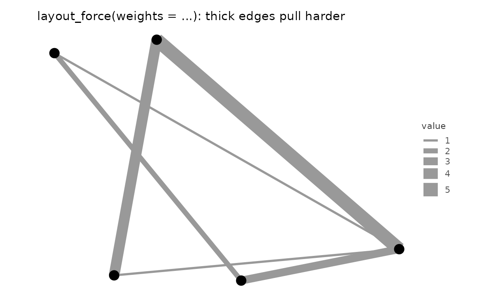

## Flows

### Sankey diagram

``` r

flows <- data.frame(
  source = c("coal", "gas", "gas", "nuclear", "solar", "solar", "wind"),
  target = c(
    "electricity", "electricity", "industry", "electricity",
    "electricity", "homes", "electricity"
  ),
  value = c(22, 30, 12, 18, 6, 4, 9)
)
flows |>
  plotit(encode(
    source = source, target = target,
    value = value, fill = source
  )) |>
  mark_sankey() |>
  label_title("mark_sankey()")
#> Coordinate system already present.
#> ℹ Adding new coordinate system, which will replace the existing one.
```

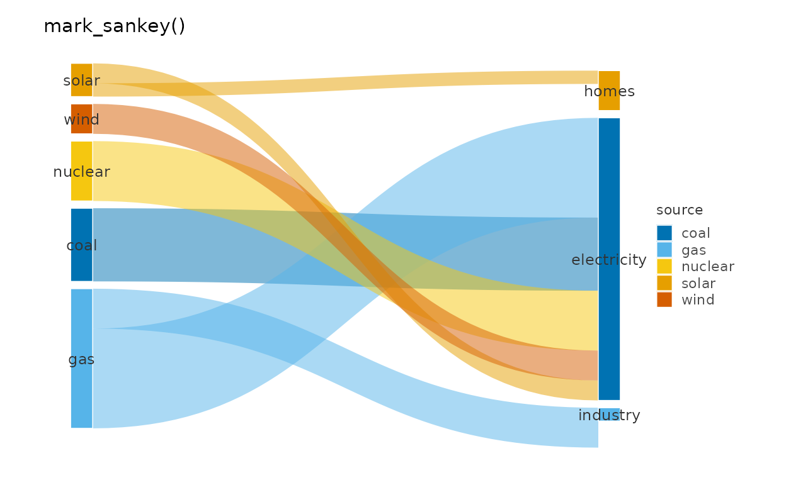

### Sankey with explicit pipeline

``` r

flows |>
  as_graph(directed = TRUE) |>
  plotit() |>
  layout_sankey(padding = 0.05, curvature = 0.6) |>
  mark_polygon(
    data = ~ribbons,
    encode(fill = source, group = .ribbon_id),
    alpha = 0.5
  ) |>
  mark_rect(data = ~nodes, fill = "grey30") |>
  mark_text(
    data = ~nodes, encode(x = xc, y = yc, label = id),
    size = 3, colour = "grey20"
  ) |>
  project_cartesian(clip = "off") |>
  label_title("layout_sankey() + primitives")
#> Coordinate system already present.
#> ℹ Adding new coordinate system, which will replace the existing one.
```

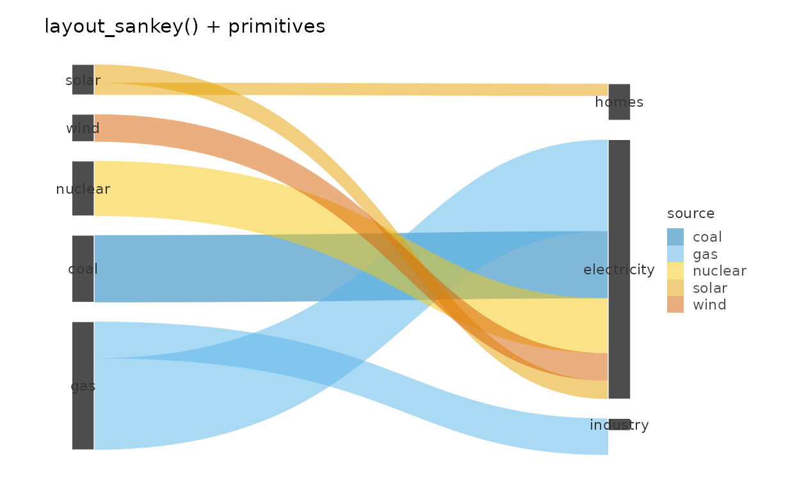

### Chord from an edge table

``` r

chord_edges <- data.frame(
  source = c("A", "A", "B", "B", "C", "C", "D"),
  target = c("B", "C", "C", "D", "D", "A", "A"),
  value  = c(8, 5, 6, 9, 4, 2, 7)
)
chord_edges |>
  plotit(encode(
    source = source, target = target,
    value = value, fill = source
  )) |>
  mark_chord() |>
  label_title("mark_chord()")
```

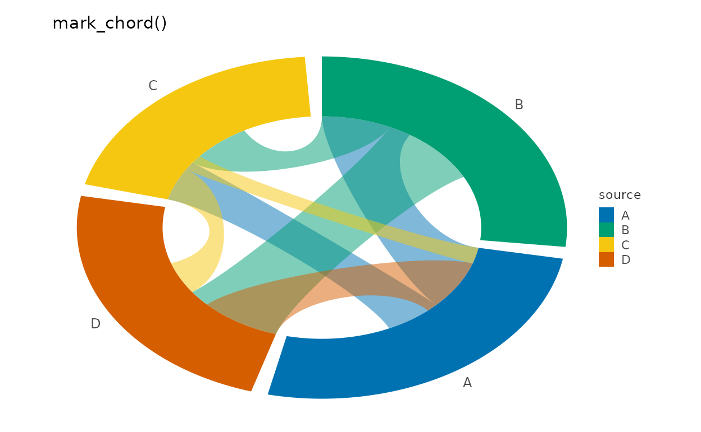

### Chord from an adjacency matrix

``` r

mat <- matrix(c(0, 5, 2, 8, 0, 3, 1, 4, 0),
  nrow = 3,
  dimnames = list(
    c("email", "browsers", "news"),
    c("email", "browsers", "news")
  )
)
as_graph(mat, directed = TRUE)$edges |>
  plotit(encode(
    source = source, target = target,
    value = value, fill = source
  )) |>
  mark_chord(gap_width = 8) |>
  label_title("as_graph() melts the matrix automatically")
```


## Hierarchies

### Treemap

``` r

h <- data.frame(
  id = c(
    "world", "america", "africa", "asia", "n-a", "s-a",
    "north", "south", "china", "india"
  ),
  parent = c(
    NA, "world", "world", "world", "america", "america",
    "africa", "africa", "asia", "asia"
  ),
  value = c(NA, NA, NA, NA, 36, 21, 11, 9, 14, 6)
)
h |>
  plotit(encode(fill = id)) |>
  mark_treemap() |>
  label_title("mark_treemap()")
```


### Treemap via explicit pipeline

``` r

as_graph(h) |>
  plotit() |>
  layout_treemap() |>
  mark_rect(
    data = ~leaves,
    encode(
      xmin = xmin, xmax = xmax, ymin = ymin, ymax = ymax,
      fill = id
    )
  ) |>
  mark_text(
    data = ~leaves,
    encode(x = xc, y = yc, label = id),
    size = 3, colour = "white"
  ) |>
  label_title("layout_treemap() + mark_rect(~leaves)")
```

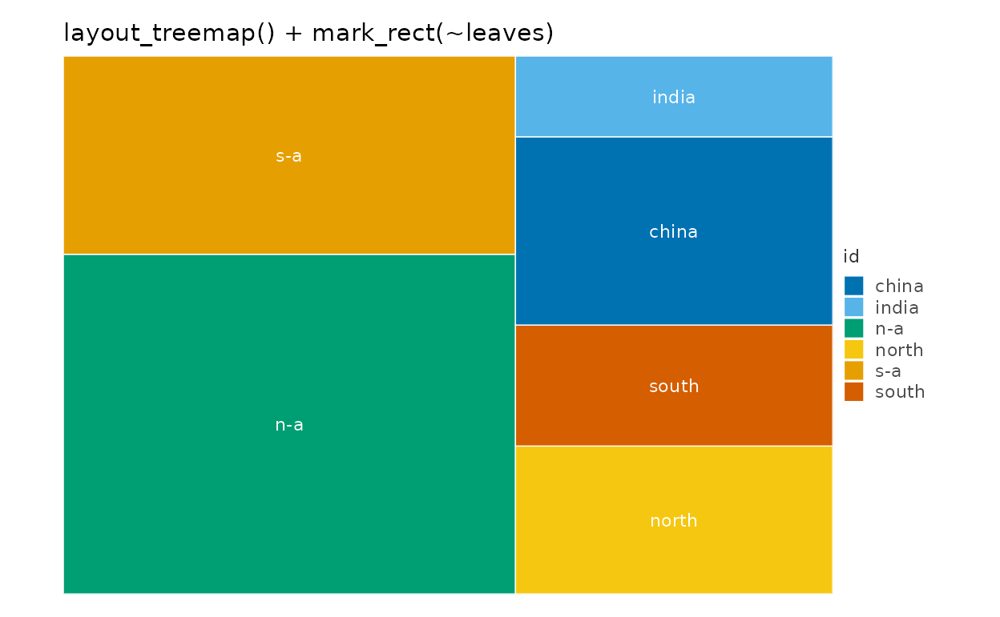

### Orthogonal tree

``` r

tree <- data.frame(
  id     = c("root", "a", "b", "a1", "a2", "a3", "b1", "b2", "b1x"),
  parent = c(NA, "root", "root", "a", "a", "a", "b", "b", "b1")
)
tree |>
  as_graph() |>
  plotit() |>
  layout_tree(direction = "down") |>
  mark_rule(data = ~edges) |>
  mark_point(data = ~nodes, size = 3) |>
  label_title("layout_tree(direction = \"down\")")
```

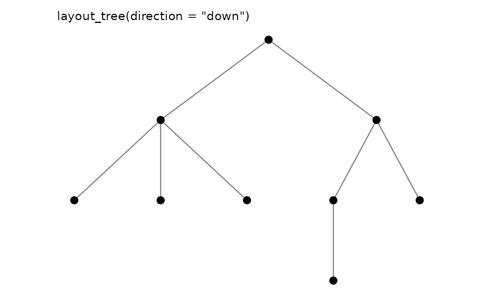

### Dendrogram from hclust

``` r

# A 150-leaf dendrogram smears its labels into an unreadable band; a small
# subset keeps the tree structure legible.
iris15 <- iris[c(1:5, 51:55, 101:105), 1:4]
rownames(iris15) <- paste0(rep(c("set", "ver", "vir"), each = 5), ".", 1:5)
hc <- hclust(dist(iris15), method = "ward.D2")
p_dend <- as_graph(hc) |>
  plotit() |>
  layout_dendrogram()
p_dend |>
  mark_rule(data = ~edges) |>
  mark_text(
    data = subset(p_dend@graph$nodes, leaf),
    mapping = encode(x = x, y = y, label = id),
    size = 2.5, angle = 90, hjust = 1, vjust = 0.5
  ) |>
  label_title("as_graph(hclust) + layout_dendrogram()")
```

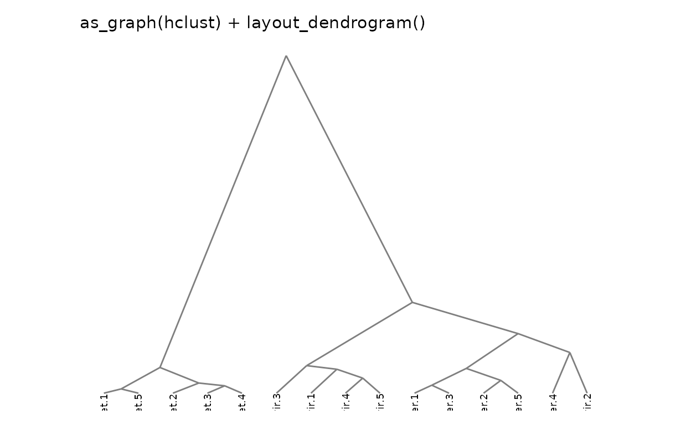

### Radial tree

``` r

tree |>
  as_graph() |>
  plotit() |>
  layout_tree(direction = "right") |>
  mark_rule(data = ~edges) |>
  mark_point(data = ~nodes, size = 2.5) |>
  project_polar(theta = "y") |>
  label_title("layout_tree + project_polar(theta = \"y\")")
```

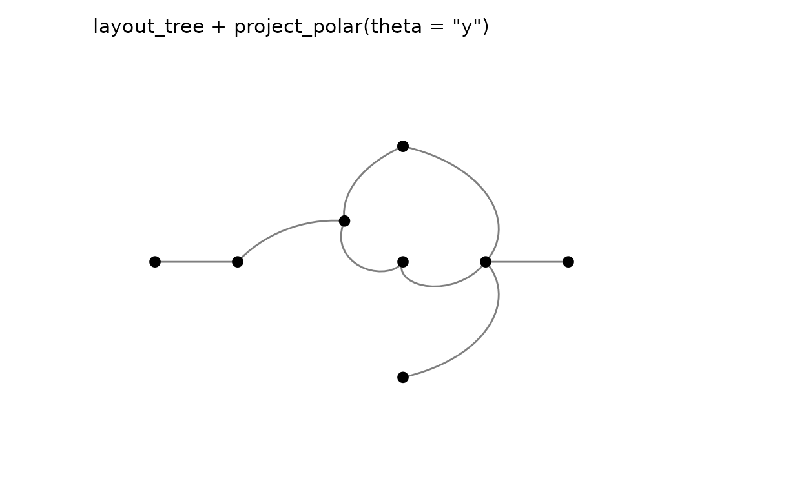

## Relations as grids

### Adjacency-matrix heatmap

``` r

df <- as.data.frame(as.table(mat))
names(df) <- c("source", "target", "value")
df |>
  plotit(encode(x = source, y = target, fill = value)) |>
  mark_rect() |>
  label_title("mark_rect on a melted flow matrix")
```

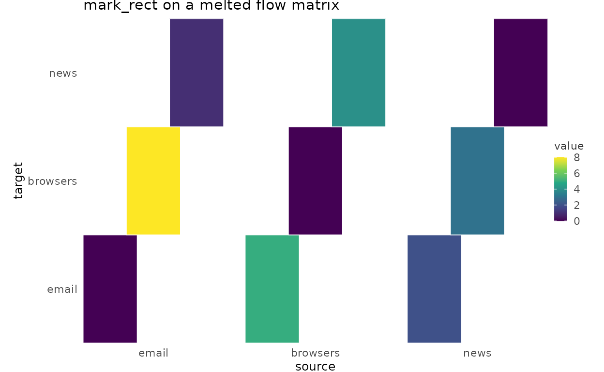

### Correlation of graph attributes

``` r

set.seed(11)
iris_num <- iris[, 1:4]
iris_num |>
  plotit(encode()) |>
  mark_corr(method = "spearman") |>
  label_title("mark_corr(method = \"spearman\")")
```

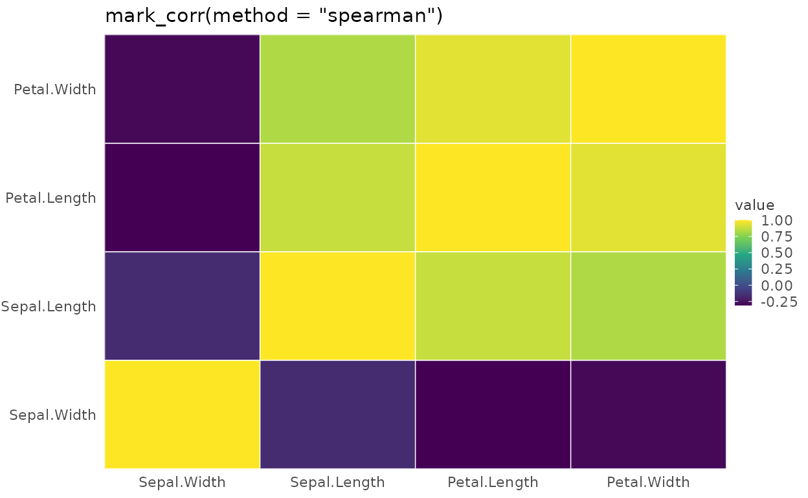
