# Gallery: Relationships & Trends

> **本页解决什么问题**：Show relations between continuous variables:
> points, smooths, counts. **前置**：已完成
> [gallery-distributions](https://zorrooz.github.io/plotit/articles/articles/gallery-distributions.md)

> **下一步**：→
> [gallery-coordinates](https://zorrooz.github.io/plotit/articles/articles/gallery-coordinates.md)

``` r

library(plotit)
```

## Scatter designs

### Grouped scatter

``` r

ggplot2::mpg |>
  plotit(encode(x = displ, y = hwy, colour = class)) |>
  mark_point(size = 2, alpha = 0.8) |>
  label_title("Highway mileage by engine class")
```

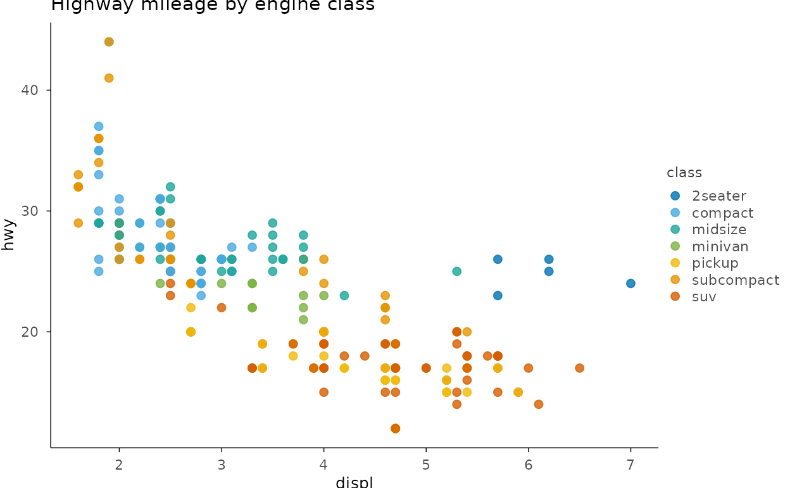

### Count-adjusted points

``` r

set.seed(7)
ggplot2::mpg |>
  plotit(encode(x = displ, y = class)) |>
  mark_count() |>
  label_title("mark_count(): points sized by overlap")
```

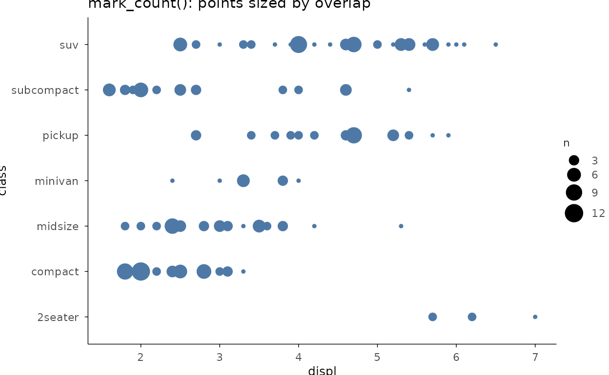

### Log-log with a linear fit

``` r

set.seed(3)
dm <- ggplot2::diamonds[sample(nrow(ggplot2::diamonds), 600), ]
dm |>
  plotit(encode(x = carat, y = price)) |>
  mark_point(alpha = 0.5, size = 1.5) |>
  mark_smooth(method = "lm", se = FALSE, colour = "#E15759") |>
  scale_x(trans = "log10") |>
  scale_y(trans = "log10") |>
  label_title("Price vs carat on log axes")
#> `geom_smooth()` using formula = 'y ~ x'
```

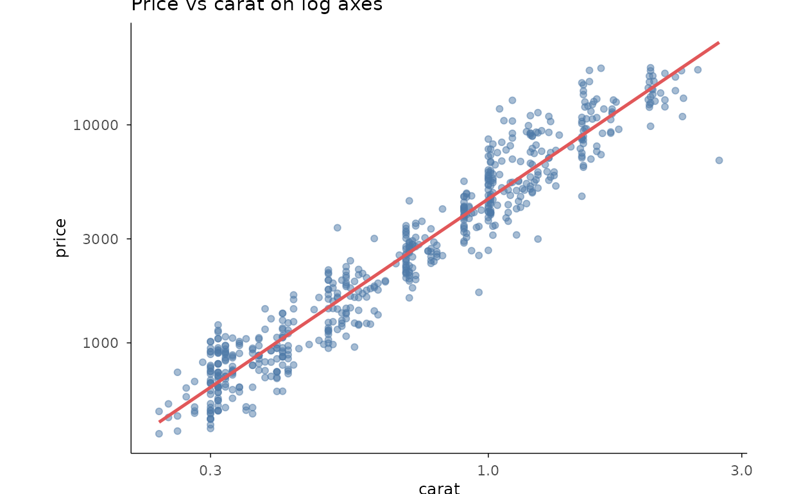

### Hexagonal density

``` r

dm |>
  plotit(encode(x = carat, y = price)) |>
  mark_hex(bins = 18) |>
  label_title("mark_hex(): dense scatter as a 2D heatmap")
```

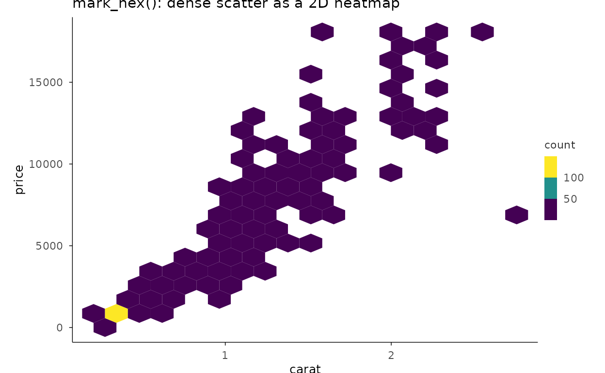

## Trends over time

### Line + smoothed trend

``` r

ggplot2::economics |>
  plotit(encode(x = date, y = unemploy)) |>
  mark_line() |>
  mark_smooth(
    method = "loess", formula = y ~ x, se = TRUE,
    colour = "#E15759", linewidth = 0.6
  ) |>
  label_title("Unemployment with a loess trend")
```

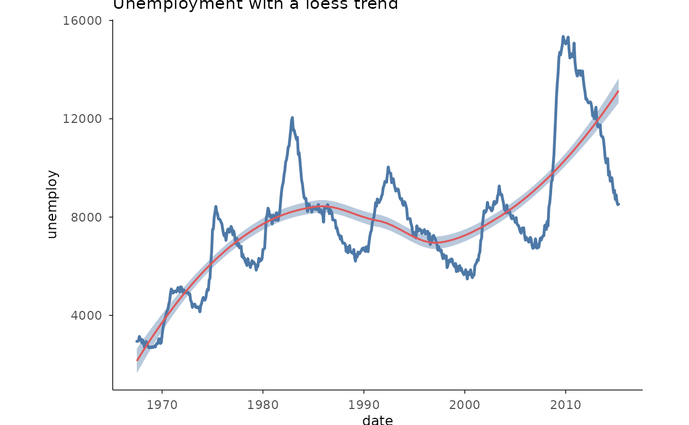

### Multi-series lines

``` r

two <- subset(
  ggplot2::economics_long,
  variable %in% c("psavert", "uempmed")
)
two |>
  plotit(encode(x = date, y = value, colour = variable)) |>
  mark_line() |>
  label_axis("value", aes = "y") |>
  label_title("Two series from economics_long")
```

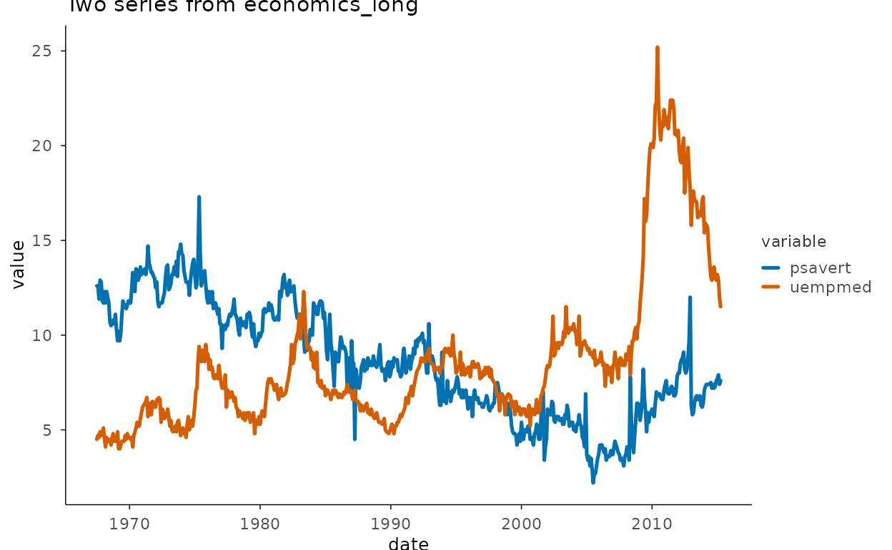

### Step series

``` r

ggplot2::economics |>
  plotit(encode(x = date, y = psavert)) |>
  mark_step(direction = "hv") |>
  label_title("mark_step(direction = \"hv\")")
```

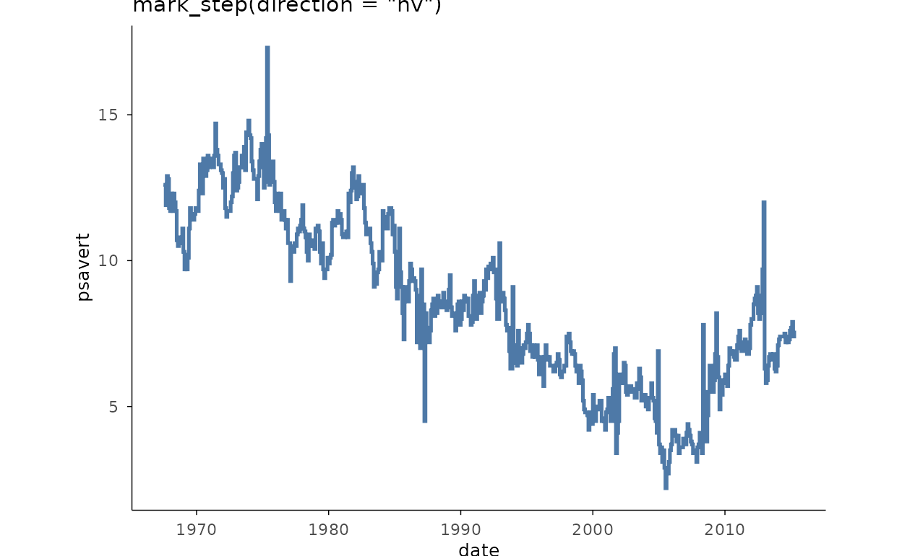

### Fitted band + line (area as interval)

``` r

fit <- stats::loess(mpg ~ wt, data = mtcars)
grid_wt <- data.frame(wt = seq(min(mtcars$wt), max(mtcars$wt), length.out = 60))
pr <- stats::predict(fit, grid_wt, se = TRUE)
grid_wt$fit <- pr$fit
grid_wt$lo <- pr$fit - 1.96 * pr$se.fit
grid_wt$hi <- pr$fit + 1.96 * pr$se.fit
mtcars |>
  plotit(encode(x = wt, y = mpg)) |>
  mark_point(size = 1.5, alpha = 0.55) |>
  mark_area(
    data = grid_wt,
    mapping = encode(x = wt, ymin = lo, ymax = hi),
    inherit.aes = FALSE, alpha = 0.25, fill = "#4E79A7"
  ) |>
  mark_line(
    data = grid_wt, mapping = encode(x = wt, y = fit),
    inherit.aes = FALSE
  ) |>
  label_title("Confidence envelope via mark_area(ymin/ymax)")
```

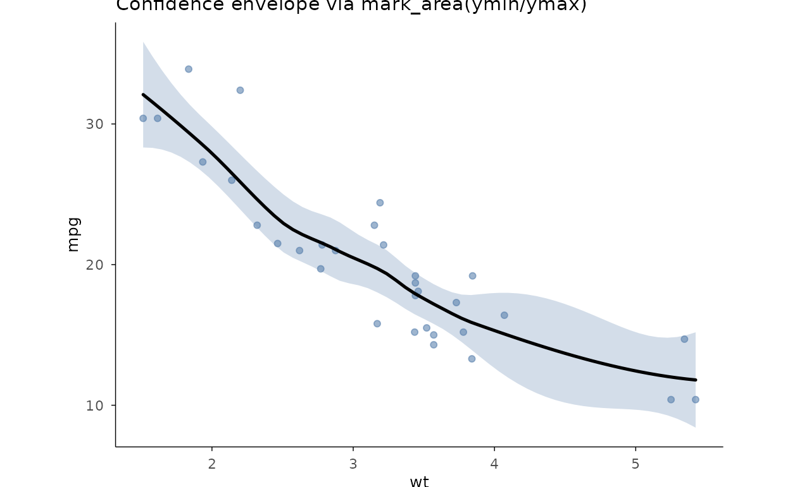

## Two-group comparisons

### Dumbbell

``` r

db <- data.frame(
  item = letters[1:6],
  before = c(3.2, 4.1, 2.6, 5.0, 3.7, 4.6),
  after = c(4.4, 3.5, 3.9, 4.7, 4.8, 3.9)
)
db |>
  plotit(encode(x = item, y = before, yend = after)) |>
  mark_dumbbell(point_size = 3) |>
  project_cartesian(flip = TRUE) |>
  label_title("Before / after per item")
```

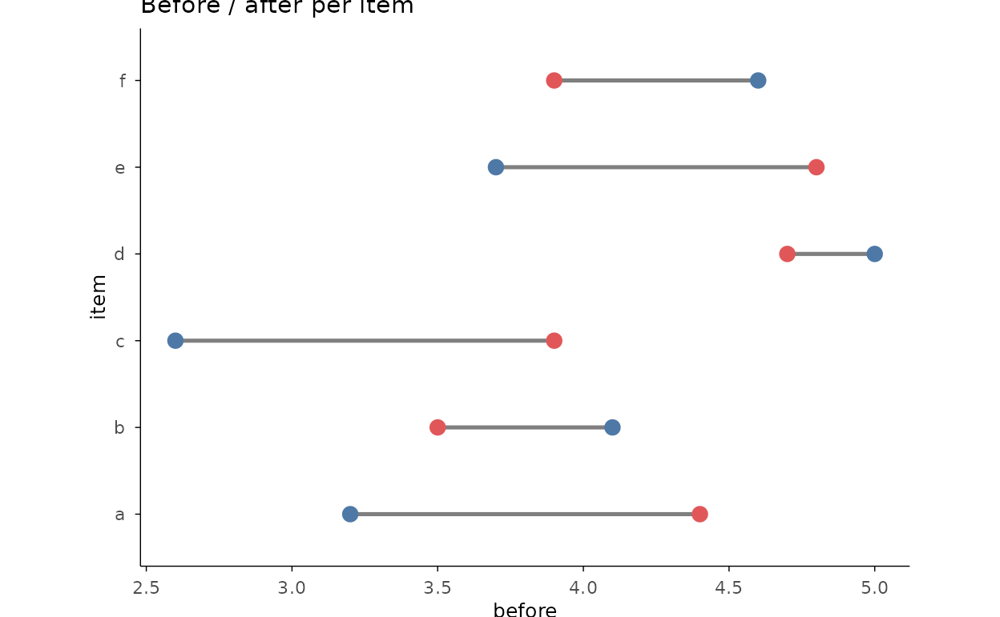

### Forest plot

``` r

studies <- data.frame(
  trial = paste0("Trial ", 1:5),
  es = c(0.42, 0.31, 0.55, 0.20, 0.48),
  lo = c(0.10, -0.05, 0.30, -0.10, 0.22),
  hi = c(0.74, 0.67, 0.80, 0.50, 0.74)
)
studies |>
  plotit(encode(x = es, y = trial, xmin = lo, xmax = hi)) |>
  mark_forest(ref = 0) |>
  label_title("mark_forest(): estimates with 95% intervals")
```

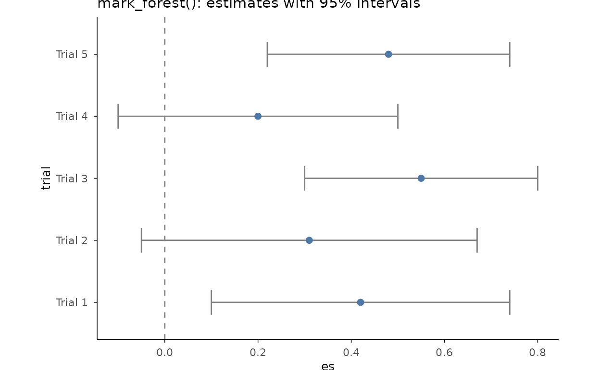

### Error bars over group means

``` r

sm <- aggregate(Sepal.Length ~ Species, data = iris, FUN = mean)
sd_v <- aggregate(Sepal.Length ~ Species,
  data = iris,
  FUN = function(x) stats::sd(x) / sqrt(length(x))
)
sm$se <- sd_v$Sepal.Length
sm |>
  plotit(encode(
    x = Species, y = Sepal.Length, ymin = Sepal.Length - se,
    ymax = Sepal.Length + se
  )) |>
  mark_point(size = 3) |>
  mark_errorbar(width = 0.25) |>
  label_axis("mean \u00b1 SE", aes = "y")
```

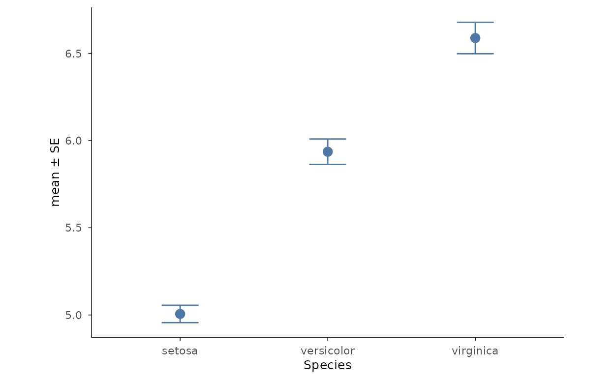

## Matrices & surfaces

### Correlation heatmap

``` r

ggplot2::mpg[, sapply(ggplot2::mpg, is.numeric)] |>
  plotit(encode()) |>
  mark_corr() |>
  label_title("Numeric columns of mpg, reordered by clustering")
```

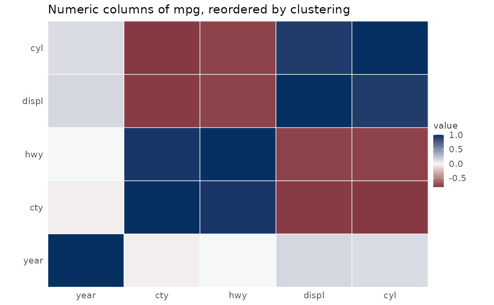

### Matrix heatmap

``` r

set.seed(42)
expr <- matrix(rnorm(60),
  nrow = 12,
  dimnames = list(paste0("gene", 1:12), paste0("sample", 1:5))
)
expr |>
  plotit(encode()) |>
  mark_heatmap(cluster = "both", scale = "row") |>
  label_title("mark_heatmap(): hclust reordering + row z-scores")
```

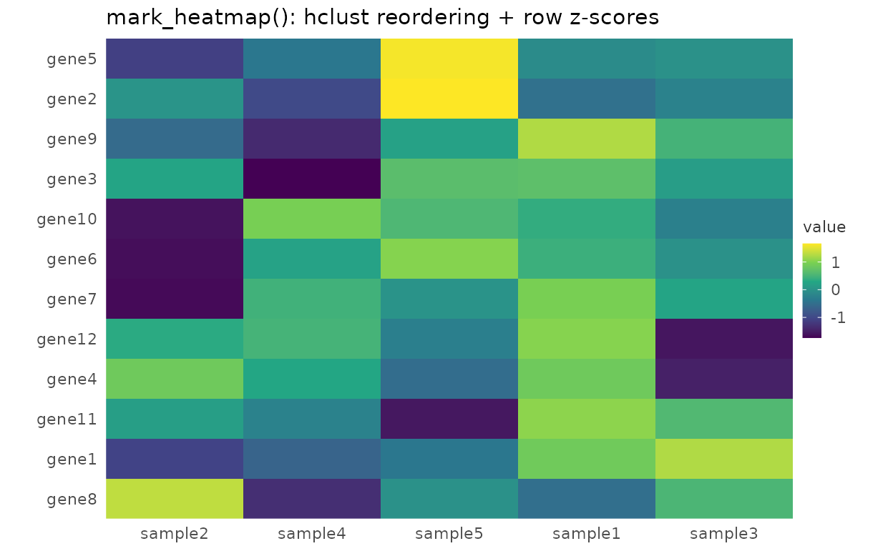

### 2D contour field

``` r

grid_df <- expand.grid(x = seq(0, 10, length.out = 40), y = seq(0, 10, length.out = 40))
grid_df$z <- sin(grid_df$x / 2) * cos(grid_df$y / 2)
grid_df |>
  plotit(encode(x = x, y = y, z = z)) |>
  mark_contour(filled = TRUE, bins = 9) |>
  label_title("mark_contour(filled = TRUE)")
```

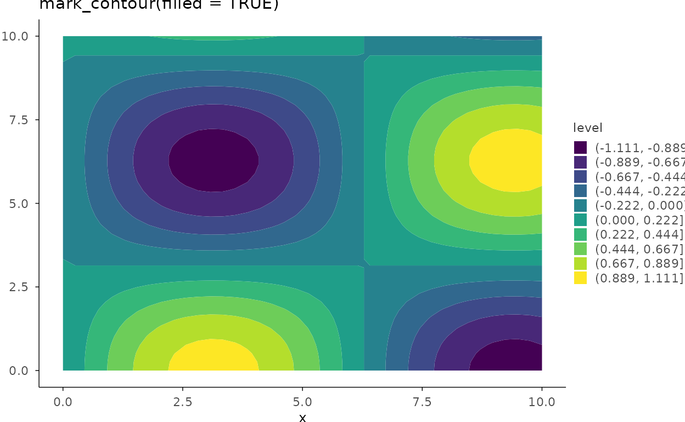

## Parallel coordinates

``` r

iris |>
  plotit(encode()) |>
  project_parallel(
    columns = c("Sepal.Length", "Sepal.Width", "Petal.Length", "Petal.Width"),
    group = "Species", alpha = 0.6
  ) |>
  label_title("project_parallel(group = \"Species\")")
```

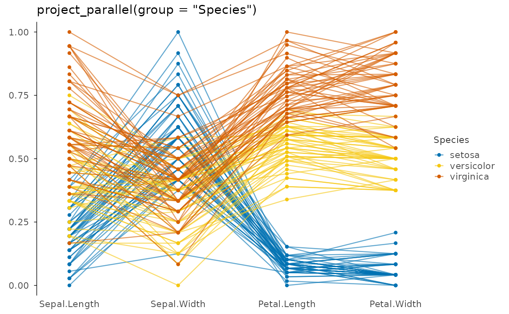
