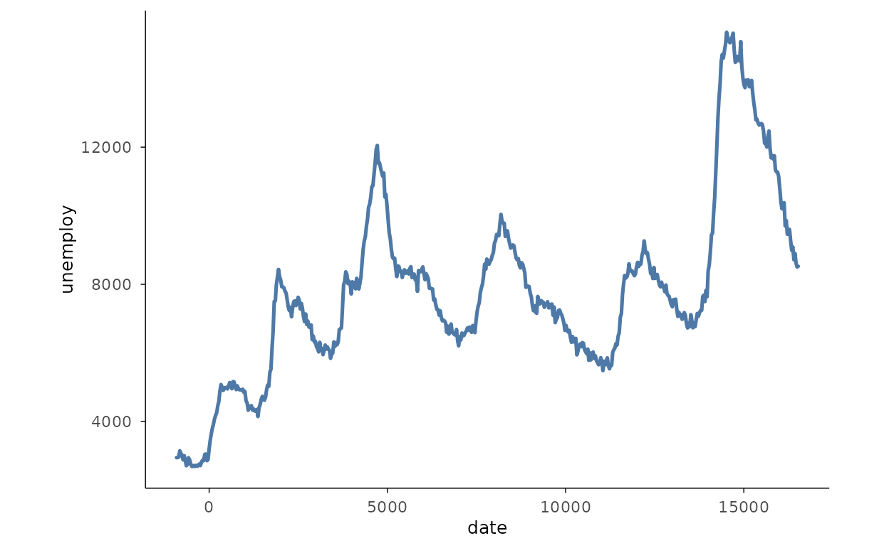
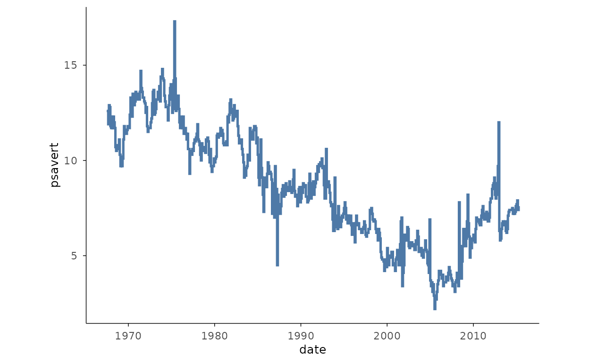
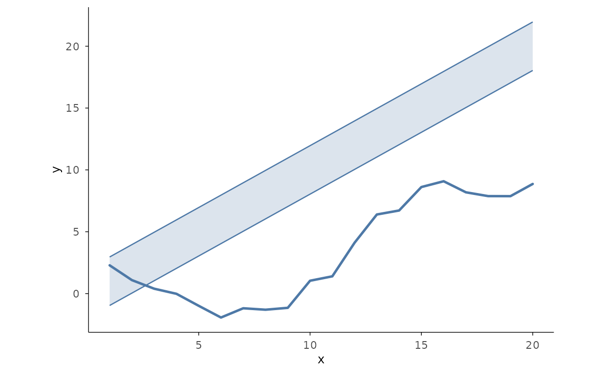
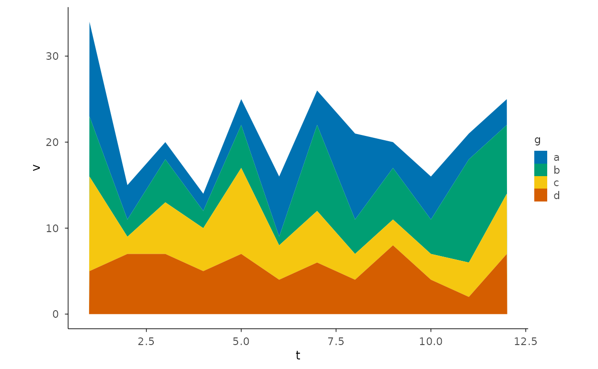
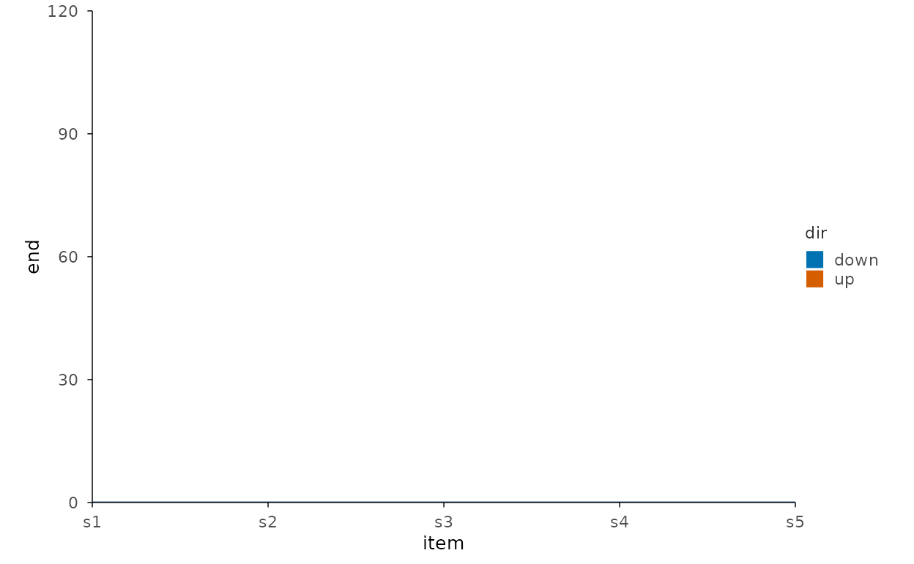
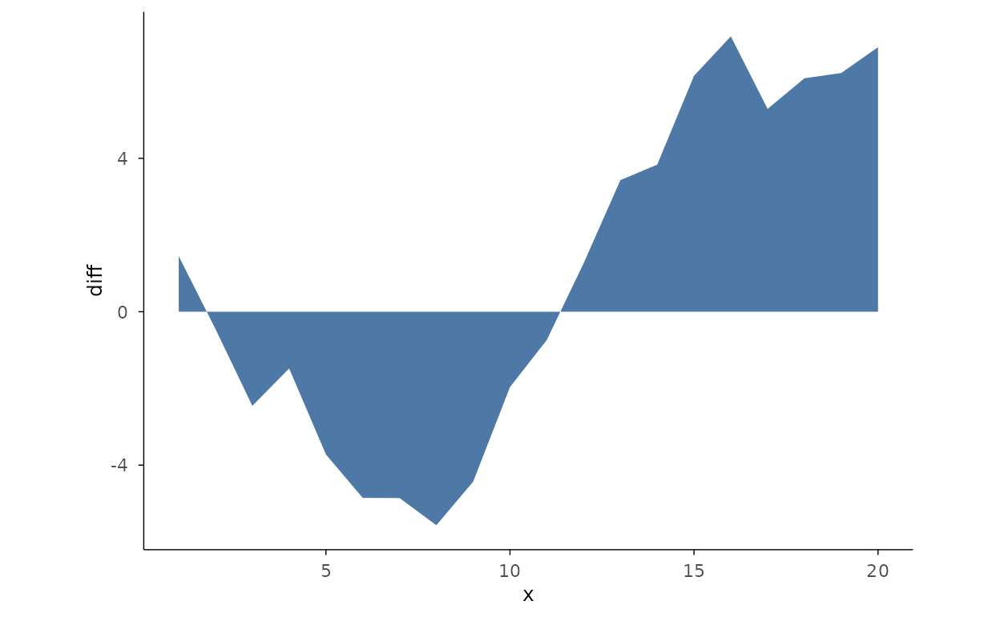
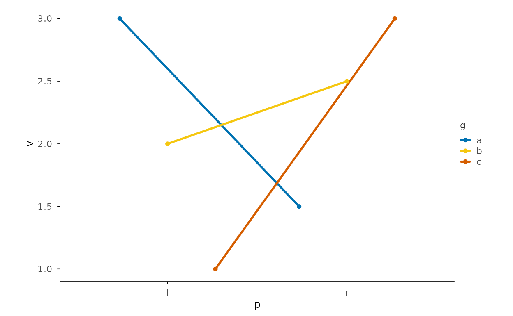

# Gallery: Trends

``` r

library(plotit)
```

## Line and step trends

### Multi-series line

``` r

ggplot2::economics |>
  plotit(encode(x = date, y = unemploy)) |>
  mark_line(linewidth = 0.9) |>
  scale_x(trans = "identity")
```



### Step change

``` r

ggplot2::economics |>
  plotit(encode(x = date, y = psavert)) |>
  mark_step(direction = "hv")
```



## Area and bands

### Area with confidence band (mark_ribbon, stage 5)

``` r

set.seed(7)
d <- data.frame(
  x = 1:20,
  y = cumsum(rnorm(20)),
  lo = seq(1, 20) - 1.96,
  hi = seq(1, 20) + 1.96
)
d |>
  plotit(encode(x = x, y = y)) |>
  mark_line() |>
  mark_ribbon(mapping = encode(ymin = lo, ymax = hi), alpha = 0.2)
```



### Stacked area

``` r

set.seed(7)
df <- expand.grid(t = 1:12, g = letters[1:4])
df$v <- rpois(nrow(df), 5)
df |>
  plotit(encode(x = t, y = v, fill = g)) |>
  mark_area(position = "stack")
```



## Recipe: waterfall (R-03)

Cumulative sum preprocessing + `mark_bar` with rise/fall colours.

``` r

set.seed(7)
steps <- data.frame(
  item = paste0("s", 1:5),
  delta = c(100, -40, 30, -20, 50)
)
steps$end <- cumsum(steps$delta)
steps$start <- steps$end - steps$delta
steps$dir <- ifelse(steps$delta >= 0, "up", "down")
steps |>
  plotit(encode(x = item, y = end, fill = dir)) |>
  mark_rect(mapping = encode(xmin = item, xmax = item, ymin = start, ymax = end)) |>
  mark_rule(yintercept = 0, colour = "#4E79A7")
```



## Recipe: difference band (R-10)

Two series, positive/negative area split.

``` r

set.seed(7)
d <- data.frame(
  x = 1:20,
  a = cumsum(rnorm(20)),
  b = cumsum(rnorm(20))
)
d$diff <- d$a - d$b
# Equivalent: area with sign-split fill
d |>
  plotit(encode(x = x, y = diff)) |>
  mark_area()
```



## Recipe: slope chart

`mark_line` + `mark_point` + `mark_text` for rank changes between two
points.

``` r

set.seed(7)
sl <- data.frame(
  p = rep(c("l", "r"), each = 3),
  g = rep(letters[1:3], 2),
  v = c(3, 2, 1, 1.5, 2.5, 3)
)
sl |>
  plotit(encode(x = p, y = v, group = g, colour = g)) |>
  mark_line() |>
  mark_point()
```


