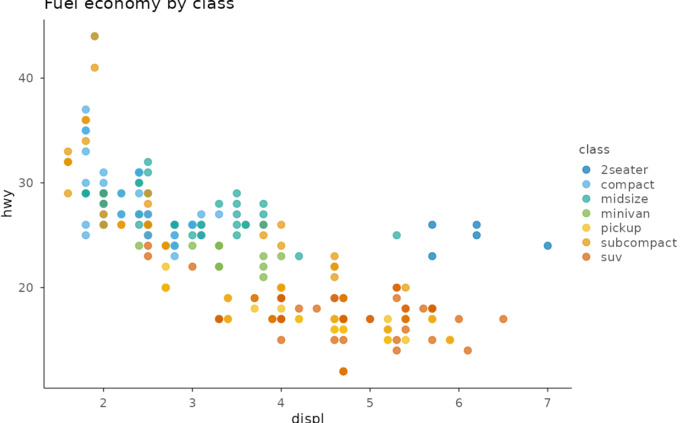

# Design Philosophy

> **本页解决什么问题**：Why plotit is built the way it is: grammar,
> defaults, extensibility. **前置**：已完成
> [use-case-publishing](https://zorrooz.github.io/plotit/articles/articles/use-case-publishing.md)

> **下一步**：→
> [plotit](https://zorrooz.github.io/plotit/articles/articles/plotit.md)

## Composition first

If a visual can be expressed by combining `mark_*` + `project_*` +
`scale_*` + `split_*` in one pipeline, plotit does **not** add a mark
for it. High-value combinations are collected as recipes (see the
gallery pages); only when a combination cannot be expressed in a
reasonable pipeline (external layout algorithms, novel data encodings)
does a new mark ship.

## Zero-dependency relational charts

Sankey, chord, treemap, network, tree and dendrogram layouts are all
self-built, deterministic R engines. No external graph library is
required — publication-reproducible by construction (`ggbeeswarm` is the
single, documented exemption).

## A static publishing pipeline

plotit targets print/publication output. Interaction (tooltips,
brushing, linking), 3D, animation and auto-mark selection are explicitly
**out of scope**; statistical p-values are computed by you and fed into
[`mark_significance()`](https://zorrooz.github.io/plotit/reference/mark_significance.md)
as a table.

``` r

library(plotit)
```

## The pipeline is the narrative

``` r

ggplot2::mpg |>
  plotit(encode(x = displ, y = hwy, colour = class)) |>
  mark_point(size = 2, alpha = 0.7) |>
  scale_color(range = "friendly") |>
  label_title("Fuel economy by class")
#> Scale for colour is already present.
#> Adding another scale for colour, which will replace the existing scale.
```


