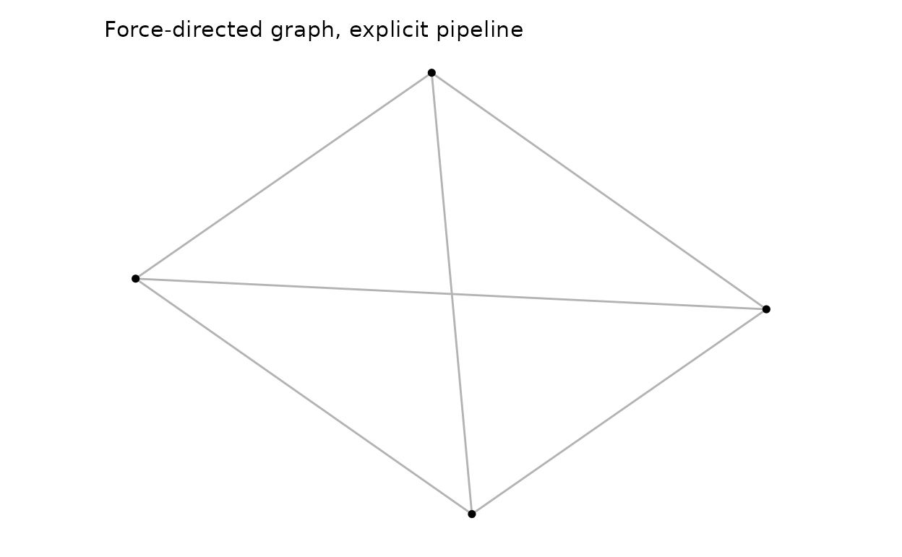
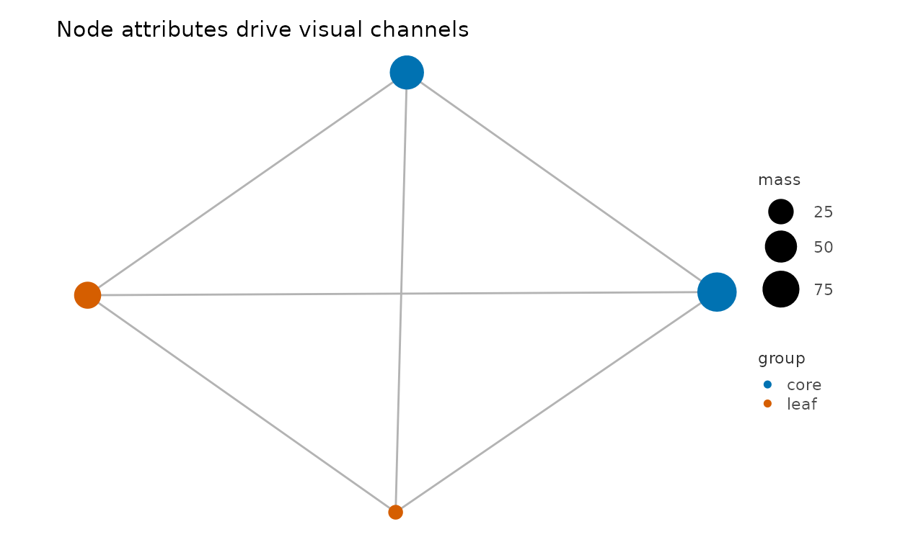
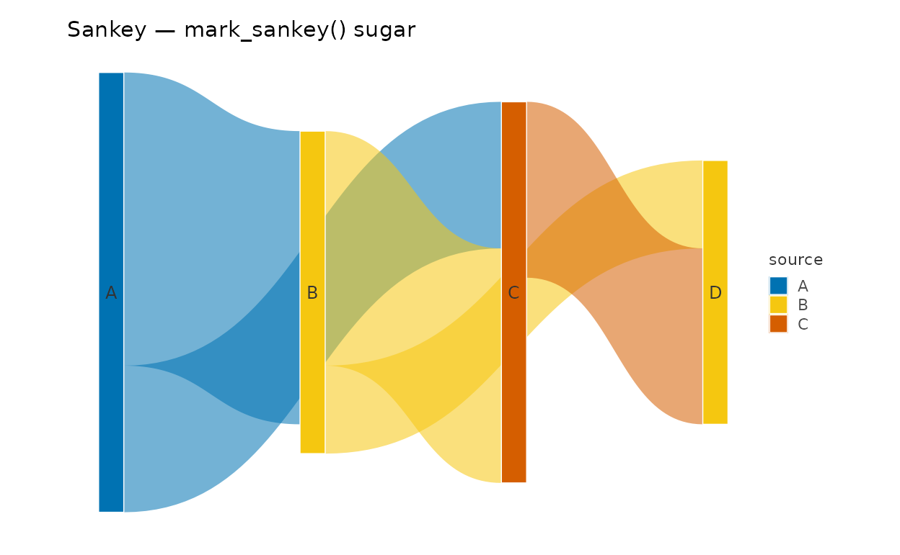
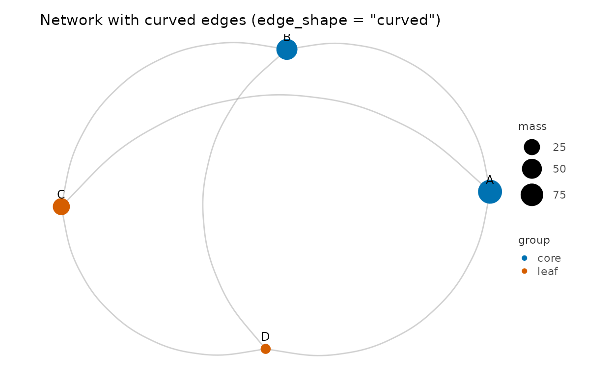
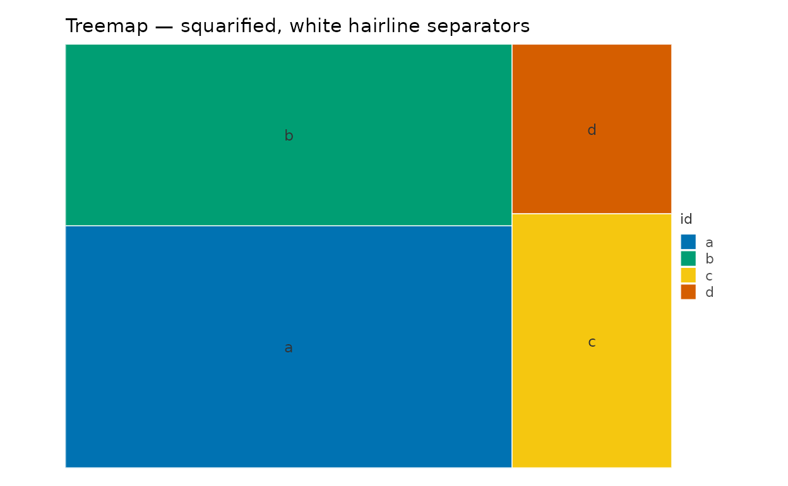
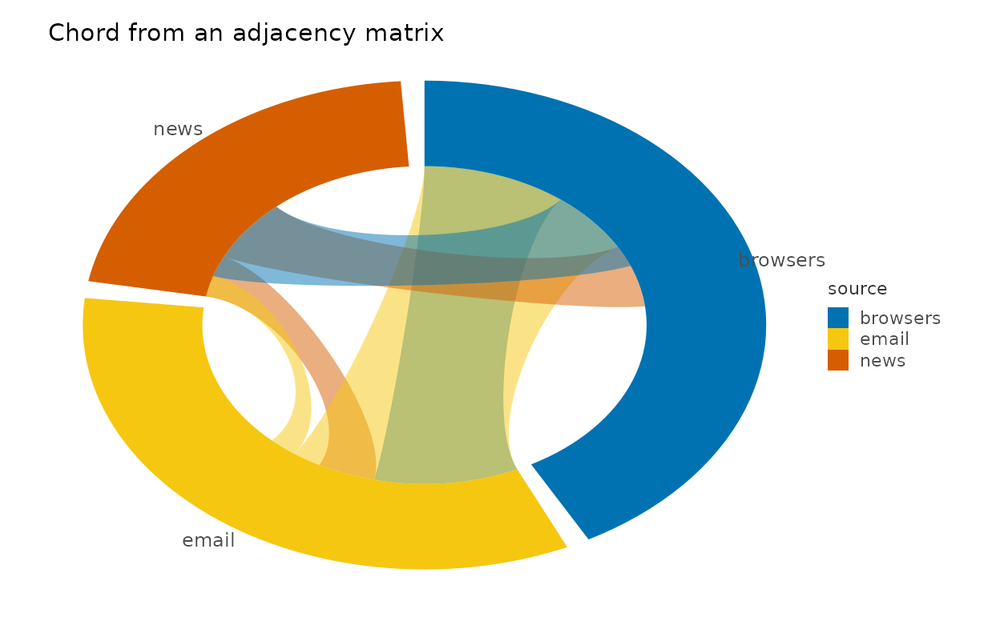
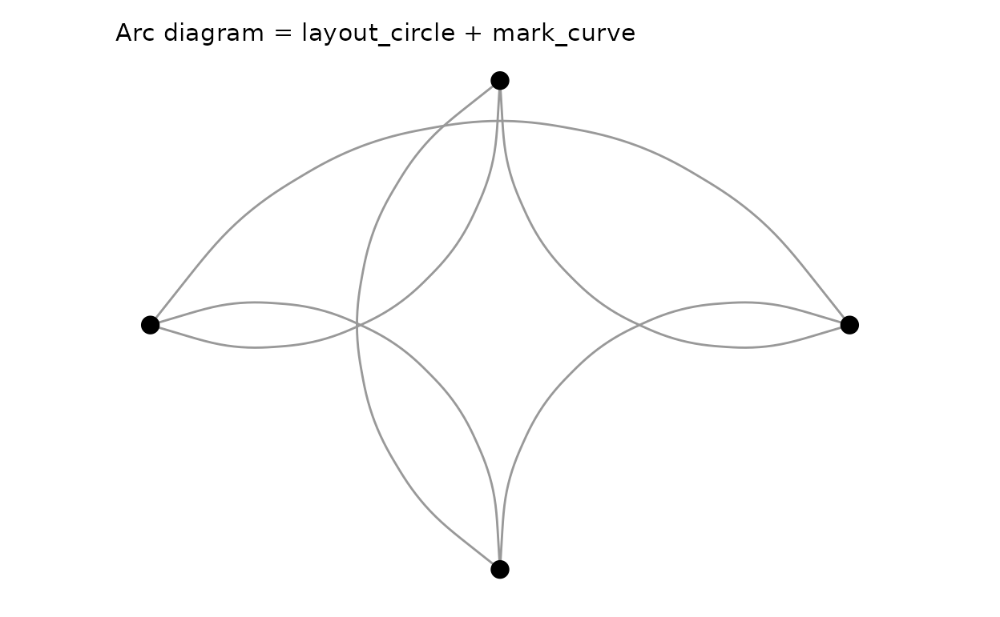
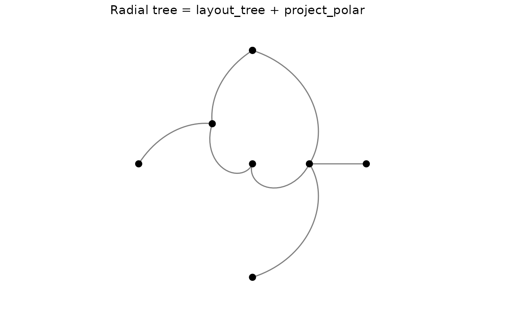
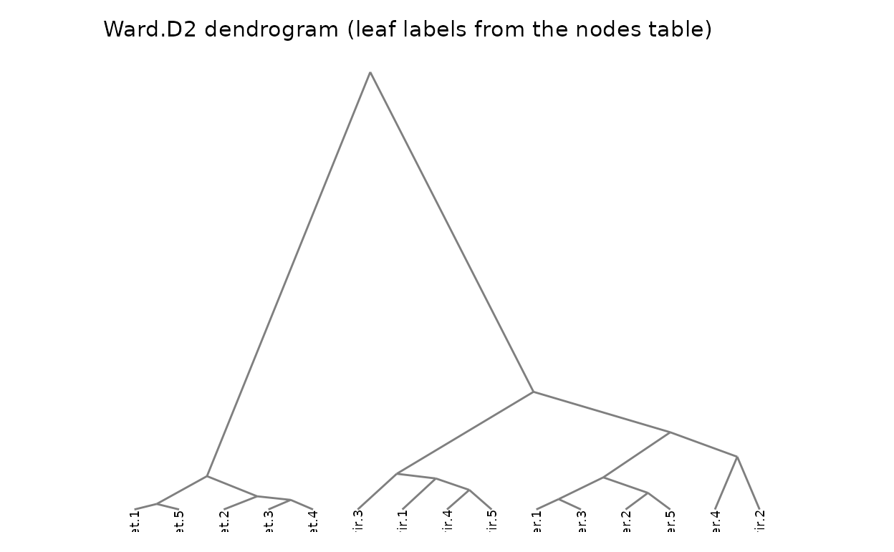
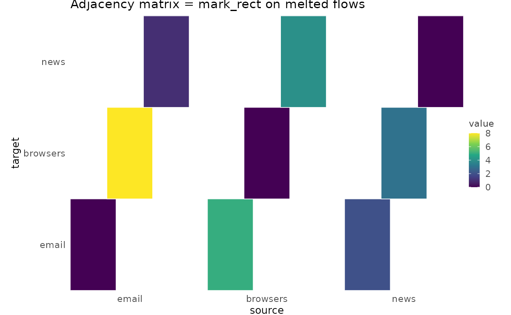

# Relational Charts: Graphs, Flows, and Hierarchies

> **本页解决什么问题**：Build graphs, flows and hierarchies with
> `as_graph() + layout_*()`. **前置**：已完成
> [composing](https://zorrooz.github.io/plotit/articles/articles/composing.md)

> **下一步**：→
> [gallery-comparisons](https://zorrooz.github.io/plotit/articles/articles/gallery-comparisons.md)

## Why relational charts need their own data model

Everything in the other articles is *tabular*: one row, one mark. A
network diagram breaks that assumption twice over. A node has no
intrinsic position — where it sits is the *output* of a layout
computation. And one row is not even the right unit: a relation has two
endpoints, so nodes and edges live in different tables with different
cardinality.

plotit answers this the way Vega’s dataflow does — **a layout is a data
transform, not a layer**. You coerce relations into a `plotit_graph` (a
named collection of plain data frames), pass each `layout_*()` step a
`plotit` object, and the layout *bakes coordinates into the tables*.
Rendering then uses the ordinary marks you already know:

    edges / matrix / tree  ──as_graph()──▶  plotit_graph  ──layout_*()──▶  x/y columns appear
                                                                                │
                                      plotit(graph) ──▶ mark_point(data = ~nodes)  ──▶

Nothing else about the grammar changes: `scale_*()`, `label_*()`,
[`style()`](https://zorrooz.github.io/plotit/reference/style.md),
[`export()`](https://zorrooz.github.io/plotit/reference/export.md), the
`+` escape hatch, and `...` passthrough all work on relational plots
exactly as before.

## Step 1 — `as_graph()`: one container, five input formats

``` r

library(plotit)

edges <- data.frame(
  source = c("A", "A", "B", "B", "C", "D"),
  target = c("B", "C", "C", "D", "D", "A"),
  value  = c(4, 2, 6, 3, 5, 1)
)
g <- as_graph(edges)
names(g)
#> [1] "nodes" "edges"
g$nodes
#>   id
#> 1  A
#> 2  B
#> 3  C
#> 4  D
```

A `plotit_graph` is a named list of data frames — `nodes` and `edges`
are the canonical tables, and layouts may add derived ones (`ribbons`,
`arcs`, `leaves`).
[`as_graph()`](https://zorrooz.github.io/plotit/reference/as_graph.md)
recognizes five input shapes:

| Input | Shape required | Typical source |
|----|----|----|
| edge table | `source`/`target` (+ optional `value`); other names via `source =`/`target =`/`value =` arguments | tidy graphs, event logs |
| matrix / `table` | `M[row, col]` melts to source = row, target = col (zero cells dropped) | flow matrices, confusion matrices |
| `hclust` / `dendrogram` | converted automatically; merge heights kept on nodes | cluster trees |
| hierarchy table | `id` + `parent` (+ optional per-leaf `value`) | org charts, taxonomies, file trees |
| `tbl_graph` | activated node/edge tables, direction detected | tidygraph pipelines |

Keys are coerced to character; when a `nodes` table is omitted, nodes
are synthesized in first-appearance order (the Vega convention). A node
table must carry an `id` column:

``` r

nodes <- data.frame(
  id    = c("A", "B", "C", "D"),
  group = c("core", "core", "leaf", "leaf"),
  mass  = c(90, 60, 30, 10)
)
as_graph(edges, nodes = nodes)$edges
#>   source target value
#> 1      A      B     4
#> 2      A      C     2
#> 3      B      C     6
#> 4      B      D     3
#> 5      C      D     5
#> 6      D      A     1
```

## Step 2 — `layout_*()`: coordinates as transforms

Seven layouts, all pure R, all deterministic (the force engine is
seeded), and all returning a *new* object — pipelines never mutate:

``` r

p_force <- g |>
  plotit() |>
  layout_force(seed = 1)

p_circle <- g |>
  plotit() |>
  layout_circle(order_by = "degree")
```

- [`layout_force()`](https://zorrooz.github.io/plotit/reference/layout_force.md)
  — Fruchterman–Reingold simulation (repulsion matrix + attraction
  accumulate + linear cooling). `seed` guarantees reproducibility,
  `iterations` controls quality, and `weights = TRUE` lets edge `value`
  pull harder.
- [`layout_circle()`](https://zorrooz.github.io/plotit/reference/layout_circle.md)
  — nodes on a ring, ordered by id or degree.
- `layout_tree(direction = "down" | "up" | "left" | "right")` —
  orthogonal tree from an `id`/`parent` hierarchy.
- `layout_dendrogram(direction = ...)` — same tree but keeps merge
  heights as the depth axis (from `hclust` inputs).
- [`layout_treemap()`](https://zorrooz.github.io/plotit/reference/layout_treemap.md)
  — Bruls squarified rectangles (xmin…ymax + a derived `leaves` table).
- [`layout_sankey()`](https://zorrooz.github.io/plotit/reference/layout_sankey.md)
  — longest-path layering + barycenter sweeps; emits bezier `ribbons`.
- [`layout_chord()`](https://zorrooz.github.io/plotit/reference/layout_chord.md)
  — sector angles proportional to flow; emits `arcs` and `ribbons`.

Every laid-out table carries geometry columns — `x`/`y` on nodes,
`x`/`y`/`xend`/`yend` on edges, corner boxes on treemap leaves, polygon
chains in `ribbons`/`arcs`. Which is exactly what marks speak. Layouts
are idempotent recomputations: chain another `layout_*()` later and it
wins (stale geometry is stripped first).

``` r

p <- g |>
  plotit() |>
  layout_force(seed = 1)
head(data.frame(p@graph$edges))
#>   source target value          x         y       xend      yend
#> 1      A      B     4 0.94973503 0.4676873 0.47248797 0.9500000
#> 2      A      C     2 0.94973503 0.4676873 0.05026497 0.5300873
#> 3      B      C     6 0.47248797 0.9500000 0.05026497 0.5300873
#> 4      B      D     3 0.47248797 0.9500000 0.52982362 0.0500000
#> 5      C      D     5 0.05026497 0.5300873 0.52982362 0.0500000
#> 6      D      A     1 0.52982362 0.0500000 0.94973503 0.4676873
```

## Step 3 — render with ordinary marks via `~table`

Pass a one-sided formula as a mark’s `data` to select a graph table.
Layout geometry binds automatically (`x`/`y`, endpoints, corners —
whichever the mark understands), so you rarely map positions at all:

``` r

g |>
  plotit() |>
  layout_force(seed = 1) |>
  mark_rule(data = ~edges, color = "grey70") |>
  mark_point(data = ~nodes) |>
  label_title("Force-directed graph, explicit pipeline")
```



Node attributes drive visual channels by mapping them *in the layer*
(the graph has no global mapping — aesthetics are declared per table):

``` r

as_graph(edges, nodes = nodes) |>
  plotit() |>
  layout_force(seed = 7) |>
  mark_rule(data = ~edges, color = "grey70") |>
  mark_point(data = ~nodes, encode(size = mass, colour = group)) |>
  scale_size(range = c(3, 9)) |>
  label_title("Node attributes drive visual channels")
```



This explicit form is the power user’s route: any mark that understands
a table’s columns can render it, and you can interleave more than the
sugars do (curved links, labels on one subset, halos…).

## Step 4 — the sugar marks: one call for the four classics

For the most common relational charts,
[`mark_network()`](https://zorrooz.github.io/plotit/reference/mark_network.md),
[`mark_sankey()`](https://zorrooz.github.io/plotit/reference/mark_sankey.md),
[`mark_chord()`](https://zorrooz.github.io/plotit/reference/mark_chord.md)
and
[`mark_treemap()`](https://zorrooz.github.io/plotit/reference/mark_treemap.md)
bundle layout + layers + label styling into a single verb. Each expands
*exactly* to a documented pipeline, so nothing is hidden — and the
laid-out tables stay on `@graph` afterwards for further tuning:

``` r

flows <- data.frame(
  source = c("A", "A", "B", "B", "C"),
  target = c("B", "C", "C", "D", "D"),
  value  = c(10, 5, 8, 3, 6)
)
flows |>
  plotit(encode(
    source = source, target = target,
    value = value, fill = source
  )) |>
  mark_sankey(edge_alpha = 0.55) |>
  label_title("Sankey — mark_sankey() sugar")
#> Coordinate system already present.
#> ℹ Adding new coordinate system, which will replace the existing one.
```



``` r

nodes |>
  plotit(encode(colour = group, size = mass, label = id)) |>
  mark_network(edges = edges, seed = 3, edge_shape = "curved", edge_alpha = 0.6) |>
  scale_size(range = c(3, 8)) |>
  label_title("Network with curved edges (edge_shape = \"curved\")")
```



`edge_shape = "curved"` routes the edge layer through
[`mark_curve()`](https://zorrooz.github.io/plotit/reference/mark_curve.md)
(straight rules remain the default). The four sugars share one
vocabulary: `node_color`, `edge_color` / `edge_width` / `edge_alpha`,
and `show_labels` — see
[`?mark_network`](https://zorrooz.github.io/plotit/reference/mark_network.md).

``` r

h <- data.frame(
  id     = c("root", "em", "srch", "a", "b", "c", "d"),
  parent = c(NA, "root", "root", "em", "em", "srch", "srch"),
  value  = c(NA, NA, NA, 32, 24, 12, 8)
)
h |>
  plotit(encode(fill = id)) |>
  mark_treemap() |>
  label_title("Treemap — squarified, white hairline separators")
```



``` r

mat <- matrix(c(0, 5, 2, 8, 0, 3, 1, 4, 0),
  nrow = 3,
  dimnames = list(
    c("email", "browsers", "news"),
    c("email", "browsers", "news")
  )
)
as_graph(mat, directed = TRUE)$edges |>
  plotit(encode(
    source = source, target = target,
    value = value, fill = source
  )) |>
  mark_chord() |>
  label_title("Chord from an adjacency matrix")
```



## Composing relational views from primitives

The payoff of “layout = transform” is that new chart types are just
pipelines — no new verbs.

### Arc diagram (network on a line)

A circular layout drawn with curved links is the classic arc diagram;
for a straight baseline, place nodes manually with a `manual`-style
pipeline (`x = level(seq), y = 0` columns bound with `mark_point`) and
keep `mark_curve` for the links:

``` r

edges |>
  as_graph(nodes = data.frame(id = c("A", "B", "C", "D"))) |>
  plotit() |>
  layout_circle(order_by = "degree") |>
  mark_curve(data = ~edges, curvature = 0.6, color = "grey60") |>
  mark_point(data = ~nodes, size = 3.5) |>
  label_title("Arc diagram = layout_circle + mark_curve")
```



### Radial tree

`layout_tree(direction = "right")` puts depth on `x` and leaf order on
`y`; `project_polar(theta = "y")` turns the pair into radius/angle:

``` r

as_graph(data.frame(
  id     = c("root", "A", "B", "a1", "a2", "a3", "b1", "b2"),
  parent = c(NA, "root", "root", "A", "A", "A", "B", "B")
)) |>
  plotit() |>
  layout_tree(direction = "right") |>
  mark_rule(data = ~edges) |>
  mark_point(data = ~nodes, size = 2.5) |>
  project_polar(theta = "y") |>
  label_title("Radial tree = layout_tree + project_polar")
```



### Dendrogram from a cluster

``` r

# A 150-leaf dendrogram smears its labels; a small subset keeps it legible.
iris15 <- iris[c(1:5, 51:55, 101:105), 1:4]
rownames(iris15) <- paste0(rep(c("set", "ver", "vir"), each = 5), ".", 1:5)
hc <- hclust(dist(iris15), method = "ward.D2")
p_dendro <- as_graph(hc) |>
  plotit() |>
  layout_dendrogram()
p_dendro |>
  mark_rule(data = ~edges) |>
  mark_text(
    data = subset(p_dendro@graph$nodes, leaf),
    mapping = encode(x = x, y = y, label = id),
    size = 2.5, angle = 90, hjust = 1, vjust = 0.5
  ) |>
  label_title("Ward.D2 dendrogram (leaf labels from the nodes table)")
```



### Adjacency-matrix heatmap (relations as grid)

For small graphs a melted flow matrix rendered with
[`mark_rect()`](https://zorrooz.github.io/plotit/reference/mark_rect.md)
is an honest alternative to a hairball:

``` r

df <- as.data.frame(as.table(mat))
names(df) <- c("source", "target", "value")
df |>
  plotit(encode(x = source, y = target, fill = value)) |>
  mark_rect() |>
  label_title("Adjacency matrix = mark_rect on melted flows")
```



## Limitations and guarantees

- `split_*()` faceting of graph data is deliberately unsupported in v1:
  layouts compute positions globally, so facet-wise edge filtering would
  produce inconsistent tables. Facet the *inputs* instead.
- The force layout is deterministic *given a seed*; changing
  `iterations` may still reorder nodes. For absolute stability, carry
  explicit `x`/`y` columns on the nodes table (they pass through
  `mark_point(data = ~nodes)` untouched).
- Every sugar mark keeps its laid-out tables on `@graph` and its
  expansion in the docs — a sugar can always be “unwrapped” to the
  explicit pipeline without any visual change.
- Straight vs curved edges, label placement, and per-group styling
  belong to the explicit pipeline form; sugars expose only the
  vocabulary above.

## Design lineage

Vega-Lite reaches this territory with imperative `joinaggregate`/custom
layout transforms; AntV G2 5.0 ships `sankey`/`chord`/`forceGraph` as
library marks whose internal expansion is again a handful of primitive
marks; D3 hands you layout functions and expects the binding yourself;
Observable Plot covers curves and matrices but not graph layouts. plotit
splits the difference: the *engine* stays in the package (pure R,
deterministic, dependency-free), the *geometry* lands in ordinary data
frames, and the *renderer* is the same `mark_*` grammar you already use
for scatter plots — composition, not special cases.
