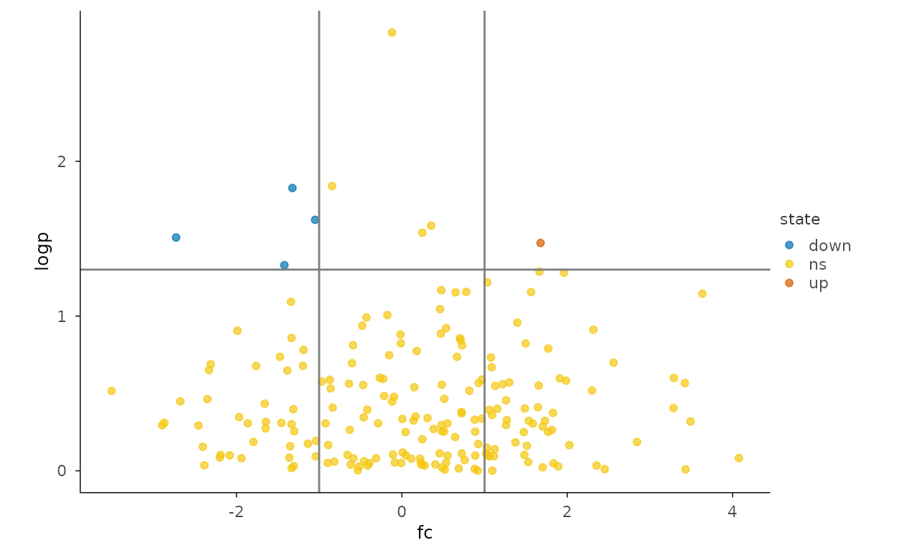
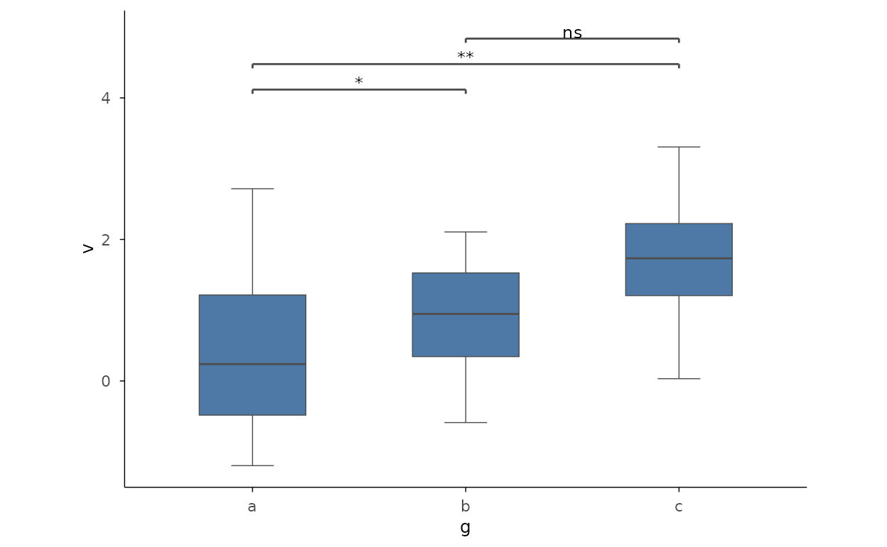
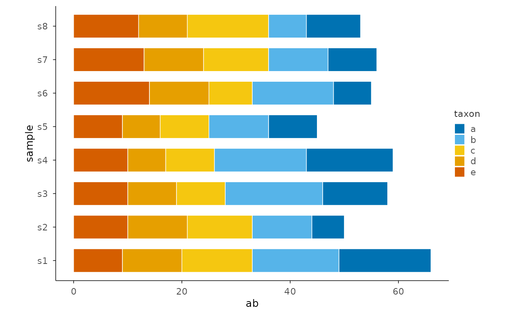
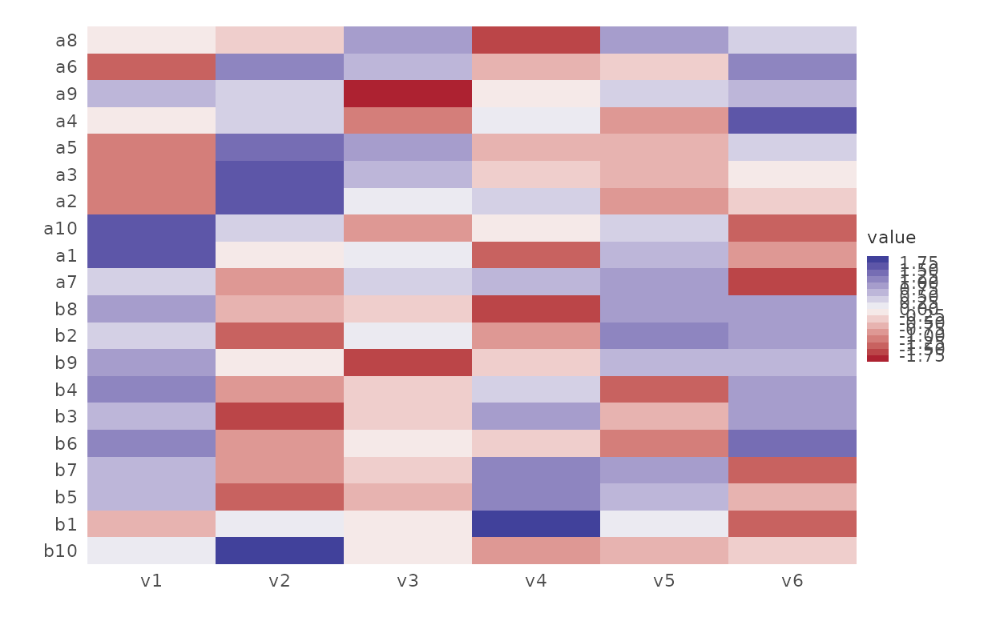

# Use Case: Bioinformatics

``` r

library(plotit)
```

Task-driven pipelines: each section answers one analysis question
(tidyplots use-case narrative).

## Volcano plot (R-17)

``` r

set.seed(7)
vol <- data.frame(
  gene = paste0("g", 1:200),
  fc = rnorm(200, 0, 1.5),
  p = runif(200, 0, 1)
)
vol$logp <- -log10(vol$p)
vol$state <- ifelse(vol$fc > 1 & vol$logp > 1.3, "up",
  ifelse(vol$fc < -1 & vol$logp > 1.3, "down", "ns")
)
vol |>
  plotit(encode(x = fc, y = logp, colour = state)) |>
  mark_point(alpha = 0.7, size = 1.5) |>
  mark_rule(xintercept = c(-1, 1), colour = "grey50") |>
  mark_rule(yintercept = 1.3, colour = "grey50") |>
  scale_color(range = "friendly")
#> Scale for colour is already present.
#> Adding another scale for colour, which will replace the existing scale.
```



## Correlation matrix

``` r

plotit(stats::cor(iris[1:4])) |>
  mark_corr() |>
  scale_fill(range = "rdbu", mid = 0)
#> Scale for fill is already present.
#> Adding another scale for fill, which will replace the existing scale.
```


## Grouped comparison with significance

``` r

set.seed(7)
d <- data.frame(g = rep(c("a", "b", "c"), each = 20), v = rnorm(60, rep(c(0, 0.8, 1.6), each = 20)))
d |>
  plotit(encode(x = g, y = v)) |>
  mark_boxplot() |>
  mark_significance(comparisons = data.frame(
    group1 = c("a", "a", "b"),
    group2 = c("b", "c", "c"),
    label = c("*", "**", "ns")
  ))
```



## Composition stack (microbiome-style)

``` r

set.seed(7)
d <- expand.grid(sample = paste0("s", 1:8), taxon = letters[1:5])
d$ab <- rpois(nrow(d), 10)
d |>
  plotit(encode(x = sample, y = ab, fill = taxon)) |>
  mark_bar(position = "stack") |>
  project_cartesian(flip = TRUE)
```



## Clustered expression heatmap (flagship)

``` r

set.seed(7)
cols <- paste0("v", 1:6)
g1 <- matrix(rnorm(60, mean = 1), nrow = 10, dimnames = list(paste0("a", 1:10), cols))
g2 <- matrix(rnorm(60, mean = 5), nrow = 10, dimnames = list(paste0("b", 1:10), cols))
mat <- rbind(g1, g2)
h <- stats::hclust(stats::dist(mat))
mat |>
  plotit(encode()) |>
  mark_heatmap(cluster = h, scale = "row") |>
  scale_fill(range = "rdylbu", n_bins = 15, na_color = "grey85")
#> Scale for fill is already present.
#> Adding another scale for fill, which will replace the existing scale.
```


